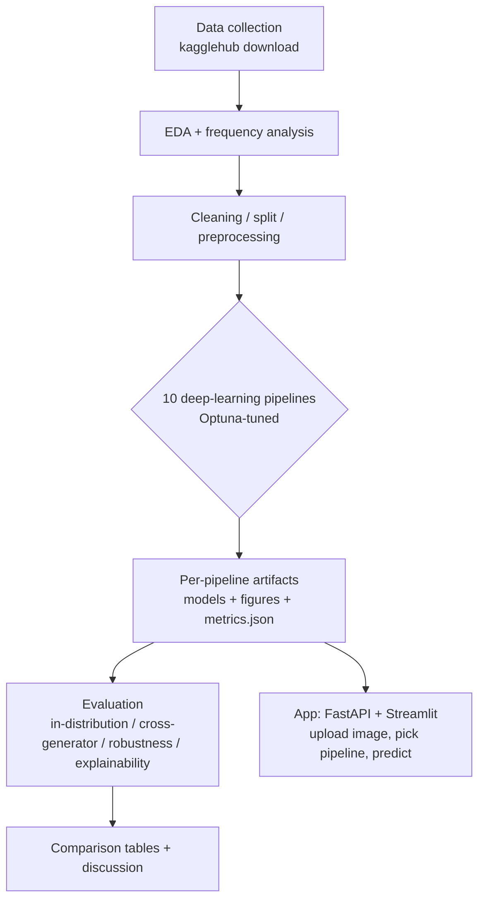

# 1 — Overview

[← docs index](README.md)

## 1.1 The problem

Generative models (Stable Diffusion, Midjourney, DALL·E, GANs, …) now produce photographic images that
are hard to distinguish from real photos by eye. This project builds **binary classifiers** that, given
an RGB image, output a probability `p_fake ∈ [0, 1]` and a decision `label = "fake" if p_fake ≥ 0.5 else
"real"`.

Why this matters now, specifically: the cost of producing a convincing synthetic photograph has fallen
to roughly zero, while the human ability to spot one has not improved at all. That asymmetry shows up
everywhere from misinformation and fabricated evidence to fraud and non-consensual imagery, and it makes
automated detection a practical need rather than an academic curiosity. The framing as a single
probability `p_fake` is deliberate: a calibrated score is more useful downstream than a hard label,
because it lets a consumer of the detector choose its own operating point (flag at 0.5 for a casual
filter, at 0.9 for a high-precision review queue) instead of being stuck with ours.

We deliberately use **higher-resolution, photographic** data (not 32×32 thumbnails) so that transfer
learning, frequency analysis, and a realistic "upload-a-photo" app are all meaningful. (The older CIFAKE
32×32 dataset was considered and dropped.) At 32×32 there is almost no high-frequency band to analyse,
ImageNet backbones expect far larger inputs, and an app that only accepts thumbnails is a toy.
Photographic resolution lets the *same* images serve every pipeline — from-scratch CNNs at 128², the
pretrained backbones at 224², and a patch model that works at native resolution — and keeps the whole
study honest about the images people would actually upload.

## 1.2 Why this is interesting (the research questions)

A single detector can score ~0.99 AUC in-distribution yet collapse on an unseen generator. The
scientific value is in characterising that behaviour rather than in chasing one more decimal of
in-distribution accuracy — that part of the problem is, for our data, essentially solved. The four
questions below each isolate a different way an apparently-excellent detector can fail:

1. **Generalization gap** — train on one set of generators (`ai-real-images`: SD + Midjourney + DALL·E),
   test per-generator on a **disjoint** set (`tiny-genimage`: 7 generators incl. BigGAN, ADM, GLIDE,
   VQDM, …). See [05-results §Cross-generator](05-results.md#52-cross-generator-generalization-ood). What
   the gap *really measures* is whether a model learned a concept ("this image was synthesised") or a
   fingerprint ("this looks like Stable Diffusion v1's upsampler"). The first transfers; the second does
   not. Because real deployment always means generators the model never trained on, the size of this gap
   is the single most honest indicator of practical value, and it is the reason `tiny-genimage` is sealed
   off from training entirely.
2. **Robustness** — measure accuracy vs. increasing perturbation strength (JPEG quality, Gaussian blur,
   downsample, additive noise). See [05-results §Robustness](05-results.md#53-robustness). This matters
   for deployment because images in the wild are almost never pristine: a messaging app re-compresses
   them, a screenshot resamples them, a CDN downscales them. If a detector leans on a fragile
   high-frequency cue, that cue is exactly what JPEG and blur attenuate first — so the robustness curve
   doubles as a diagnosis of *how delicate* the learned signal is, and a detector that is accurate only
   on untouched images is accurate only in the lab.
3. **Frequency-domain artifacts** — real and generated images differ in the high-frequency band and in
   the azimuthally-averaged power spectrum (shown in EDA), motivating the `two-stream`, `freqcross`, and
   `srm-noise` pipelines. The reason these artifacts *exist* is mechanical: generators build images by
   repeatedly upsampling (transposed convolutions, interpolation), and that process stamps periodic,
   grid-aligned traces and an unnatural high-frequency roll-off onto the output — patterns a camera
   sensor and lens never produce. Being a property of the generation *process* rather than the depicted
   *content*, they are a promising candidate for a cue that survives a change of generator.
4. **Explainability** — Grad-CAM (CNNs), attention rollout (ViT), embedding t-SNE (CLIP), per-patch MIL
   attention, and DIRE error maps. Explainability buys two things here. First, trust: a "fake" verdict is
   far more credible when we can show *where* in the image the evidence sits. Second, and more usefully,
   it is a shortcut-detector — if a model's heatmap lights up a watermark, a border, or empty sky rather
   than the content, we have caught it cheating before the out-of-distribution test does it for us.

## 1.3 The datasets

| Name | Size (kept) | Generators | Layout | Role |
|------|:-----------:|------------|--------|------|
| `ai-real-images` | **59,882** | Stable Diffusion + Midjourney + DALL·E | `split/{real,fake}` | **Primary** — training + in-distribution eval |
| `tiny-genimage` | **34,998** | **7**: biggan, vqdm, sdv5, wukong, adm, glide, midjourney | `generator/{train,val}/{nature,ai}` | **Cross-generator OOD** test (never trained on) |

The pairing is the design, not an accident of availability. The whole generalization question only
becomes *measurable* when the train-time and test-time generators are disjoint: training and testing on
the same generators would tell us how well a model memorises a fixed set of fingerprints, whereas
training on one family and testing on a completely different one measures transfer directly. The two sets
are also chosen to span a useful range of "distance" from the training distribution — `tiny-genimage`
mixes GAN-era models (BigGAN), older diffusion (ADM, GLIDE) and newer diffusion (SDv5, Wukong) — which is
why some of its generators turn out far harder than others.

`ai-real-images` ships only `train`/`test`, so we carve a **stratified 10% validation split** from its
train set. `tiny-genimage` is held out entirely as the out-of-distribution probe. Details, EDA, and the
all-important *resolution-shortcut* caveat are in [02-data.md](02-data.md) — that chapter explains the
collection, cleaning, leakage checks, and preprocessing in full, so the description here stays at the
level of *what the two datasets are for*.

## 1.4 The ten pipelines

Each pipeline is a self-contained way of solving the same task, developed in its own notebook, producing
its own artifacts, and compared head-to-head. Four "core" families plus extra research architectures.
Spanning families rather than tuning one model is itself a research choice: it lets the final comparison
speak to *which class of idea* travels best across generators, not just which checkpoint won.

| # | Pipeline | Family | Core idea |
|---|----------|--------|-----------|
| 04 | `cnn-scratch` | from-scratch CNN | Small baseline CNN — the number to beat. The honest floor: how far does a plain convnet get with no pretraining? |
| 05 | `cnn-residual` | from-scratch CNN | Deeper pre-activation residual CNN + SE attention + EMA. Tests whether more capacity, learned from scratch, actually helps here. |
| 06 | `cnn-finetune` | transfer learning | Two-stage fine-tune of an ImageNet backbone (EfficientNet-B0). Reuses generic visual features so the model only has to learn the real-vs-fake boundary. |
| 07 | `vit-lora` | transfer + PEFT | ViT-Base fine-tuned with **LoRA** on the attention projections. A transformer's global receptive field plus parameter-efficient tuning — strong, cheap to adapt. |
| 08 | `clip-probe` | foundation embeddings | Frozen CLIP encoder → trained MLP head. The "does a foundation model already separate real from fake?" experiment; the natural favourite for OOD. |
| 09 | `two-stream` | hybrid | RGB CNN ∥ FFT CNN → fusion (multi-component). Hands the network the frequency artifacts explicitly rather than hoping an RGB CNN rediscovers them. |
| 10 | `freqcross` | frequency | 3-branch RGB + FFT + radial-spectrum, attention fusion. Pushes the frequency idea further, adding the 1-D radial power profile as its own learned branch. |
| 11 | `srm-noise` | forensic | SRM high-pass + Bayar constrained conv noise-residual detector. Borrows image-forensics front-ends that suppress content and expose the noise fingerprint. |
| 12 | `patch-ensemble` | hybrid | Native-resolution 224px patches + gated-attention MIL. Looks *before* the 256 resize to keep fine detail, then lets attention pick the telling patches. |
| 13 | `dire-recon` | reconstruction | DIRE: diffusion invert+reconstruct, classify the error map. Exploits that diffusion-made images reconstruct with lower error than real ones. |

Deep dives for each are in [pipelines/](pipelines/README.md). Shared training/tuning conventions are in
[03-shared-methods.md](03-shared-methods.md).

**Shared I/O contract (all pipelines).** Input: an RGB image, resized to the pipeline's working size
(**224** for backbones/ViT/CLIP/patch/DIRE, **128** for the from-scratch and frequency CNNs) and
normalized. Output: a single logit → sigmoid → `p_fake`. Multi-component pipelines (`two-stream`,
`freqcross`) also emit each component's `p_fake` before the fused one. Holding the input and output
contract fixed across all ten pipelines is what makes the head-to-head comparison fair and what lets the
app and the evaluation harness treat every model interchangeably: the two working sizes simply reflect
that backbones and transformers were pretrained at 224² while the from-scratch CNNs are kept at 128² to
stay fast, and exposing each component's score before the fused one keeps multi-branch models honest
about *which* branch carried the decision.

## 1.5 End-to-end flow

The pipeline below is strictly left-to-right and reflects the notebook numbering: data work first, then
the ten models in parallel (each writing its own artifacts), then a shared evaluation stage that consumes
those artifacts, and finally the app — which loads the very same saved models for interactive use.



## 1.6 Repository map

The repository separates *research* from *product*: everything exploratory lives under `notebooks/`
(one notebook per stage or pipeline, with heavy reusable code factored into `utils/`), while `src/` holds
only the deployable app. Datasets, trained weights, and caches are gitignored — the tree below is the
committed structure, not the multi-gigabyte working state.

```text
deepfake-detection/
├── docs/                     # ← you are here (this documentation set)
│   └── report/               # LaTeX report scaffold (separate work, not covered here)
├── notebooks/                # all research/experiments
│   ├── 00..03  data: collection, EDA, cleaning, split+preprocessing
│   ├── 04..13  one pipeline per notebook
│   ├── eval-*.ipynb          # comparison / generalization / robustness / optuna / explainability
│   ├── utils/                # reusable helpers (data, models, training, metrics, tuning, …)
│   ├── artifacts/            # per-pipeline {figures, models, metrics} + evaluation/ aggregates
│   ├── _babysit_runs.ps1     # headless notebook runner (GPU-serialized)
│   └── _progress.py          # read-only progress reporter
├── src/                      # the app: backend/ (FastAPI) + frontend/ (Streamlit)
├── tests/                    # pytest suite for utils + app
├── data/                     # datasets + manifests + caches (gitignored)
├── requirements.txt
└── CLAUDE.md                 # working spec / conventions
```

Next: [02-data.md →](02-data.md)
