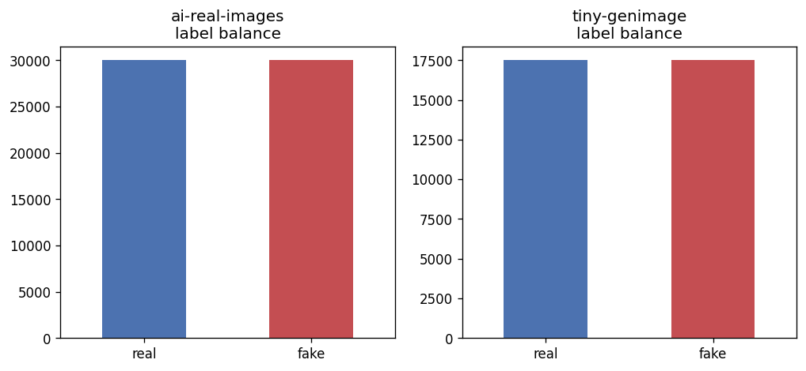
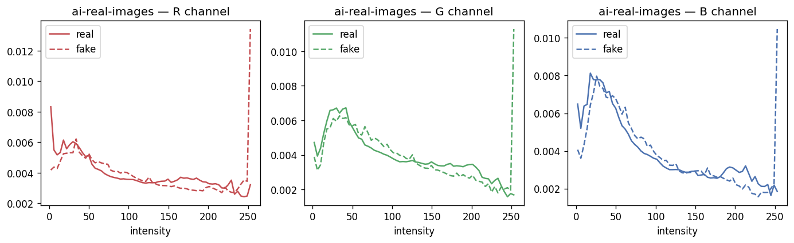
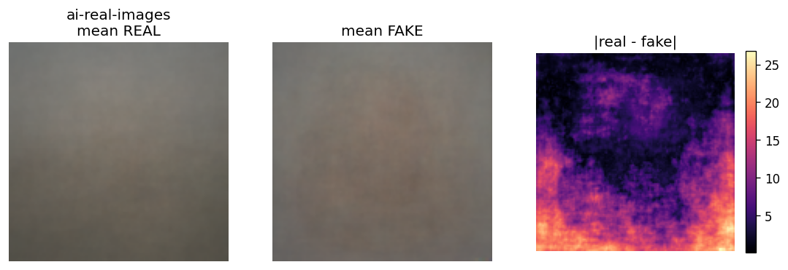
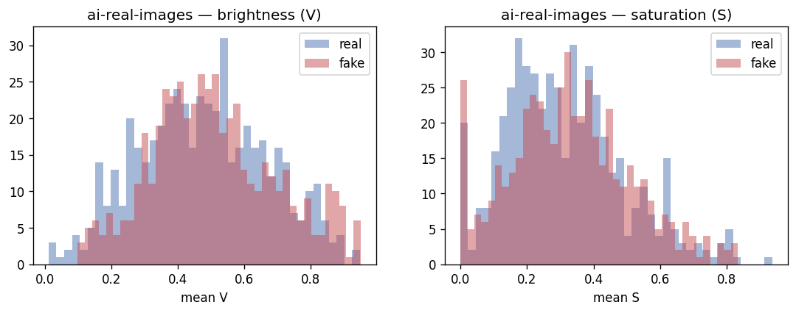
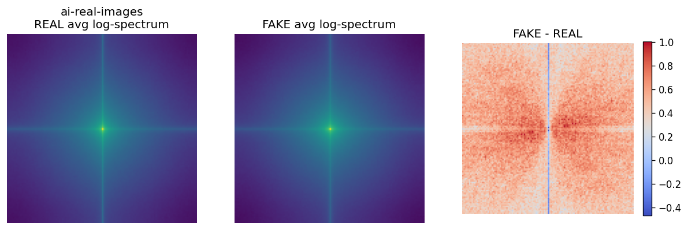
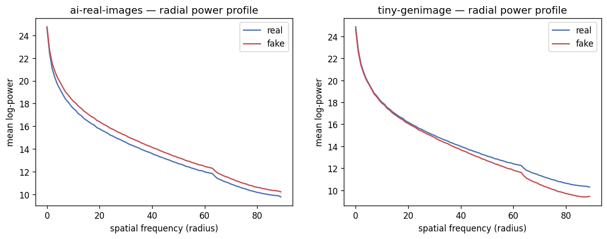
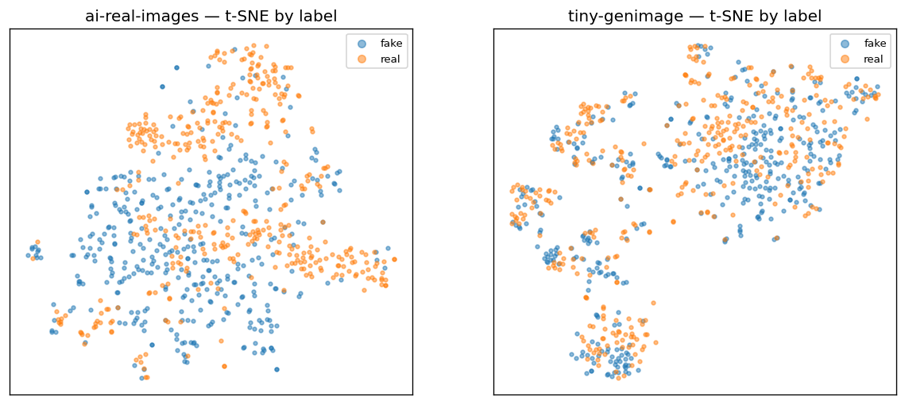
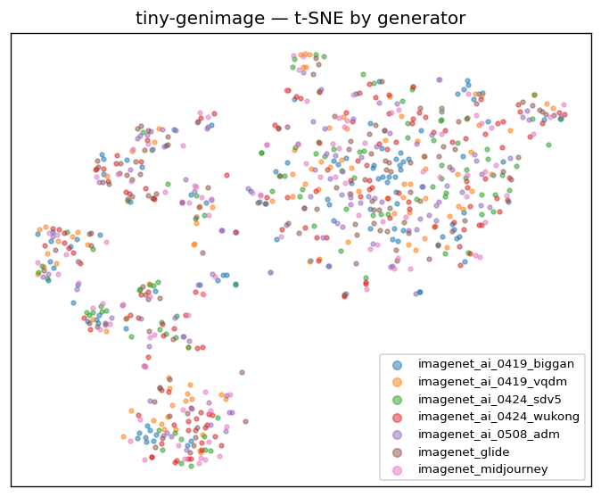
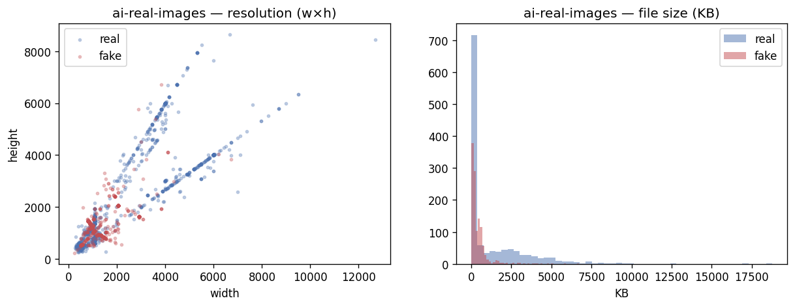

# 2 — Data: collection, EDA, cleaning, preprocessing

[← docs index](README.md) · [← 01 Overview](01-overview.md)

> **Notebooks:** [`00_data_collection`](../notebooks/00_data_collection.ipynb) ·
> [`01_eda`](../notebooks/01_eda.ipynb) · [`02_cleaning`](../notebooks/02_cleaning.ipynb) ·
> [`03_split_and_preprocessing`](../notebooks/03_split_and_preprocessing.ipynb)
> **Helpers:** [`utils/data.py`](../notebooks/utils/data.py) · [`utils/eda.py`](../notebooks/utils/eda.py) ·
> [`utils/clean.py`](../notebooks/utils/clean.py) · [`utils/datasets.py`](../notebooks/utils/datasets.py)

Everything downstream — every pipeline, every metric — rests on the data pipeline, so this stage gets
disproportionate care. The central danger in deepfake detection is not *under*-fitting but **learning the
wrong thing**: a model that scores 99% by reading a giveaway that has nothing to do with whether an image
is generated (image size, JPEG quantisation, a watermark, a colour cast). Such a model evaporates the
moment it meets data collected differently. This chapter explains how the four data notebooks turn two
raw Kaggle datasets into a clean, leak-free, shortcut-neutralised training set — and, just as
importantly, *why* each decision was made. The single most consequential of those decisions, the
**resolution-shortcut fix**, is in [§2.3.6](#236-the-resolution-shortcut--the-most-important-data-decision).

---

## 2.1 The two datasets, and why this pairing

The project deliberately uses **two** datasets with **disjoint generators**, because that pairing is what
makes the central research question — *does a detector generalize to generators it never saw?* —
measurable at all. If we trained and tested on the same generators, we would only learn how well a model
memorises a fixed set of fingerprints; by training on one family and testing on a completely different
one, we measure the **generalization gap** directly (quantified in [05-results §5.2](05-results.md#52-cross-generator-generalization-ood)).

| | `ai-real-images` (primary) | `tiny-genimage` (OOD probe) |
|---|---|---|
| **Role** | Training **and** in-distribution evaluation | Held-out **cross-generator** test — *never trained on* |
| **Kept images** | **59,882** | **34,998** |
| **Balance** | ~30k real / ~30k fake (≈ 50/50) | per-generator real/fake |
| **Real source** | photographs (Pexels / Unsplash / WikiArt) | "nature" photographs |
| **Generators** | Stable Diffusion + Midjourney + DALL·E | **7**: biggan, vqdm, sdv5, wukong, adm, glide, midjourney |
| **Native layout** | `train`/`test` × `{real, fake}` | `generator/{train,val}/{nature=real, ai=fake}` |
| **Kaggle slug** | `tristanzhang32/ai-generated-images-vs-real-images` | `yangsangtai/tiny-genimage` (a GenImage subset) |

Two design notes are worth dwelling on:

- **Why photographic, higher-resolution data.** An earlier candidate, CIFAKE, is 32×32 — too small for
  transfer learning from ImageNet backbones, too small for meaningful frequency analysis, and too small
  for a credible "upload your photo" app. It was considered and dropped. Working at photo resolution lets
  the same data serve the from-scratch CNNs (downscaled to 128²), the pretrained backbones (224²), and
  the native-resolution patch model — and keeps the app realistic.
- **Why `tiny-genimage` is sealed off.** It is treated strictly as a test set: no split of it is ever
  seen during training or hyperparameter search. Its seven generators include GAN-era (BigGAN), older
  diffusion (ADM, GLIDE), and newer diffusion (SDv5, Wukong) models, giving a spread of "distances" from
  the training generators. That spread is exactly why some of its generators turn out far harder than
  others ([05-results §5.2](05-results.md#52-cross-generator-generalization-ood)).

Datasets are **gitignored** — only the small per-dataset manifests live under `data/`; the image files
stay in the kagglehub cache, and manifests store absolute paths into it.

## 2.2 Collection and manifests (notebook 00)

[`00_data_collection`](../notebooks/00_data_collection.ipynb) downloads both datasets in one run with
**`kagglehub`** (`download_kaggle_dataset` in [`utils/data.py`](../notebooks/utils/data.py)), which caches
them locally and returns a path. The notebook then walks each dataset's folder tree and **infers** the
label, split, and generator/source from the directory names — so the rest of the project never hard-codes
a path or re-derives a label. The result is one CSV per dataset at `data/<name>/manifest.csv`:

| Column | Meaning |
|--------|---------|
| `filepath` | absolute path into the kagglehub cache |
| `label` | `real` / `fake` (inferred from the folder) |
| `split` | native split (`train` / `test` / `val`) |
| `source` | generator or origin (e.g. `imagenet_ai_0424_sdv5`, `pexels`) |
| `dataset` | which dataset the row belongs to |

This manifest-first design means every later notebook starts from a tabular view of the data and can
filter/slice it without touching the filesystem layout.

## 2.3 Exploratory data analysis (notebook 01)

EDA here does double duty: it **characterises** the data (so we know what we are dealing with) and it
**motivates the architectures** (several pipelines exist *because* of what EDA revealed). All figures are
saved under [`artifacts/eda/figures/`](../notebooks/artifacts/eda/figures/).

### 2.3.1 Class balance

Both datasets are essentially balanced (≈ 50/50 real/fake), and `tiny-genimage` is further broken down
across its seven generators. Balance matters because it lets us read accuracy and AUC without
class-imbalance caveats, and it justifies a 0.5 default decision threshold (later refined per pipeline on
validation — see [03 §3.4](03-shared-methods.md#34-metric-definitions-utilsmetricspy)).



### 2.3.2 Colour and pixel statistics

Per-channel intensity histograms and the **mean image** per class expose systematic colour/spatial
biases — for instance, generated images can sit at slightly different brightness or saturation than real
photos. This is a double-edged finding: it is genuine signal, but it is also exactly the kind of cue a
detector could over-rely on and fail to transfer. Seeing it here is *why* augmentation is kept light and
why normalization is handled carefully (§2.6).




### 2.3.3 Brightness and saturation

HSV brightness/saturation distributions are compared real-vs-fake; they tend to overlap heavily, which
reassures us that low-level colour statistics alone are not a trivial separator — the harder, more
transferable signal lives elsewhere (frequency and texture).



### 2.3.4 Frequency analysis — the empirical heart of the project

This is the most important EDA result and the direct motivation for three pipelines (`two-stream`,
`freqcross`, `srm-noise`). Generative models — especially those built on **upsampling / transposed
convolutions** — leave characteristic traces in the **frequency domain**: periodic artifacts, an altered
fall-off of high-frequency energy, and spectral peaks that real camera images do not have. These traces
are often invisible to the eye yet strongly discriminative, and — crucially — they can be **more stable
across generators** than semantic content, which is why frequency-aware models tend to hold up better
out-of-distribution.

Two views make this concrete:

- The **average 2D FFT log-magnitude spectrum** (per class). Real and generated spectra differ, most
  visibly in the high-frequency band (the periphery of the spectrum).
- The **azimuthally-averaged radial power profile** — the 2D spectrum collapsed to a 1-D curve of power
  vs. spatial frequency. This summarises the high-frequency fall-off in a single, easy-to-compare line
  and is fed directly (as a learned branch) into [`freqcross`](pipelines/freqcross.md).




> **Why this drives architecture.** If the discriminative signal lives partly in frequency, a pure-RGB
> CNN may under-use it. So we build models that consume frequency explicitly: a parallel FFT branch
> ([`two-stream`](pipelines/two-stream.md)), a three-way RGB+FFT+radial fusion
> ([`freqcross`](pipelines/freqcross.md)), and a high-pass noise-residual front-end
> ([`srm-noise`](pipelines/srm-noise.md)). These are not arbitrary — they are hypotheses generated by
> this plot.

### 2.3.5 Embedding t-SNE

Finally, images are embedded with a **frozen CLIP encoder**, reduced with PCA(50) → t-SNE(2), and plotted
coloured by label and by generator. Real and fake form largely separable clusters in CLIP's semantic
space, which both validates using CLIP features at all and foreshadows the
[`clip-probe`](pipelines/clip-probe.md) pipeline (a trained head on exactly these embeddings). Colouring
by generator also previews how different the seven OOD generators look from each other.




### 2.3.6 The resolution shortcut — the most important data decision

EDA surfaced a serious trap. In `ai-real-images`, the **real photographs are systematically larger and
heavier** than the generated images: the real images' shorter side is roughly twice that of the fakes,
and the fakes cluster tightly at canonical generator output sizes (256 / 512 / 1024 px). The metadata
distributions (`03_properties_*` figures) show this plainly.



Why this is dangerous: a model could achieve very high accuracy by simply learning *"large/high-detail →
real, small/512px → fake."* That is a **dataset-collection artifact**, not a property of generated
imagery — it would not transfer to a real photo saved at 512px, and it is a form of leakage between the
label and a trivial property. Left unaddressed, every in-distribution number in this project would be
suspect.

**The fix** (applied in preprocessing, §2.6.1): **every image is resized to a fixed 256×256 square**
before any model sees it (`Resize(shorter→256)` + `CenterCrop(256)`). This destroys the resolution and
aspect-ratio cue, forcing the models to rely on *content and texture* rather than image dimensions. It is
the single most important data-quality decision in the project, and it is the reason the in-distribution
results can be trusted as measuring detection skill rather than a collection quirk.

## 2.4 Cleaning (notebook 02)

Three problems must be removed before training, each for a concrete reason: **corrupt files** crash data
loading mid-epoch; **duplicate images** inflate metrics (the same picture counted many times) and can
silently bridge train and test; **train↔test leakage** invalidates the test set entirely. The cleaning
notebook addresses all three from a single disk read per image via
[`clean.scan_image`](../notebooks/utils/clean.py), which returns readability, a content hash, and a
perceptual hash together.

| Step | Mechanism | Why it matters |
|------|-----------|----------------|
| **Corrupt / truncated** | strict PIL decode (no `LOAD_TRUNCATED_IMAGES`) → a truncated file *raises* and is flagged | a single undecodable file can crash a long training run |
| **Exact duplicates** | **SHA-1** of the file bytes; identical hash ⇒ identical file | duplicates over-weight some samples and skew metrics |
| **Near-duplicates** | **DCT perceptual hash (pHash)** compared by **Hamming distance**; small distance ⇒ visually the same image | re-saves/re-compressions are not byte-identical but are effectively the same picture |
| **Train↔test leakage** | cross-split duplicate/near-duplicate check; the train copy is kept, the test copy dropped | an image appearing in both splits makes the test score meaningless |

A perceptual hash is used for near-duplicates precisely because a pixel-identical check (SHA-1) misses
the common case where the *same* image was re-encoded at a different quality or size — the bytes differ
but the picture does not. The notebook writes a cleaned manifest (`manifest_clean.csv`) with a boolean
`keep` column rather than deleting anything, so the decision is auditable.

| Dataset | Input | **Kept** | Dropped |
|---------|------:|---------:|--------:|
| `ai-real-images` | 60,000 | **59,882** | 118 |
| `tiny-genimage` | 35,000 | **34,998** | 2 |

## 2.5 Stratified split (notebook 03)

`ai-real-images` ships only `train` and `test`, so we carve a **stratified 10% validation split** out of
its training set (stratified on `label`, fixed seed 42) — stratification keeps the val set balanced, and
the seed makes the split reproducible. The **test split is left completely untouched**, so it remains a
clean measure of in-distribution performance, and `tiny-genimage` is reserved whole for OOD. Validation
is what every pipeline early-stops on and tunes its decision threshold on; test is touched only at the
very end.

| Split | Count | Used for |
|-------|------:|----------|
| train | **43,127** | training + Optuna search |
| val | **4,792** | early stopping, threshold tuning, Optuna objective (val AUC) |
| test | **11,963** | in-distribution evaluation only |

## 2.6 Preprocessing (notebook 03)

### 2.6.1 The 256² disk cache

Each kept image is decoded once, resized (`Resize(shorter→256)` + `CenterCrop(256)`), and written as a
`uint8` row into a per-split memory-mapped array — `cache/cache_{train,val,test}_256.npy` (~11 GB total),
built by [`datasets.build_cache`](../notebooks/utils/datasets.py) one image at a time (so it never blows
up RAM) and **idempotently** (a finished cache is skipped on re-run). The cache earns its disk cost twice
over:

1. **Speed** — training no longer pays for JPEG decode + resize every epoch; it reads contiguous `uint8`
   from a memmap, which keeps the GPU fed.
2. **Shortcut neutralisation** — because every row is already a fixed 256² square, the
   [resolution shortcut](#236-the-resolution-shortcut--the-most-important-data-decision) is gone by
   construction; no model can see the original dimensions.

### 2.6.2 Normalization stats

Normalization is per-input-family, resolved by `datasets.resolve_stats(norm, …)`:

| `norm` | Stats | Used by |
|--------|-------|---------|
| `"dataset"` | computed on our train cache | from-scratch / frequency CNNs (cnn-scratch, cnn-residual, two-stream, freqcross, srm-noise) |
| `"imagenet"` | standard ImageNet mean/std | pretrained backbones (cnn-finetune, vit-lora, patch-ensemble, dire-recon) |
| `"clip"` | CLIP's own preprocessing stats | clip-probe |

The `"dataset"` stats are streamed over the 43,127-image train cache by `datasets.compute_norm_stats`:

```json
{ "mean": [0.458, 0.430, 0.396], "std": [0.303, 0.286, 0.289], "size": 256, "split": "train", "n": 43127 }
```

Backbones use ImageNet stats because their pretrained weights expect that input distribution; CLIP uses
its own. Matching each model to the normalization its weights were trained under is a small but real
correctness detail.

### 2.6.3 Canonical transforms and the light-augmentation policy

Transforms are built with torchvision **transforms v2**:

- **Train** (from the 256 cache): `RandomResizedCrop(size, scale=(0.8,1.0))` → `RandomHorizontalFlip(0.5)`
  → `ToDtype(float32, scale=True)` → `Normalize`.
- **Eval / val / test / OOD / app**: deterministic `Resize(size)` + `CenterCrop(size)` → `ToDtype` →
  `Normalize`.

The augmentation is **deliberately light**, and this is a considered choice rather than an omission. The
artifacts these detectors rely on — subtle frequency fingerprints, fine texture statistics, compression
traces — are *exactly* what heavy augmentation destroys. Rotation, colour jitter, blur, JPEG
recompression, cutout, and mixup are all **excluded** from training: each would attenuate or erase the
very signal the model needs. (They are not wasted, though — JPEG/blur/noise reappear as *evaluation-time*
robustness perturbations, where the goal is precisely to measure how fast accuracy falls as that signal
is degraded; see [04-evaluation §4.4](04-evaluation.md#44-protocol-3--robustness).) A horizontal flip and
a mild crop are safe because they preserve those statistics while still reducing overfitting.

## 2.7 Datasets and loaders ([`utils/datasets.py`](../notebooks/utils/datasets.py))

The cache and transforms are wired into reusable PyTorch components:

- **`DeepfakeDataset(df, transform, source="cache"|"files")`** — returns `(CHW float tensor, label
  float)` with the convention **fake = 1.0 / real = 0.0**. It is **picklable** (the memmap is opened
  lazily per DataLoader worker), which is what allows multi-worker loading on Windows.
- **`make_loaders(manifest_split_path, working_size, batch_size, norm, num_workers)`** → `{train, val,
  test}` DataLoaders, with the augmenting transform + shuffle on train and deterministic transforms on
  val/test.
- **`make_ood_loader(tiny_manifest, size, …)`** → a loader over all `tiny-genimage` rows, read from files
  with the eval transform matched to the model's size/norm — the basis of the cross-generator protocol.
- **`PatchBagDataset` / `make_patch_loaders` / `make_patch_ood_loader`** → return `(K, 3, patch, patch)`
  bags of **native-resolution** crops (train = random crops, eval = a deterministic grid) for the
  [`patch-ensemble`](pipelines/patch-ensemble.md) pipeline, which deliberately works *before* the 256
  resize to keep native detail.

With clean, balanced, leak-free, shortcut-neutralised data and a fast cache behind a uniform loader API,
every pipeline in [03-shared-methods](03-shared-methods.md) and [pipelines/](pipelines/README.md) starts
from the same trustworthy footing.

Next: [03-shared-methods.md →](03-shared-methods.md)
