# 5 — Results & comparison

[← docs index](README.md) · [← 04 Evaluation](04-evaluation.md)

This is the chapter the whole project builds toward. Everything before it — the data hygiene of
[02-data](02-data.md), the shared training and metric machinery of
[03-shared-methods](03-shared-methods.md), the ten pipelines, the three evaluation protocols of
[04-evaluation](04-evaluation.md) — exists so that the numbers here can be *trusted* and *compared on a
level field*. The point of the comparison is not to crown a single winner. It is to answer the scientific
question the project was framed around: **does in-distribution skill translate into cross-generator
deployment skill, and if not, what kind of model closes the gap?** Read with that lens, the most
important columns are not the in-distribution AUCs (where almost everything looks excellent) but the
**OOD accuracy** and the **generalization gap** in [§5.2](#52-cross-generator-generalization-ood).

All numbers below are read from each pipeline's `metrics.json` and the aggregated
[`artifacts/evaluation/*.csv`](../notebooks/artifacts/evaluation/). Figures link into the same tree. Every
pipeline is scored by the **same** harness on the **same** held-out test set, so differences reflect the
models, not the measurement.

> **`dire-recon` caveat.** Its in-distribution numbers are on a **2,000-image subsample** (the diffusion
> reconstruction is compute-heavy), so they are not directly comparable to the other pipelines' full
> 11,963-image test results. Flagged with \* throughout. Treat its row as indicative rather than
> head-to-head: a 2,000-image estimate has materially wider error bars than an 11,963-image one, and the
> subsample was drawn precisely because running DDIM invert-and-reconstruct over the full test set was
> not affordable.

---

## 5.1 In-distribution (ai-real-images test, n = 11,963)

This is the "can the model do the task at all" table — train and test draw from the **same** three
generators (Stable Diffusion, Midjourney, DALL·E), so it measures detection skill under the friendliest
possible conditions. The numbers are reported on the untouched test split defined in
[02-data §2.5](02-data.md#25-stratified-split-notebook-03); no model ever saw these 11,963 images during
training or hyperparameter search.

Sorted by AUC-ROC. (`acc_t` = accuracy at the val-tuned threshold.)

| Pipeline | Acc | F1 | **AUC** | PR-AUC | Prec | Rec | MCC | Brier | acc_t |
|----------|:---:|:--:|:-------:|:------:|:----:|:---:|:---:|:-----:|:-----:|
| vit-lora | 0.9782 | 0.9782 | **0.9972** | 0.9969 | 0.9784 | 0.9779 | 0.9564 | **0.0172** | 0.9781 |
| patch-ensemble | 0.9681 | 0.9681 | 0.9963 | 0.9960 | 0.9863 | 0.9493 | 0.9368 | 0.0229 | 0.9739 |
| cnn-finetune | 0.9559 | 0.9559 | 0.9930 | 0.9936 | 0.9432 | 0.9702 | 0.9123 | 0.0357 | 0.9585 |
| clip-probe | 0.9592 | 0.9592 | 0.9930 | 0.9932 | 0.9610 | 0.9572 | 0.9184 | 0.0318 | 0.9578 |
| freqcross | 0.9003 | 0.9001 | 0.9651 | 0.9667 | 0.9310 | 0.8645 | 0.8026 | 0.0749 | 0.9048 |
| cnn-scratch | 0.9011 | 0.9011 | 0.9648 | 0.9664 | 0.9140 | 0.8854 | 0.8026 | 0.0735 | 0.9014 |
| two-stream | 0.8977 | 0.8977 | 0.9609 | 0.9604 | 0.9019 | 0.8923 | 0.7954 | 0.0862 | 0.8982 |
| srm-noise | 0.8824 | 0.8824 | 0.9518 | 0.9486 | 0.8897 | 0.8728 | 0.7649 | 0.0855 | 0.8810 |
| dire-recon \* | 0.8730 | 0.8730 | 0.9399 | 0.9308 | 0.8791 | 0.8650 | 0.7461 | 0.1058 | 0.8645 |
| cnn-residual | 0.7868 | 0.7864 | 0.8672 | 0.8563 | 0.7625 | 0.8327 | 0.5762 | 0.1505 | 0.7883 |

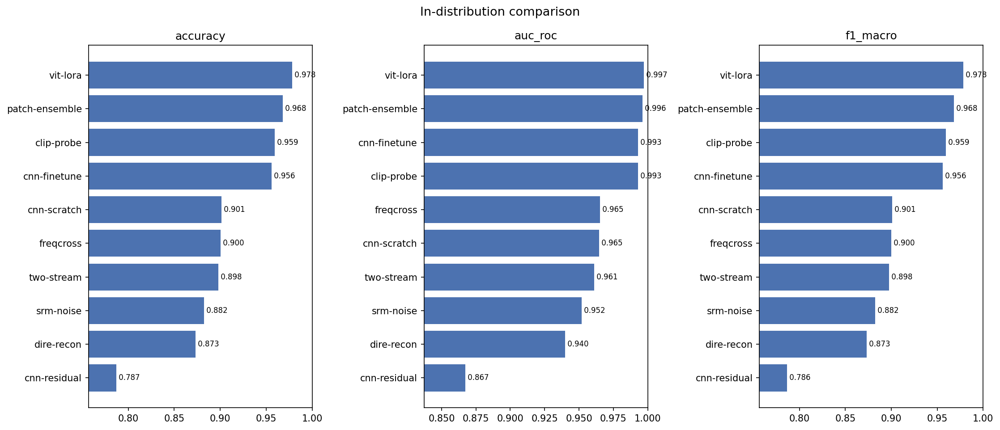
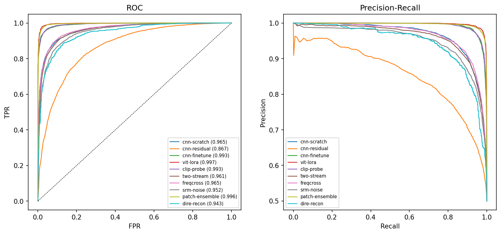
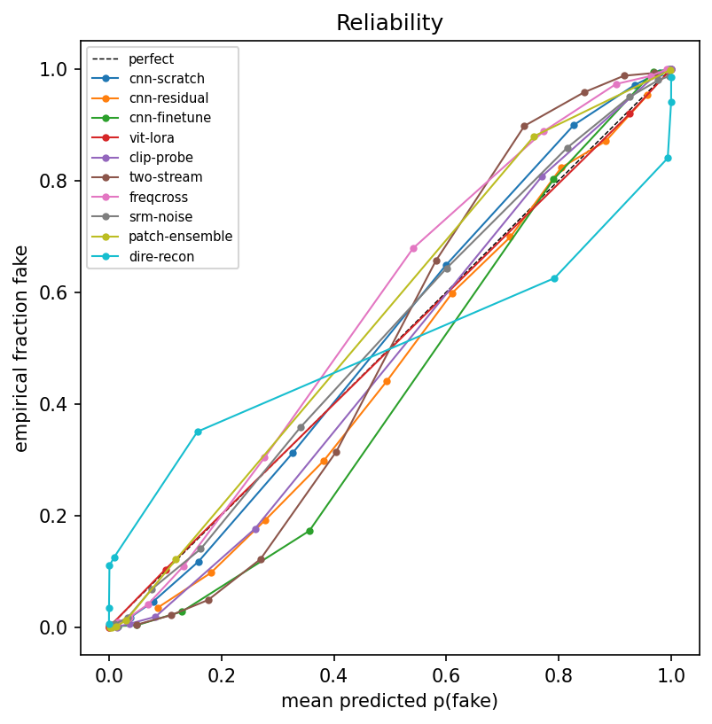
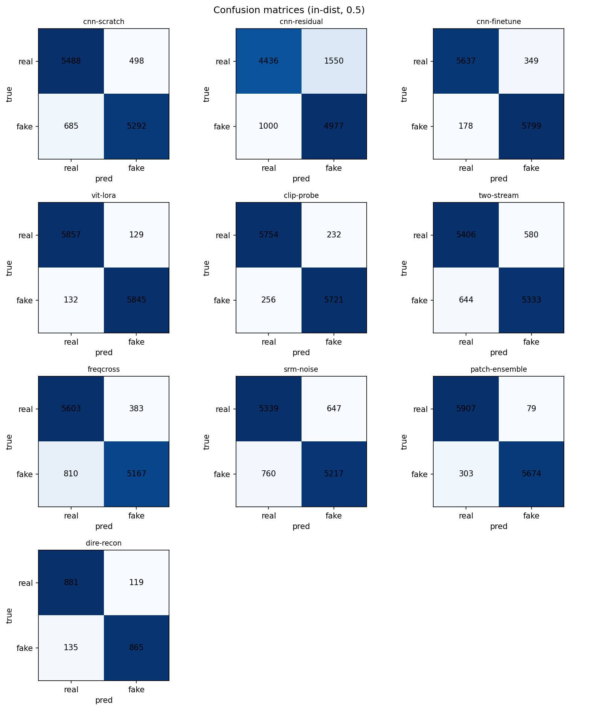

**Read:** the four 224-px pipelines (vit-lora, patch-ensemble, cnn-finetune, clip-probe) all clear
0.99 AUC; the 128-px from-scratch/frequency CNNs sit in the 0.95–0.97 band; `cnn-residual` is the clear
laggard (0.867). Calibration tracks capacity — `vit-lora` has the lowest Brier (0.017), `cnn-residual`
the highest (0.151).

The table tells a clean, almost monotone story, and it is worth unpacking *why* the ranking falls out the
way it does. The top cluster shares one decisive ingredient: **224-px input plus a strong prior**. Three
of the four ride pretrained ImageNet/CLIP backbones (vit-lora, cnn-finetune, clip-probe) and the fourth
(patch-ensemble) preserves native-resolution detail by classifying full-resolution patches before the 256
resize. Both routes give the model more *and finer* pixels to read the subtle generative fingerprints
from. The 128-px from-scratch and frequency CNNs are working at a quarter of the spatial resolution with
no pretraining to lean on, so it is unsurprising — and reassuring, as a sanity check on the harness — that
they land a clean tier below at 0.95–0.97. In other words, the in-distribution ranking is largely a
ranking of **input resolution × prior strength**, not of architectural cleverness; the clever-architecture
payoff, if any, shows up later in [§5.2](#52-cross-generator-generalization-ood).

A few columns deserve a second look because accuracy alone hides them. `patch-ensemble` posts the
**highest precision** in the table (0.9863) but a noticeably lower recall (0.9493): it almost never calls a
real image fake, but it lets more fakes slip through as real — a conservative operating point that the
val-tuned threshold then nudges back (acc 0.9681 → 0.9739). `cnn-finetune` sits at the opposite balance
(precision 0.9432, recall 0.9702): it is eager to shout "fake," catching more of them at the cost of more
false alarms on real photos. Which of these is "better" is a deployment decision, not a leaderboard one —
it depends entirely on whether a missed fake or a slandered real photo is the costlier mistake, which is
exactly why we report precision/recall and MCC rather than collapsing everything to accuracy.

> **Why the Brier column matters as much as AUC.** AUC says *can the model rank a fake above a real*; the
> Brier score says *are its probabilities honest enough to act on a fixed threshold.* A model can rank
> perfectly yet be badly over-confident, and an over-confident detector is dangerous in an app where a
> user reads `p_fake = 0.97` as near-certainty. Brier tracking capacity here (vit-lora 0.017 →
> cnn-residual 0.151, an order of magnitude apart) means the strong models are not just better rankers,
> they are better-calibrated — their 0.9 really does behave like 0.9. The reliability overlay above is the
> visual form of this column.

## 5.2 Cross-generator generalization (OOD)

This is the table the project is really about. In-distribution numbers tell us a model can recognise the
three generators it trained on; they say almost nothing about whether it has learned *what makes an image
generated* versus *what makes a Stable-Diffusion-image look like a Stable-Diffusion-image.* The only way
to separate those two is to test on generators the model has **never seen**. Here every pipeline is
trained on `ai-real-images` and then evaluated, untouched, on the seven held-out generators of
`tiny-genimage` (BigGAN, VQDM, SDv5, Wukong, ADM, GLIDE, Midjourney) — the disjoint-generator pairing set
up in [02-data §2.1](02-data.md#21-the-two-datasets-and-why-this-pairing).

Train on `ai-real-images`, test on `tiny-genimage`'s 7 unseen generators. Sorted by OOD accuracy.

| Pipeline | In-dist acc | **OOD acc** | **Gen. gap** | Lift over random |
|----------|:-----------:|:-----------:|:------------:|:----------------:|
| patch-ensemble | 0.9681 | **0.6775** | **0.291** | +0.177 |
| vit-lora | 0.9782 | 0.6022 | 0.376 | +0.102 |
| clip-probe | 0.9592 | 0.5837 | 0.376 | +0.083 |
| cnn-finetune | 0.9559 | 0.5636 | 0.392 | +0.063 |
| freqcross | 0.9003 | 0.5526 | 0.348 | +0.052 |
| cnn-scratch | 0.9011 | 0.5488 | 0.352 | +0.049 |
| dire-recon | 0.8730 | 0.5415 | 0.332 | +0.041 |
| two-stream | 0.8977 | 0.5264 | 0.371 | +0.026 |
| srm-noise | 0.8824 | 0.5231 | 0.359 | +0.023 |
| cnn-residual | 0.7868 | 0.5190 | 0.268 | +0.019 (≈ chance) |

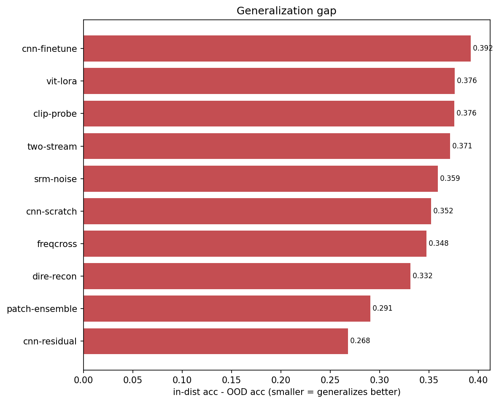
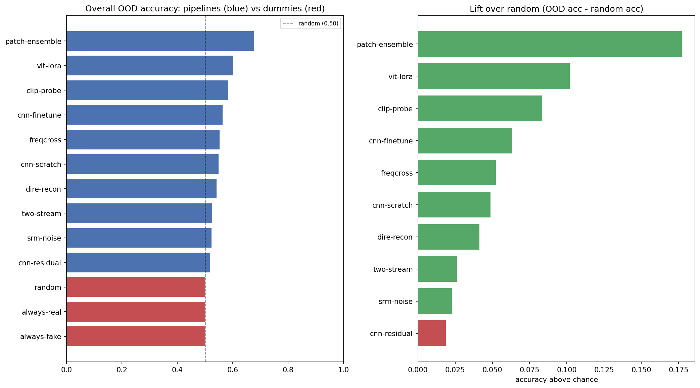
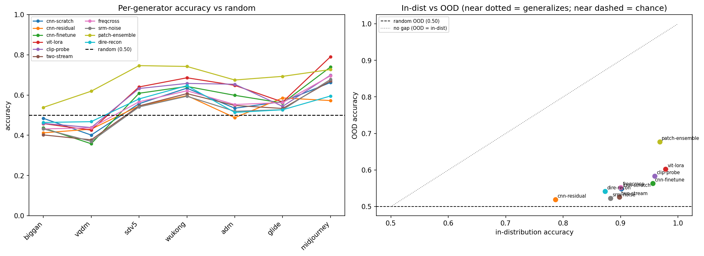

The first thing to notice is that **the leaderboard reshuffles completely**. `vit-lora`, the runaway
in-distribution champion (0.9972 AUC), drops to *second* on OOD, while `patch-ensemble` — which was second
in-distribution — takes a commanding lead (0.6775, more than seven points clear of the field). The second
thing is the **scale of the collapse**: every model sheds roughly 30–40 accuracy points moving from its
own generators to unseen ones. Even the most robust model, `patch-ensemble`, loses 29 points (0.968 →
0.678). This is the generalization gap made concrete, and it is the empirical core of the project's
argument. The "Lift over random" column reframes the same result against a brutal baseline (an
always-fake / chance floor): the best model is only +0.177 above chance on unseen generators, and the
bottom half of the table is within a few points of coin-flipping. A detector you would happily ship on
its in-distribution numbers can be **barely better than guessing** the moment a new generator appears —
which is precisely the deployment reality these models would face, since the generator landscape changes
faster than any training set.

**Per-generator** (overall heatmap below). Across **every** pipeline the hardest generators are **VQDM**
and **BigGAN** (most models 0.36–0.54) and the easiest is **Midjourney** (0.57–0.79), with **Wukong**
and **SDv5** in between — i.e. the GAN/older-diffusion generators that differ most from the
SD/Midjourney/DALL·E training mix transfer worst.

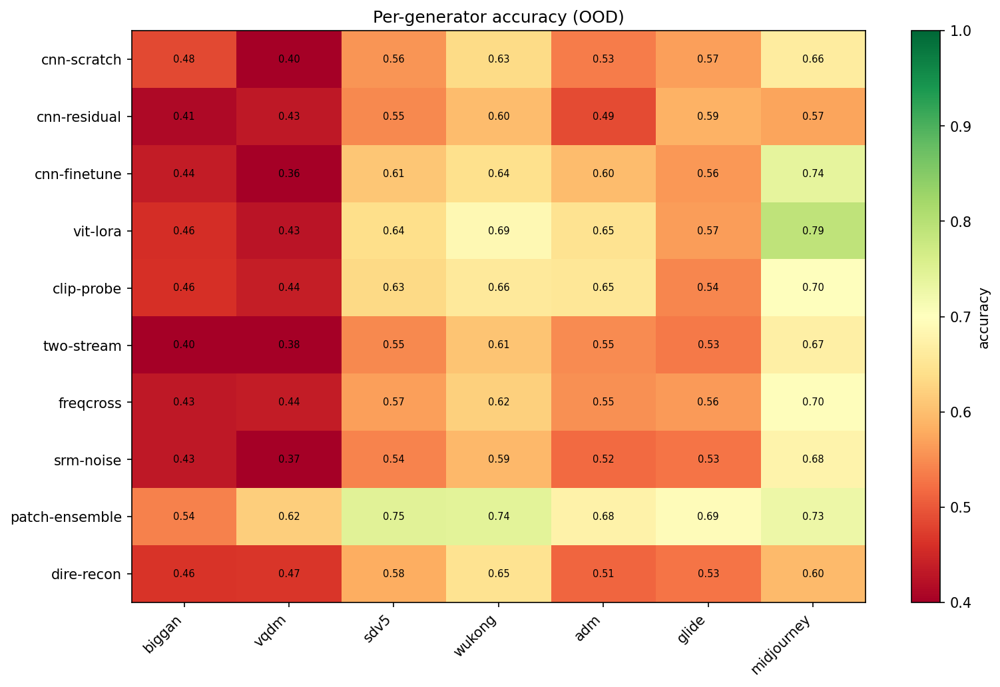

The heatmap is more informative than the aggregate column because the difficulty ordering is **stable
across architectures** — the columns light up and go dark together. That consistency is itself a finding:
it means OOD difficulty is largely a property of *how far a generator sits from the training distribution*,
not of any single model's blind spot. Midjourney is easiest because the training mix already contains
Midjourney-family imagery, so it is barely "out" of distribution at all; the GAN-era BigGAN and the older
diffusion VQDM are hardest because their synthesis processes — and therefore their frequency and texture
fingerprints — are the most alien to anything the models saw. The practical reading is that a detector's
cross-generator score is dominated by **distributional distance**, so the way to harden a real detector is
to widen the *variety* of generators it trains on, not merely to add more images from the same few.

## 5.3 Robustness

A detector that only works on pristine images is of limited use: real uploads are JPEG-compressed,
resized by social platforms, softened by phone cameras, and occasionally noisy. This protocol stress-tests
that fragility directly by applying each perturbation at increasing strength and watching accuracy fall.
Crucially, these perturbations were deliberately **excluded from training augmentation** (see
[02-data §2.6.3](02-data.md#263-canonical-transforms-and-the-light-augmentation-policy)) so that this is a
genuine out-of-the-box robustness measurement, not a test of augmentation the models already rehearsed.

Accuracy vs. increasing perturbation strength (JPEG, blur, downsample, noise) over a test subsample, for
the **image-family** pipelines (see [04-evaluation §4.4](04-evaluation.md#44-protocol-3--robustness)).
Produced by [`eval-robustness.ipynb`](../notebooks/eval-robustness.ipynb):

- `notebooks/artifacts/evaluation/robustness_summary.csv` — clean / mean-perturbed / worst accuracy per pipeline.
- `notebooks/artifacts/evaluation/figures/robustness_curves.png` — the 2×2 curve grid.

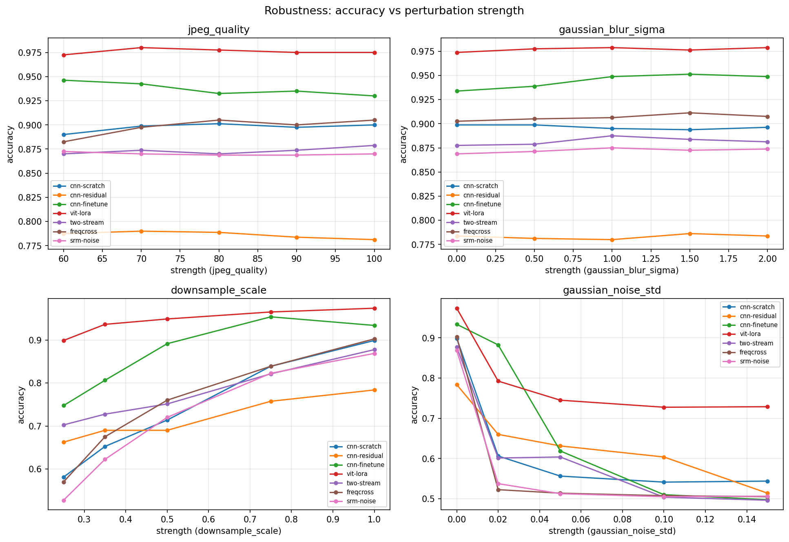

**Summary** (`robustness_summary.csv`), image-family pipelines only, sorted by mean accuracy across all
perturbed conditions:

| Pipeline | Clean acc | Mean-perturbed | Worst-case |
|----------|:---------:|:--------------:|:----------:|
| vit-lora | 0.975 | **0.923** | **0.728** |
| cnn-finetune | 0.930 | 0.859 | 0.498 |
| cnn-scratch | 0.900 | 0.790 | 0.541 |
| two-stream | 0.879 | 0.787 | 0.496 |
| freqcross | 0.905 | 0.786 | 0.505 |
| srm-noise | 0.870 | 0.760 | 0.505 |
| cnn-residual | 0.781 | 0.731 | 0.514 |

**`vit-lora` is comfortably the most robust** (mean-perturbed 0.923, and the only model whose worst case
stays above 0.7), with `cnn-finetune` second — the same 224-px pretrained models that led in-distribution
also hold their accuracy best under perturbation. (`cnn-residual` shows the *smallest* spread, but only
because it starts lowest; a model already near chance has little left to lose.)

The headline finding, though, is *which* perturbations matter — and it **overturns the going-in
assumption**. Averaged across the seven pipelines, accuracy falls from the clean level to the strongest
level of each perturbation as follows:

| Perturbation (clean → strongest) | Mean accuracy drop | Verdict |
|----------------------------------|:------------------:|---------|
| Gaussian noise (σ → 0.15) | **0.350** | devastating |
| Downsample (scale → 0.25×) | **0.221** | severe |
| JPEG quality (→ 60) | 0.003 | negligible |
| Gaussian blur (σ → 2.0) | ≈ 0 | negligible |

The detectors are **remarkably robust to JPEG compression and blur** — dropping JPEG quality all the way
to 60, or blurring at σ=2, costs essentially nothing — yet they **collapse under additive noise** and
degrade sharply under heavy downsampling. The noise collapse is steep and immediate: the
frequency-reliant models lose most of their skill at the *mildest* noise level tested (e.g. `freqcross`
0.902 → 0.522 at σ=0.02, `srm-noise` 0.869 → 0.537, `two-stream` 0.877 → 0.601), whereas `vit-lora` only
eases to 0.792 and bottoms out at 0.729.

> **Why noise and downsampling — not compression — are the threat.** All four perturbations were expected
> to hurt by attacking the high-frequency band where the generative fingerprints live (per the frequency
> EDA in [02-data §2.3.4](02-data.md#234-frequency-analysis--the-empirical-heart-of-the-project)). The data
> refines that picture sharply. JPEG-to-Q60 and mild blur evidently leave *enough* of the discriminative
> structure intact for these models to keep deciding correctly — a genuinely reassuring result for a real
> app, where uploads are routinely re-compressed and softened. **Additive noise is the exception**: it does
> not merely attenuate the high-frequency band, it *floods it with random energy*, swamping the subtle
> forensic residuals. That is exactly why the explicitly frequency-aware models (freqcross, srm-noise,
> two-stream) turn out to be the **most** noise-fragile rather than the most robust — the cue they stake
> their decision on is the first casualty — while `vit-lora`, reading more global/semantic structure, is
> the most noise-tolerant. The engineering lesson is that the robustness property to design for here is
> **noise tolerance, not compression tolerance**, and that a model's reliance on the high-frequency band is
> simultaneously its in-distribution strength and its robustness weakness.

## 5.4 Multi-component pipelines (fusion vs. single stream)

Two pipelines do not produce a single score but fuse several specialised branches, and they let us ask a
sharper question than "is the model good?": **does adding a frequency view actually buy anything over a
plain RGB CNN, or is it decoration?** Because each branch also emits its own auxiliary prediction, we can
read the contribution of every stream in isolation and against the fused output.

For `two-stream` (RGB + FFT) and `freqcross` (RGB + FFT + radial), each notebook's §6 reports the
per-stream auxiliary heads alongside the fused output. In both cases **fusion beats either stream
alone**: the spatial (RGB) stream is the strongest individual branch, the **frequency** and **radial**
branches are much weaker on their own, but adding them lifts the fused score (and matters more OOD, where
frequency artifacts are more generator-stable). The branch-attention weights are visualised in
[`freqcross/figures/fusion_attention.png`](../notebooks/artifacts/freqcross/figures/fusion_attention.png).
See [two-stream](pipelines/two-stream.md) and [freqcross](pipelines/freqcross.md) for the per-component
breakdown.

The pattern is exactly what the frequency EDA predicted and worth stating plainly: the frequency and
radial branches are **poor stand-alone classifiers but useful complements**. Alone, a spectrum-only CNN
throws away the rich semantic and textural content an RGB CNN exploits, so it under-performs badly. But the
errors a frequency branch makes are *different* from the errors an RGB branch makes — it catches some fakes
the spatial stream is fooled by — so fusing them recovers signal that neither has alone. This is the
classic ensemble argument, and it explains why fusion lifts the in-distribution number only modestly yet
matters more out-of-distribution: the frequency fingerprint is one of the few cues that stays comparatively
**stable across generators**, so when the semantic cues stop transferring, the frequency branch is carrying
relatively more of the load.

## 5.5 Hyperparameter search (Optuna)

The comparison is only fair if each tuned pipeline was given a comparable chance to find good
hyperparameters, so this section documents that search rather than burying it. Eight of the ten pipelines
were tuned with Optuna (TPE sampler + MedianPruner, maximising validation AUC); `cnn-scratch` and
`cnn-residual` were deliberately left on fixed hyperparameters as the "no-tuning" reference points — a
caveat that matters for reading `cnn-residual`'s result below.

Source: [`optuna_best_params.csv`](../notebooks/artifacts/evaluation/optuna_best_params.csv) (notebooks
06–13; `cnn-scratch`/`cnn-residual` are not Optuna-tuned). `best val AUC` is the search objective.

| Pipeline | best val AUC | trials | complete | pruned | loss |
|----------|:-----------:|:------:|:--------:|:------:|:----:|
| vit-lora | 0.9966 | 12 | 6 | 6 | focal |
| patch-ensemble | 0.9942 | 8 | 8 | 0 | focal |
| clip-probe | 0.9940 | 80 | 37 | 43 | focal |
| dire-recon | 0.9441 | 20 | 9 | 11 | bce |
| freqcross | 0.9338 | 20 | 7 | 13 | bce |
| srm-noise | 0.9324 | 24 | 11 | 13 | bce |
| two-stream | 0.9321 | 20 | 5 | 15 | focal |
| cnn-finetune | 0.9922 | 12 | 7 | 5 | focal |

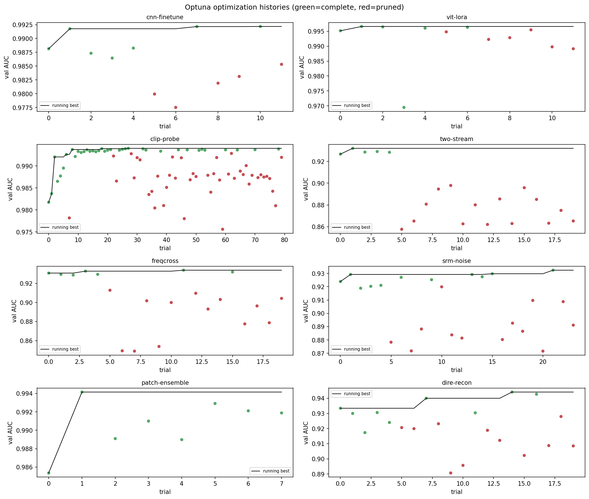
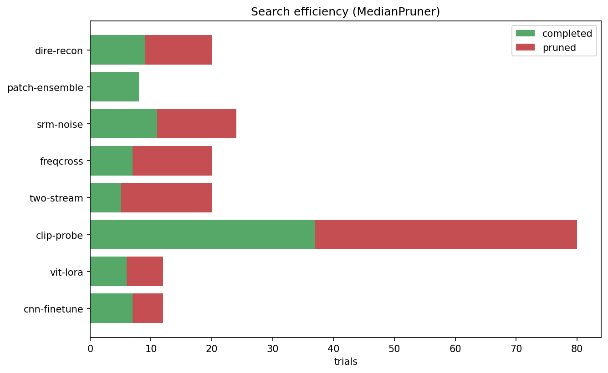

**Pattern:** **focal loss** won for the high-capacity backbones (vit-lora, cnn-finetune, clip-probe,
patch-ensemble), while **BCE** won for the smaller forensic/frequency nets (freqcross, srm-noise) and
dire-recon. MedianPruner is doing real work — `clip-probe` pruned 43/80 trials and `two-stream` 15/20.

That loss-function split is not a coincidence — it lines up with model capacity in a sensible way. Focal
loss down-weights the easy, confidently-correct examples and concentrates gradient on the hard, ambiguous
ones; a high-capacity backbone has the headroom to chase those hard cases and benefits from being pushed
toward them. The smaller forensic nets have less capacity to spare, so plain BCE — which treats every
example evenly — turns out to be the steadier objective for them. The pruning statistics are equally worth
reading as a story about **search efficiency**: `clip-probe` runs the deepest search (80 trials) because
its frozen-backbone setup makes each trial cheap, and MedianPruner kills 43 of them early once they are
clearly trailing the running median — so the headline 0.9940 was found without paying for 80 full
trainings. Conversely `patch-ensemble` completes all 8 of its trials (none pruned) because each is
expensive enough that a short, un-pruned search was the right budget. The takeaway for the comparison is
that the tuned pipelines were genuinely tuned, which makes the two **un-tuned** baselines the only
asterisks on the field.

---

## Discussion

### The "CLIP generalizes best" hypothesis was *not* confirmed
Going in, the expectation (from the literature and the EDA t-SNE) was that **`clip-probe`** — a trained
head on frozen CLIP embeddings — would generalize best to unseen generators, because semantic embeddings
should flag "deviation from the real manifold" rather than generator-specific low-level artifacts.
**The data disagrees:** `clip-probe` is only **3rd** on OOD (0.584), behind **`patch-ensemble`** (0.677,
the clear winner) and `vit-lora` (0.602). The likely reason: at **native-resolution patches**,
`patch-ensemble` preserves the high-frequency texture statistics that distinguish generated from real
images *more consistently across generators* than CLIP's semantic features, and its gated-attention MIL
can focus on the most artifact-bearing patches. CLIP's head, by contrast, still latches onto
`ai-real-images`-specific cues. This is the project's most interesting scientific result and a good
counter-example to "foundation embeddings always generalize best."

It is worth dwelling on *why* this reversal happens, because it sharpens what the patch model is actually
doing. CLIP was trained to capture **semantic** content — what an image is *of* — and the cue that survives
across generators there is whatever about "AI-image-ness" leaked into CLIP's semantic space during its own
pretraining. That is a real signal (clip-probe still clears chance comfortably and is mid-pack on OOD), but
it is also partly entangled with the look of the *specific* training generators, so it transfers
imperfectly. `patch-ensemble` attacks the problem from the opposite end: it never down-samples to 256, it
classifies many **native-resolution crops**, and its gated-attention MIL learns to up-weight the patches
that carry the most forensic evidence. Low-level synthesis artifacts — upsampling traces, texture
statistics, local frequency structure — turn out to be a *more generator-stable* tell than high-level
semantics, and working at native resolution is what keeps those artifacts legible. The lesson is not that
foundation embeddings are bad, but that for this task the **transferable signal lives lower in the stack
than expected**, and the architecture that best exposes that low-level signal wins out-of-distribution.

### The generalization gap is real and large
Every pipeline beats a random/always-fake floor on OOD — but only barely for half of them. OOD accuracy
clusters in **0.52–0.68** versus **0.79–0.98** in-distribution; the smallest gap (patch-ensemble, 0.291)
still represents a ~30-point drop. `cnn-residual` is essentially at chance OOD (0.519). The takeaway: high
in-distribution AUC says almost nothing about cross-generator deployment, which is exactly why the
cross-generator protocol is the centre of this project.

To make the deployment implication explicit: a stakeholder shown only [§5.1](#51-in-distribution-ai-real-images-test-n--11963)
would reasonably conclude that this problem is "solved" — four models above 0.99 AUC, the worst still at
0.87. [§5.2](#52-cross-generator-generalization-ood) shows that conclusion is an illusion created by
testing on the training generators. The moment a genuinely new generator appears — which, in the real
world, happens every few months — the *best* of these detectors operates at 68% accuracy and most operate
near 55%. That is the single most important caveat to attach to any number in this report, and it is the
reason the project insists on reporting the cross-generator protocol with at least as much prominence as
the in-distribution one. The honest summary line for a deployed detector is its **OOD** accuracy, not its
in-distribution AUC.

### Per-generator structure
The ordering (VQDM/BigGAN hardest → Midjourney easiest) is stable across architectures, suggesting the
difficulty is a property of how far each generator's statistics sit from the training generators, not of
any one model. GAN/older-diffusion generators (BigGAN, VQDM) are the stress test.

This stability is what lets us read the per-generator results as a *map of distributional distance* rather
than a list of model quirks. Because the hard generators are hard for everyone and the easy one is easy for
everyone, the difficulty is anchored in the data, not the detector: Midjourney sits closest to the training
mix (which already contains Midjourney-style imagery), while BigGAN's GAN synthesis and VQDM's older
diffusion produce fingerprints least like anything in training. The practical consequence for anyone
building on this work is concrete — to raise the *floor* of cross-generator performance, broaden the
**variety** of generator families in the training set (especially adding GAN-era and older-diffusion
sources), rather than simply scaling up images from the same handful of modern generators, which mostly
improves the already-easy cases.

### Robustness: additive noise, not compression, is the real threat
The robustness sweep ([§5.3](#53-robustness)) overturned the going-in assumption. We expected JPEG
compression and blur — both low-pass filters that strip the high-frequency band — to be the most
damaging perturbations. In fact the detectors shrug them off: dropping JPEG quality to 60 or blurring at
σ=2 costs essentially nothing (mean accuracy change ≈ 0). The genuine vulnerabilities are **additive
Gaussian noise** (mean drop 0.350) and **downsampling** (0.221). Most tellingly, the explicitly
frequency-aware models — the very ones built to exploit the high-frequency band — are the **most**
noise-fragile, not the most robust: `freqcross` falls from 0.90 to 0.52 at the mildest noise level
(σ=0.02), and `srm-noise` and `two-stream` collapse similarly, while `vit-lora` (worst-case 0.729) is by
far the most noise-tolerant. The mechanism is consistent with the rest of this report: noise floods
exactly the band those detectors stake their decision on, whereas `vit-lora` reads more global, semantic
structure that random noise leaves comparatively intact. The deployment lesson mirrors the generalization
one — the cue that makes a frequency detector sharp in the lab is also its single point of failure in the
wild, so the property to engineer for is **noise tolerance, not compression tolerance**. It also nuances
the §5.1 ranking: `cnn-finetune` and `vit-lora` lead both in-distribution *and* under perturbation, but
the frequency models that looked competitive in-distribution are the most brittle once the input is noisy.

### `cnn-residual` under-performs — a caveat to explain
A deeper pre-activation residual net **with SE attention and EMA** scoring **below** the plain
`cnn-scratch` baseline (0.867 vs 0.965 AUC) is a red flag rather than an expected result. The most likely
cause is optimisation: `cnn-scratch`/`cnn-residual` are the two pipelines that are **not** Optuna-tuned
(fixed hyperparameters), and the residual net's larger capacity is more sensitive to LR/regularisation.
It is a valid trained model, but if the result is reported it should be framed as "needs an Optuna pass
to be a fair comparison," not as "residual + attention hurts."

The reasoning behind that framing is worth spelling out, because the result is genuinely
counter-intuitive: residual connections, SE attention, and EMA weight-averaging are each individually
well-established to *help*, so a net combining all three landing below the bare baseline almost certainly
indicates a training problem, not an architectural one. Larger, deeper models have sharper, less forgiving
loss landscapes — the learning rate, weight decay, and warmup that happen to suit the small `cnn-scratch`
are very unlikely to be near-optimal for the residual net, and a mis-set LR alone can cost double-digit
AUC. Because this is the one strong-architecture model that never received a hyperparameter search, the
fair scientific statement is that *its current number reflects un-tuned optimisation, not the ceiling of
the architecture.* Running the same Optuna search the other pipelines got is the obvious follow-up, and
until then `cnn-residual` should be read as an incomplete experiment rather than evidence against residual
designs.

### Calibration & threshold tuning
Brier scores track capacity (vit-lora 0.017 → cnn-residual 0.151). Val-tuned thresholds move accuracy
only marginally for the strong models but help the precision/recall balance for `patch-ensemble`
(0.968 → 0.974) and `freqcross` (0.900 → 0.905), confirming the value of tuning the threshold on
validation rather than fixing 0.5.

The general principle is that the **decision threshold and the model are separate knobs**, and tuning the
threshold on validation costs nothing yet recovers free accuracy wherever a model's natural operating point
is off-centre. The strong, well-calibrated models barely move because their probability mass is already
cleanly split around 0.5 — there is little to gain. The models that benefit are the ones, like
`patch-ensemble`, whose default operating point is lopsided (recall the high-precision/lower-recall profile
from [§5.1](#51-in-distribution-ai-real-images-test-n--11963)): shifting the threshold rebalances missed
fakes against false alarms and lifts accuracy from 0.968 to 0.974. Two cautions belong here, though. First,
the threshold is tuned on **validation** and reported on **test**, never tuned on the test set itself —
otherwise the gain would be illusory. Second, every threshold figure in this chapter is for the
**in-distribution** operating point; there is no guarantee the same threshold is optimal on a new
generator, so a deployed detector would in practice want its threshold (and ideally its calibration)
re-checked whenever the input distribution shifts.

Next: [06-app.md →](06-app.md) · or the [per-pipeline deep dives](pipelines/README.md)
