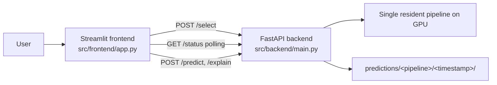
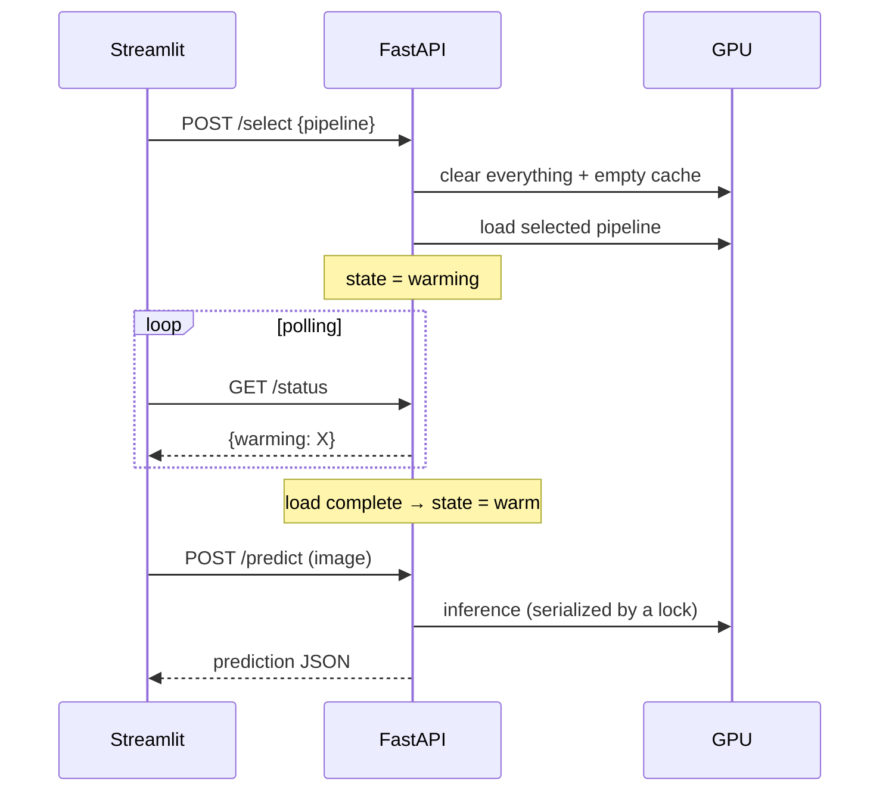

# 6 — The application (FastAPI + Streamlit)

[← docs index](README.md) · [← 05 Results](05-results.md)

The notebooks prove the science; the app makes it **tangible**. The whole point of this layer is to turn a
folder of trained checkpoints into something a person can actually use — drop in a photo, choose how to
analyse it, and get back a real/fake verdict with a visual explanation of *why*. Two design pressures shape
every decision below: it must run on **one mid-range consumer GPU** (the same RTX 3060 the models were
trained on), and it must reuse the **exact** model-building and preprocessing code the notebooks trained
with, so that what the app computes is byte-for-byte what was evaluated in
[05-results](05-results.md) — no quietly divergent second implementation.

A local app (no Docker) to **upload a photo, pick a pipeline, and get a real/fake prediction** with
explainability. **Streamlit** frontend ↔ **FastAPI** backend over HTTP; the frontend **polls** for
pipeline state. Code under [`src/`](../src/).



The split is deliberate: FastAPI owns everything stateful and GPU-bound (which model is loaded, running
inference, writing prediction records), while Streamlit is a thin, stateless view that only knows how to
ask the backend questions over HTTP. That separation is what lets the heavy backend live on the GPU machine
while the UI could, in principle, run anywhere — and it is why the two never share Python objects, only
JSON.

---

## 6.1 Backend ([`src/backend/`](../src/backend/))

| File | Role |
|------|------|
| [`config.py`](../src/backend/config.py) | repo paths, device selection, predictions dir; puts `notebooks/` on `sys.path` so the app reuses the **exact** `utils.models` builders / transforms the notebooks trained with |
| [`schemas.py`](../src/backend/schemas.py) | Pydantic response models (the shared prediction contract) |
| [`manager.py`](../src/backend/manager.py) | `ResidencyManager` — the single-GPU warm-up/residency state machine |
| [`main.py`](../src/backend/main.py) | FastAPI app + endpoints |
| [`pipelines/`](../src/backend/pipelines/) | `BasePipeline` + one adapter per pipeline + the selector registry |

The single most important line in that table is the one about `config.py` putting `notebooks/` on
`sys.path`. Rather than re-implementing each architecture and its preprocessing inside `src/`, the backend
imports the very same `utils.models.build_*` builders and transform definitions the training notebooks
used. This is a correctness decision, not a convenience: a re-implementation, however careful, is a second
chance to introduce a subtle mismatch in resize, normalization, or layer wiring that would make the app's
predictions silently disagree with the reported metrics. Reusing one source of truth removes that entire
class of bug.

### Endpoints

| Method · path | Purpose |
|---------------|---------|
| `GET /health` | liveness |
| `GET /pipelines` | static metadata for every pipeline (+ availability on disk) |
| `GET /status` | resident pipeline, per-pipeline state (`cold`/`warming`/`warm`), device, busy flag |
| `POST /select {key}` | clear the GPU + warm the requested pipeline (runs in the background) |
| `POST /predict` (image) | run the warm pipeline, persist the result |
| `POST /explain` (image) | return a Grad-CAM / attention-rollout overlay (or a reason it's unavailable) |

The endpoint set divides cleanly into **read** routes the UI can hammer freely (`/health`, `/pipelines`,
`/status`) and **action** routes that touch the GPU (`/select`, `/predict`, `/explain`). The read routes
are cheap and side-effect-free by design, which is what makes the polling model below safe; the action
routes are the ones that must be coordinated so they never collide on the single GPU.

### Single-GPU residency & warm-up ([`manager.py`](../src/backend/manager.py))

The governing constraint is blunt: a consumer GPU does not have the memory to hold ten deep-learning models
at once. ViT-Base, EfficientNet/ResNet backbones, a frozen CLIP encoder, the patch ensemble — loading them
all simultaneously would exhaust 12 GB long before the user picked one. So the backend enforces a strict
**one-model-at-a-time residency policy**: exactly one pipeline lives on the GPU, and switching pipelines
means fully evicting the old one first.

Only **one pipeline is resident on the GPU at a time**. On `POST /select` the backend:

1. **completely clears the GPU** — drops the previous model's references and empties the CUDA cache;
2. **loads** the selected pipeline (rebuild architecture via `utils.models.build_*` + attach committed
   weights);
3. exposes the state as **`warming`** during 1–2, then **`warm`** when ready; all others are **`cold`**.

The "completely clears" step is doing real work and is easy to get wrong. Simply assigning a new model over
the old Python reference is not enough — PyTorch's caching allocator holds onto the freed memory, so the
backend must both drop every reference to the previous model *and* empty the CUDA cache before loading the
next one. Skip either half and the second model's load can OOM on a GPU that, on paper, had room. Getting
this eviction right is what allows a 12 GB card to offer all ten pipelines, just never more than one
concurrently.



A lock serialises inference so predictions never overlap on the GPU. The frontend never assumes a
pipeline is ready — it **asks** via `GET /status`.

Two ideas in that diagram are worth naming explicitly. First, the **three-state machine** — `cold` (not
loaded), `warming` (being loaded, possibly several seconds for a large backbone), `warm` (ready to
predict). Loading a model is not instantaneous, so a state that means "in transit" is essential; without it
the UI could fire a `/predict` at a model that is half-loaded. Second, **why polling rather than a push
connection**: warm-up is a short, one-off transition, and HTTP polling (`GET /status` every second or so)
is dramatically simpler than maintaining a websocket — no persistent connection to keep alive, reconnect,
or reason about, and the read endpoint is cheap enough that polling it costs almost nothing. The UI simply
asks "are you ready yet?" on a timer and reflects whatever the backend reports. The serialising lock is the
final piece: even though only one model is resident, two prediction requests could still arrive together,
and running them concurrently on one GPU risks contention or corrupted state — so inference is funnelled
through a lock and runs strictly one at a time.

### The pipeline registry ([`pipelines/__init__.py`](../src/backend/pipelines/__init__.py))

Maps **selector keys → factories**. `cnn-finetune` exposes one key per backbone (both write to the
`cnn-finetune` artifact folder):

```
cnn-scratch · cnn-residual · cnn-finetune-efficientnet_b0 · cnn-finetune-resnet50 · vit-lora
            · clip-probe · two-stream · freqcross · srm-noise · patch-ensemble · dire-recon
```

Each adapter subclasses `BasePipeline` and implements `build()` / `load_weights()` / `warmup()` /
`preprocess()` / `forward_components()` / `explain()`. A pipeline is **available** only if its weights
exist on disk — so `cnn-finetune-resnet50` shows as unavailable (only EfficientNet-B0 was trained), and
`clip-probe` reports explainability as unavailable (no spatial map; it's an embedding probe).

The `BasePipeline` interface is what keeps the rest of the backend pipeline-agnostic: the manager and
endpoints only ever call those six methods, so adding a new pipeline means writing one adapter, not
touching the server. The **availability check** is a deliberate guard rather than an afterthought — because
the model-sharing scheme commits only some checkpoints (see
[07-reproducibility §7.5](07-reproducibility.md#75-whats-committed-vs-ignored-gitignore)), a freshly cloned
repo will legitimately be missing some weights. Surfacing that as "unavailable" in `/pipelines` lets the UI
grey those options out instead of letting a user select a pipeline that would then fail to load. The
`clip-probe`-has-no-explainability case is the same idea applied to a different capability: it is an
embedding probe with no spatial feature map to run Grad-CAM over, so it honestly reports explainability as
unavailable rather than fabricating a meaningless heatmap.

> All ten pipelines are wired into the selector (eleven keys — `cnn-finetune` exposes one per backbone).
> Each adapter rebuilds its architecture from the committed `best_params.json` (via
> `eval_protocols.load_model`), so the app reproduces the evaluated models exactly. `dire-recon` additionally
> requires `diffusers` and downloads Stable Diffusion v1.5 on first use, so it is offered only when those are
> present.

## 6.2 Prediction schema ([`schemas.py`](../src/backend/schemas.py))

The schema is the contract between backend and frontend, and the design goal behind it is **UI
simplicity**: the Streamlit code should render any pipeline's result without knowing or caring which
pipeline produced it. That is only possible if every pipeline — whether it emits a single score or several
— returns the *same shape*.

**Every** pipeline returns the same shape so the UI needs no special-casing — single-component pipelines
simply have a one-entry `components` list:

```json
{
  "pipeline": "two-stream",
  "key": "two-stream",
  "timestamp": "2026-06-20T12:34:56Z",
  "image": "upload.png",
  "final": { "label": "fake", "p_fake": 0.93 },
  "components": [
    { "name": "spatial",   "label": "fake", "p_fake": 0.88 },
    { "name": "frequency", "label": "fake", "p_fake": 0.95 }
  ],
  "saved_to": "predictions/two-stream/20260620T123456Z/"
}
```

The UI relies on `final.label` / `final.p_fake` always being present and renders `components`
generically when it has more than one entry.

The trick that makes this work is treating the **single-component case as a degenerate multi-component
case**: a plain CNN reports a `components` list of length one, while `two-stream` reports its spatial and
frequency sub-scores plus the fused `final`. The UI never branches on pipeline identity — it always reads
`final` for the headline verdict and iterates `components` for the breakdown, simply showing more rows when
there are more. This is what keeps the frontend small and means a future multi-branch pipeline needs zero
UI changes. Pinning the contract in **Pydantic models** rather than hand-built dicts adds a second benefit:
the response shape is validated at the boundary, so a malformed prediction is caught in the backend instead
of silently breaking the UI.

## 6.3 Prediction tracking

Every prediction the app makes is written to disk, and that is a deliberate **traceability** choice rather
than incidental logging. For a tool that issues real/fake judgements, being able to go back and ask "what
exactly did the model see, and what did it say?" matters — for debugging a surprising verdict, for building
up a record of borderline cases, and for honest reporting.

Every inference is persisted under the backend for traceability:

```text
src/backend/predictions/<pipeline-name>/<inference-timestamp>/
├── <uploaded-image>     # the input image
└── prediction.json      # the prediction output (schema above)
```

(`src/backend/predictions/` is gitignored.)

The layout — one timestamped folder per inference, holding **both** the exact input image and the full
prediction JSON — means each record is self-contained and re-examinable in isolation: the image and the
verdict can never drift apart. Keying by pipeline then timestamp keeps the history naturally grouped and
chronological. The directory is gitignored because these are runtime artifacts (and may contain
user-uploaded images), not source — exactly the same reasoning that keeps `data/` and the babysitter logs
out of the repo in [07-reproducibility §7.5](07-reproducibility.md#75-whats-committed-vs-ignored-gitignore).

## 6.4 Frontend ([`src/frontend/app.py`](../src/frontend/app.py))

Streamlit UI: a pipeline selector (filtered to available pipelines), a file uploader, and two tabs —
**Prediction** (final + per-component scores) and **Explainability** (the Grad-CAM/attention overlay). It
polls `GET /status` (~1 s) during warm-up and reflects `cold`/`warming`/`warm`. Backend URL configurable
via `BACKEND_URL`.

The frontend holds **no model state of its own** — it is a pure reflection of what the backend reports.
The selector is filtered to *available* pipelines (those whose weights exist on disk, per §6.1), so a user
cannot pick something that would fail to load. During the warm-up transition the UI polls `/status` roughly
once a second and renders the `cold`/`warming`/`warm` state honestly, so the user sees "warming…" rather
than a frozen page or a premature, broken prediction. Making `BACKEND_URL` configurable is what allows the
lightweight UI to run on a different host from the GPU-bound backend when desired.

## 6.5 Running the app

> **Two-Python gotcha.** This machine has Python 3.12 (CUDA torch — what `python` resolves to) and
> Python 3.10 (CPU-only torch, which owns the bare `uvicorn`/`streamlit` executables). **Always launch via
> `python -m …`** so the app runs under the CUDA interpreter; a bare `uvicorn` lands on CPU torch and the
> device shows `cpu`. See [07-reproducibility.md](07-reproducibility.md).

This gotcha is subtle because it **fails quietly rather than loudly**. The machine has two Python installs,
and the bare `uvicorn` / `streamlit` executables on `PATH` belong to the *3.10, CPU-only* interpreter,
while `python` resolves to the *3.12, CUDA* one. Launch the backend as a bare `uvicorn` and nothing
errors — the app starts, serves requests, and answers — but every model runs on the CPU-only torch, so
`/status` reports `device: cpu` and inference is glacial instead of GPU-fast. There is no crash to alert
you; the only symptom is the device string and the latency. Routing every launch through `python -m …`
forces the command to run inside the CUDA interpreter (`python -m uvicorn` is "run the uvicorn module under
*this* Python"), which is the one reliable way to land on the GPU build. The first thing to check if the
app feels slow is therefore the device field in `/status`.

```bash
# Terminal 1 — backend (CUDA)
python -m uvicorn src.backend.main:app --port 8000

# Terminal 2 — frontend
python -m streamlit run src/frontend/app.py        # opens http://localhost:8501

# Keep the app OFF the GPU (e.g. while training/eval runs there):
DF_DEVICE=cpu python -m uvicorn src.backend.main:app --port 8000
```

That last command is the deliberate inverse of the gotcha: when a training or evaluation notebook already
owns the GPU (as during the robustness sweep in [05-results §5.3](05-results.md#53-robustness)), forcing
the app onto the CPU with `DF_DEVICE=cpu` lets you demo or test it without two processes fighting over the
same card.

Next: [07-reproducibility.md →](07-reproducibility.md)
