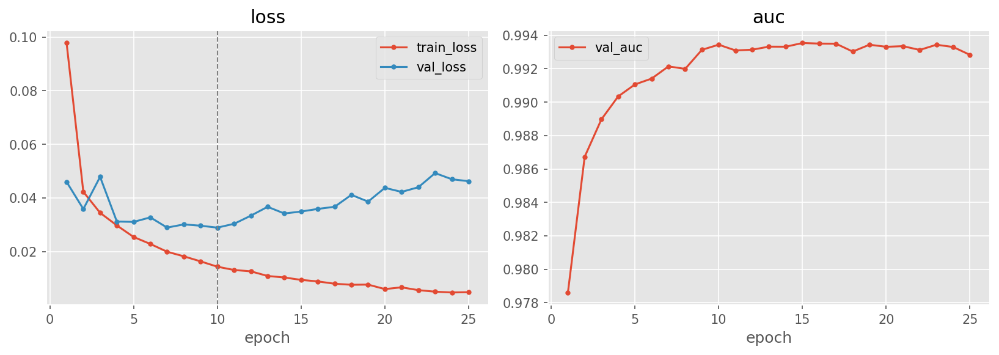
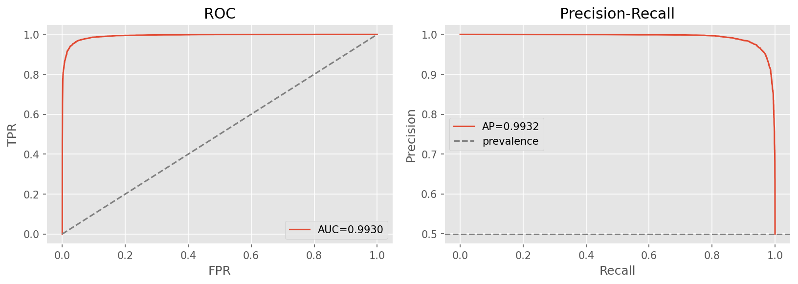
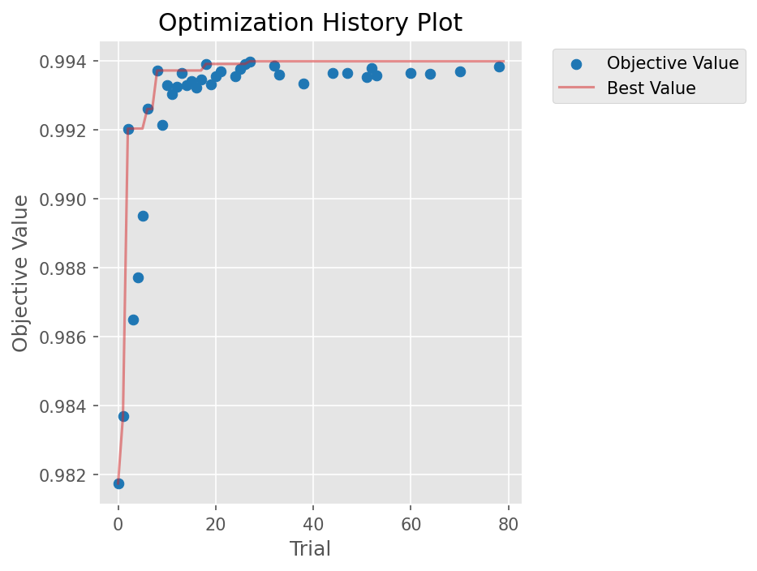

# clip-probe — frozen CLIP embeddings + trained MLP head

[← pipelines](README.md) · notebook [`08_clip-probe.ipynb`](../../notebooks/08_clip-probe.ipynb) ·
builders [`models.build_mlp_head`](../../notebooks/utils/models.py),
[`embed.py`](../../notebooks/utils/embed.py)

This pipeline is the project's bet on **foundation-model features**. Every other detector learns its own
visual representation from our data; this one borrows a representation that was learned on hundreds of
millions of image–text pairs and asks a tiny classifier to read it. The interest is less in the
in-distribution score (which is excellent) than in what the design *predicted* about generalization — and
in the fact that the data politely declined to agree.

## Purpose
The reasoning was a priori attractive. A frozen CLIP encoder maps an image to a 512-D vector that captures
**high-level semantic and distributional structure** rather than the low-level, generator-specific texture
that a from-scratch CNN keys on. A head trained on those vectors should therefore learn to flag *"this
image sits off the manifold of real photographs"* instead of *"this image carries Stable Diffusion's
particular upsampling fingerprint."* The first is a property of fakeness in general; the second is a
property of one generator. On that logic, `clip-probe` was **hypothesised to be the best cross-generator
generalizer** of all the pipelines.

> **The hypothesis was not confirmed.** On the held-out `tiny-genimage` generators it lands **3rd**, not
> 1st, with an overall OOD accuracy of **0.5837**. The semantic-feature story is appealing but the
> measured generalization gap tells a more sobering story — the full discussion of why is in
> [05-results §Discussion](../05-results.md#the-clip-generalizes-best-hypothesis-was-not-confirmed). This
> is exactly the kind of negative result the project set out to surface: the point of the cross-generator
> protocol is to falsify comfortable intuitions, and here it did.

## Architecture
A **frozen** CLIP image encoder (open_clip **ViT-B-32 / openai**) produces a 512-D embedding; a small
trained MLP head turns that embedding into a single fakeness logit. The encoder's weights never receive a
gradient — only the head learns.

```
frozen CLIP ViT-B-32  →  512-D embedding  →  build_mlp_head(in_dim=512, hidden, n_layers, p_drop)

build_mlp_head:  [Linear(512→hidden) → ReLU → Dropout] × n_layers → Linear(hidden→1)
```

The architectural division of labour matters: CLIP does all the perceptual heavy lifting, and the head is
deliberately shallow because its only job is to carve a decision boundary in an already-rich feature
space. That asymmetry is what makes the pipeline so cheap to train and search.

**Why the embeddings are cached.** Running the CLIP encoder is the expensive part of a forward pass; the
MLP head is almost free. Since the encoder is frozen, its output for a given image **never changes** across
epochs or across Optuna trials — so re-encoding the same images thousands of times would be pure waste. We
therefore encode every image **once to disk** (`clip_emb_{train,val,test}.npy`) and let all subsequent
search and training operate on those cached 512-D vectors. The payoff is dramatic: a "training run" becomes
a few matrix multiplies over a small array, which is precisely what makes an **80-trial** Optuna search
affordable here when the convolutional pipelines could only afford 20–24 trials.

## Input & preprocessing
RGB **224×224** with **CLIP's own** preprocessing/normalization (`norm="clip"` — see
[02-data §2.6.2](../02-data.md#262-normalization-stats); a model must be fed the input distribution its
frozen weights were trained under, or the embeddings degrade). The two-phase split is worth stating
explicitly: **at training time** the head reads pre-computed embeddings from disk, but **at inference time**
(in the app) the encoder runs live on the uploaded image and the head consumes its output — so the deployed
path is genuinely end-to-end, the cache is purely a training-speed optimisation.

## Training method
Because there is effectively no convolution in the loop, training is fast and the schedule can afford to be
generous: **AdamW**, **cosine schedule with a 2-epoch warmup over 60 epochs**, **batch 512** (embeddings are
tiny, so large batches cost almost nothing), and **early-stopping on validation AUC** (patience 10,
`min_delta 1e-4`). The loss is tuned between BCE and **focal loss**, with the focal variant winning. Only
the head's parameters are optimised; CLIP stays frozen throughout.

## Optuna search
The search is the **heaviest in the project** and also has the **highest prune rate**, both consequences of
the cached-embedding speed — we could afford to launch many trials and let the MedianPruner kill the
unpromising ones early.

| Hyperparameter | Search space |
|----------------|--------------|
| `hidden` | {128, 256, 512, 1024} |
| `n_layers` | {1, 2, 3} |
| `p_drop` | [0.1, 0.6] |
| `lr` | [3e-4, 3e-3] log |
| `weight_decay` | [1e-5, 1e-3] log |
| `label_smooth` | [0, 0.1] |
| `loss` | {bce, focal} |

**80 trials** (37 complete, **43 pruned**), maximizing validation AUC, **best val AUC 0.9940**.

Winner: **hidden 1024, n_layers 3**, p_drop 0.544, lr 1.26e-3, weight_decay 1.55e-5, label_smooth 0.001,
**loss focal (γ 2.15)**. The search converges on the *largest* head it was offered (1024-wide, 3 layers)
with heavy dropout (0.544) — a sensible combination, since a high-capacity head plus strong regularisation
lets it exploit a rich 512-D feature space without memorising it.

## Results
In-distribution this is one of the strongest detectors in the project — the CLIP space separates real from
fake almost linearly, and a well-tuned head reaches a **0.9930 AUC**. The tuned threshold (0.5625) trades a
hair of accuracy for better-balanced errors; both operating points share the same AUC/PR-AUC/Brier because
those are threshold-independent.

| | Acc | F1 | AUC | PR-AUC | MCC | Brier |
|---|:---:|:--:|:---:|:------:|:---:|:-----:|
| @0.5 | 0.9592 | 0.9592 | **0.9930** | 0.9932 | 0.9184 | 0.0318 |
| @tuned (0.5625) | 0.9578 | 0.9578 | 0.9930 | 0.9932 | 0.9158 | 0.0318 |

Confusion @0.5: `[[5754, 232], [256, 5721]]` — errors are nearly symmetric between the classes, and the low
Brier (0.0318) says the probabilities are well-calibrated, not just well-ranked.

**Out-of-distribution: 0.5837 overall (3rd).** Per generator: adm 0.654 · biggan 0.459 · glide 0.544 ·
midjourney 0.699 · sdv5 0.633 · vqdm 0.439 · wukong 0.658.

> **Reading the OOD row.** The spread is the real story. CLIP handles the diffusion-family generators it can
> relate to its training distribution reasonably (midjourney 0.699, adm 0.654, wukong 0.658, sdv5 0.633) but
> collapses toward chance on the most distant ones (**vqdm 0.439, biggan 0.459** — below 50%, i.e. it is
> *worse than guessing* on those). A semantic encoder evidently does not, on its own, confer the broad
> generator-agnostic robustness we hoped for; it generalizes where the new generator looks semantically
> familiar and fails where it does not. See
> [05-results §Discussion](../05-results.md#the-clip-generalizes-best-hypothesis-was-not-confirmed).





## Explainability
There is **no spatial Grad-CAM here**, and not as an omission — it would be meaningless. Grad-CAM
attributes a decision back to spatial locations in a convolutional feature map, but this pipeline's
classifier never sees pixels; it sees a single 512-D vector with no spatial extent to highlight. The
honest explainability tool for an *embedding probe* is therefore to interrogate the **embedding space
itself**.

We do that with **t-SNE of the frozen embeddings**
([`tsne_embeddings.png`](../../notebooks/artifacts/clip-probe/figures/tsne_embeddings.png), plus the
[evaluation t-SNE](../../notebooks/artifacts/evaluation/figures/clip_tsne.png)). When real and fake form
visibly separable clusters in CLIP space *before any head is trained*, that is the direct visual evidence
for why a shallow head suffices — the encoder has already done the separating. It also connects this
pipeline straight back to the EDA t-SNE in [02-data §2.3.5](../02-data.md#235-embedding-t-sne), which used
the same frozen encoder and first suggested the approach.

## Saved model & reload
Only the **MLP head** is committed → `artifacts/clip-probe/models/best.pt` (**<2 MB**), because the encoder
is a re-downloadable public checkpoint (see the model-sharing scheme in
[01-overview](../01-overview.md)). To reconstruct: rebuild the architecture with
`build_mlp_head(512, hidden=1024, n_layers=3)`, let open_clip re-download ViT-B-32, and load the head with
`load_checkpoint`. Recipe = this committed weights file + this notebook's `build_*` cell.
