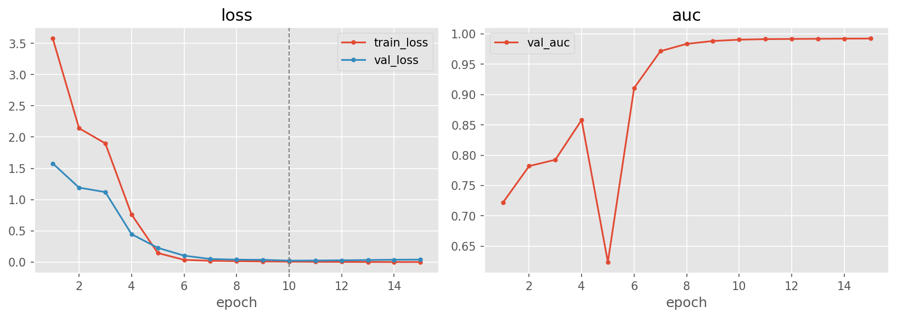
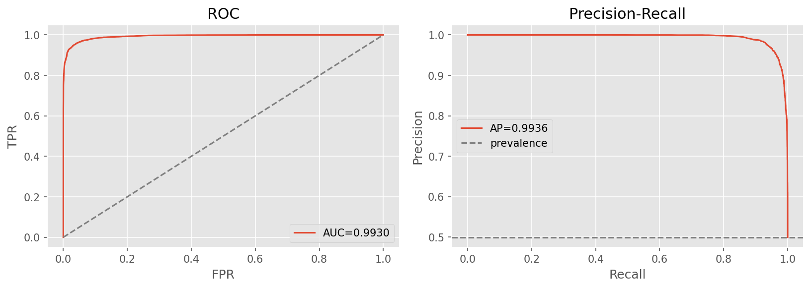
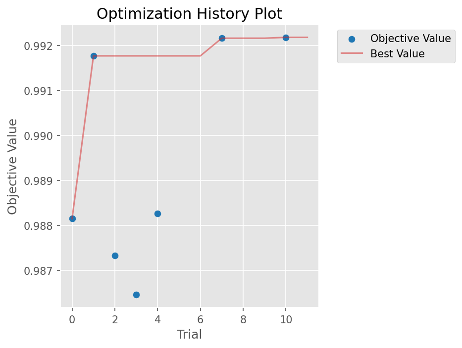

# cnn-finetune — fine-tuned ImageNet CNN backbone

[← pipelines](README.md) · notebook [`06_cnn-finetune.ipynb`](../../notebooks/06_cnn-finetune.ipynb) ·
builder [`models.build_cnn_finetune`](../../notebooks/utils/models.py)

## Purpose
This is the transfer-learning entry: instead of learning visual features from scratch, start from a CNN
already trained on ImageNet and adapt it to real-vs-fake. The intuition is that a backbone trained on a
million natural images has already learned a rich, general-purpose vocabulary of edges, textures, and
shapes — features that took the whole of ImageNet to discover and that our ~43k-image training set could
never learn as well on its own. Fine-tuning re-points that vocabulary at a new, narrow question, which is
why transfer learning usually reaches a far higher accuracy on a far smaller dataset than a from-scratch
network. A pleasant side-effect of using photo-resolution data is that the backbone applies **directly** at
224 px: there are none of the upsampling hacks that low-resolution datasets like CIFAKE force on you. This
pipeline is **Optuna-tuned** and uses a **two-stage** fine-tune.

## Architecture
`timm.create_model(backbone, pretrained=True, num_classes=1, drop_rate=p_drop)` — passing `num_classes=1`
makes timm attach the right head for us automatically (global average pool → dropout → a single-logit
linear layer), so the only new parameters are that binary head sitting on top of the pretrained feature
extractor. The Optuna search was allowed to choose the backbone between `efficientnet_b0` and `resnet50`,
and the winner was **EfficientNet-B0** — the lighter, more parameter-efficient of the two.

> **EfficientNet-B0 only.** The backbone is itself an Optuna hyperparameter, and the search selected
> EffNet-B0, so only `models/best_efficientnet_b0.pt` was trained and committed. A ResNet50 variant was
> *not* built. The app still exposes a `cnn-finetune-resnet50` key for completeness, which therefore shows
> as unavailable — selecting EffNet-B0 was a tuning outcome, not an oversight.

## Input & preprocessing
RGB **224×224**, **ImageNet** normalization. The normalization stats are pulled from the timm model's own
data config rather than hard-coded — matching the input distribution the pretrained weights were trained
under is a real correctness detail, because feeding the backbone a differently-normalised input would shift
every activation away from the regime its filters expect.

## Training method — two stages
The two-stage recipe exists to avoid wrecking the pretrained features before the head is ready.

1. **Head-only** (3 epochs): freeze the backbone (`freeze_backbone`) and train just the freshly-initialised
   head at `head_lr`, with a ~1-epoch cosine warmup, batch 96. At the start, the random head produces large,
   meaningless gradients; if those flowed into the backbone they would scramble the very ImageNet features
   we are trying to reuse. Freezing the backbone first lets the head learn to read the existing features
   before anything upstream is allowed to move.
2. **Unfreeze + discriminative LRs** (12 epochs): now unfreeze everything, but train it at *different*
   speeds. `build_discriminative_param_groups` assigns three learning-rate tiers — the head at `head_lr`,
   the late backbone layers at `head_lr·decay`, and the early layers at `head_lr·decay²`. The reasoning is
   that early convolutional layers encode generic, broadly-reusable primitives (edges, colour blobs) that
   should barely change, while later layers and the head encode task-specific abstractions that need to
   adapt the most — so each tier moves only as much as it should. Crucially, **weight decay is disabled on
   BN and bias parameters**: those are scale/shift terms, and shrinking them toward zero with L2 has no
   useful regularising effect and can actively destabilise the normalisation statistics. An **EMA at 0.999**
   tracks a smoothed copy of the weights (the EMA is what we evaluate and save), with a cosine schedule, a
   1-epoch warmup, and early stopping on validation AUC.

## Optuna search ([details](../03-shared-methods.md#33-hyperparameter-search--the-optuna-framework))
Space: `backbone {efficientnet_b0, resnet50}`, `p_drop [0.1,0.5]`, `head_lr [3e-4,3e-3] log`,
`disc_decay [0.2,0.5]`, `weight_decay [1e-5,1e-3] log`, `label_smooth [0,0.1]`, `loss {bce,focal}`
(`focal_gamma [1,3]`). **12 trials** (7 complete, 5 pruned), **best val AUC 0.9922**. The pruned trials are
the search working as intended — the MedianPruner kills clearly-losing configurations early so the budget
concentrates on promising regions.

Winner: `efficientnet_b0`, p_drop 0.473, head_lr 1.43e-3, disc_decay 0.334, weight_decay 1.07e-5,
label_smooth 0.060, **loss focal (γ 2.94)**. The search landing on **focal loss with a high γ ≈ 2.94** is
telling: focal loss down-weights easy, already-correct examples and concentrates the gradient on the hard
ones, which suits a task where most images are trivially classified and only a minority carry the decisive
artifact signal.

## Results

| | Acc | F1 | AUC | PR-AUC | MCC | Brier |
|---|:---:|:--:|:---:|:------:|:---:|:-----:|
| @0.5 | 0.9559 | 0.9559 | **0.9930** | 0.9936 | 0.9123 | 0.0357 |
| @tuned (0.582) | 0.9585 | 0.9585 | 0.9930 | 0.9936 | 0.9171 | 0.0357 |

Confusion @0.5: `[[5637, 349], [178, 5799]]`. In-distribution this is a clear step above both from-scratch
nets — **0.993 AUC**, 0.956 accuracy, and a Brier of just 0.036, confirming that transfer learning buys a
large jump for very little data. The tuned threshold of 0.582 is notably above 0.5, which means the raw
probabilities lean slightly toward "fake"; nudging the threshold up rebalances precision and recall
(precision and recall converge to ≈ 0.96 each at the tuned point) and lifts accuracy and MCC a little.

The cautionary half of the story is generalization. **OOD overall acc 0.5636**; per-generator: adm 0.599 ·
biggan 0.436 · glide 0.560 · midjourney 0.740 · sdv5 0.609 · vqdm 0.358 · wukong 0.643. Set against its
0.956 in-distribution accuracy, that is the **largest generalization gap** in the project (≈ 0.392). The
interpretation is that fine-tuning is a double-edged sword: by adapting the powerful backbone *hard* to the
training generators it achieves the best in-distribution fit, but in doing so it specialises onto those
generators' particular fingerprints and transfers the least to unseen ones — it is precisely the model that
learned the training distribution best that survives the distribution shift worst. See
[05-results §Discussion](../05-results.md#discussion).

## Explainability
Grad-CAM on `conv_head` (EffNet's final convolutional stage) →
[`gradcam.png`](../../notebooks/artifacts/cnn-finetune/figures/gradcam.png) — showing which regions the
adapted backbone keys on when it calls an image fake.

## Saved model & reload
**EMA weights only** (slim) → `artifacts/cnn-finetune/models/best_efficientnet_b0.pt` (~16 MB). Because the
ImageNet backbone is freely re-downloadable, only the trained EMA weights are committed rather than the
whole model; a teammate rebuilds the architecture with `build_cnn_finetune("efficientnet_b0")` (which
re-downloads the backbone) and attaches the weights via `training.load_weights`.
