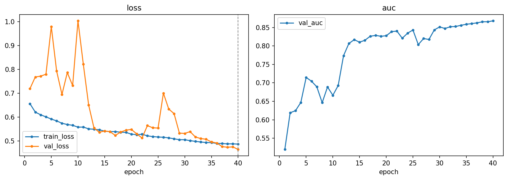
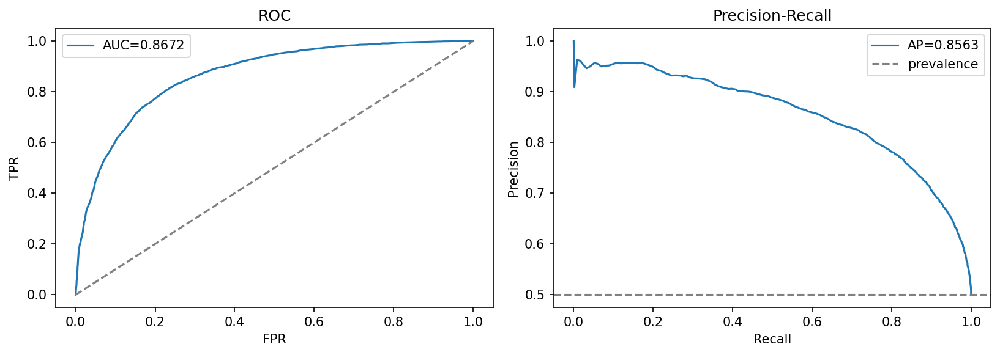

# cnn-residual — residual CNN with SE attention (custom)

[← pipelines](README.md) · notebook [`05_cnn-residual.ipynb`](../../notebooks/05_cnn-residual.ipynb) ·
builder [`models.build_cnn_residual`](../../notebooks/utils/models.py)

## Purpose
The hypothesis here is that a deeper, better-regularised from-scratch network can out-resolve the small
baseline by preserving the high-frequency artifacts that distinguish generated images while still being
trainable end-to-end. It is our own architecture — a pre-activation residual CNN with
**Squeeze-and-Excitation** channel attention and an **EMA** copy of the weights — built to test whether
depth and attention, rather than a pretrained backbone, are enough to push past the
[`cnn-scratch`](cnn-scratch.md) reference. It is the natural "can we do better by hand?" step before
transfer learning enters the picture.

## Architecture
The body is three stages of **pre-activation BasicBlocks**. Pre-activation means each block applies
`BN → ReLU → Conv` (twice) *before* the residual addition, rather than the original ResNet's
`Conv → BN → ReLU`. The practical payoff is a cleaner identity path: the skip connection carries the
unmodified input straight through, so gradients flow back unimpeded and very deep stacks train more
stably. On top of every block sits a **Squeeze-and-Excitation** module, which performs *channel*
attention — it global-average-pools each feature map to a single number per channel, passes that
descriptor through a tiny bottleneck MLP (reduction 16), and uses the result to reweight the channels,
letting the network amplify the feature maps that carry artifact signal and damp the rest.

> **Why SE rather than CBAM.** CBAM adds a *spatial* attention branch on top of the channel one, pooling
> across channels to produce a per-pixel spatial mask. That spatial pooling is precisely what we want to
> avoid here: it tends to blur the fine, localised high-frequency texture that generative fingerprints
> live in. SE is also cheaper and re-weights channels without ever touching the spatial map, so it sharpens
> *what* the network attends to without smearing *where* — the right trade-off for a frequency-sensitive
> detector.

A final detail: the **last BN's γ in each block is zero-initialised**, so at the start of training each
residual block computes the identity function (its conv path contributes nothing until γ grows). The whole
network therefore begins as a near-identity mapping and learns its non-linear corrections gradually, which
is a well-known stabiliser for deep residual training.

```
Conv3×3(3→64, s1) + BN + ReLU                 # stem, full res
→ stage1: 2× PreActBlock(64),  s1
→ stage2: 2× PreActBlock(128), first s2
→ stage3: 2× PreActBlock(256), first s2       # each block: BN-ReLU-Conv ×2 + SE(reduction 16)
→ BN-ReLU → GAP → Dropout(0.3) → Linear(256→1)
```
≈ **2.8 M** parameters — roughly 3× the baseline. Stage 1 stays at full resolution (same high-frequency
rationale as `cnn-scratch`'s stem), and only stages 2–3 downsample by stride-2.

## Input & preprocessing
RGB **128×128**, **dataset** normalization; light aug (RandomResizedCrop 0.8–1.0 + HFlip at train,
deterministic Resize + CenterCrop at eval). Identical to the baseline so the two from-scratch nets differ
*only* in architecture and training recipe, not in what they are fed.

## Training method
BCE · AdamW (lr 2e-3, wd 1e-3) · cosine + 4-epoch warmup over **40 epochs** · label smoothing 0.05 ·
batch 192 · **EMA decay 0.999** · early-stop on val AUC (patience 7). The **EMA (exponential moving
average)** maintains a slowly-tracking shadow copy of the weights, updated as
`θ_ema ← 0.999·θ_ema + 0.001·θ`; the EMA weights are what we *evaluate and save*, because they sit in a
flatter, lower-variance region of the loss surface than the raw SGD iterate and usually generalise a touch
better. Like the baseline, this pipeline is **not Optuna-tuned** — the learning rate, weight decay,
schedule, and EMA decay are all set by hand.

## Results

| | Acc | F1 | AUC | PR-AUC | MCC | Brier |
|---|:---:|:--:|:---:|:------:|:---:|:-----:|
| @0.5 | 0.7868 | 0.7864 | 0.8672 | 0.8563 | 0.5762 | 0.1505 |
| @tuned (0.531) | 0.7883 | 0.7883 | 0.8672 | 0.8563 | 0.5772 | 0.1505 |

Confusion @0.5: `[[4436, 1550], [1000, 4977]]`. **OOD overall acc 0.5190** (≈ chance); per-generator:
adm 0.488 · biggan 0.412 · glide 0.586 · midjourney 0.573 · sdv5 0.546 · vqdm 0.431 · wukong 0.597. The
in-distribution AUC of 0.867 and the elevated Brier of 0.15 (versus 0.07 for the simpler baseline) both
point the same way: this model is *less* confident and *less* accurate than a network a third its size.

> **Caveat (important).** This deeper attention+EMA net **under-performs the plain `cnn-scratch` baseline**
> (0.867 vs 0.965 AUC). That is a red flag, not an expected result. Depth, residual connections, and
> channel attention are strictly *capacity-adding* — in the worst case the residual blocks can learn the
> identity and recover the shallower model, so a correctly-optimised version of this network should at
> least *match* the baseline, never lose to it by ten AUC points. The most likely explanation is therefore
> an **optimisation/tuning** problem, not an architectural one, and the decisive piece of evidence is that
> this is one of the only two pipelines **not** put through an Optuna search: its learning rate, weight
> decay, warmup, and EMA decay were hand-set, and a deeper network with attention is far more sensitive to
> those choices than the tiny baseline. A 2e-3 base LR that suits a 0.98 M-parameter net can easily be in
> the wrong regime for a 2.8 M-parameter pre-activation residual stack, leaving it under-trained within its
> 40-epoch budget. The honest framing is "this pipeline needs a tuning pass," not "residual + attention
> hurts." See [05-results §Discussion](../05-results.md#discussion) and the dedicated
> [cnn-residual under-performs caveat](../05-results.md#cnn-residual-under-performs--a-caveat-to-explain).




## Explainability
Grad-CAM on the last residual stage →
[`gradcam.png`](../../notebooks/artifacts/cnn-residual/figures/gradcam.png). Reading the CAM alongside the
under-performance above is instructive: if the highlighted regions look diffuse or fixate on uninformative
areas, that is further circumstantial evidence the model never settled into a good solution.

## Saved model & reload
Full model + EMA → `artifacts/cnn-residual/models/best.pt` (~44 MB). As with the baseline there is no
re-downloadable backbone, so the whole model is committed. Rebuild with `build_cnn_residual()` and load the
**EMA** weights — the ones evaluated above — via `training.load_ema_weights`.
