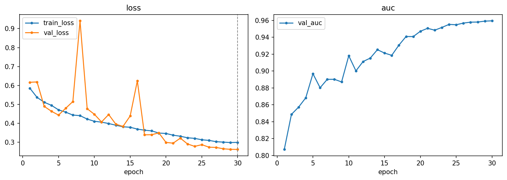
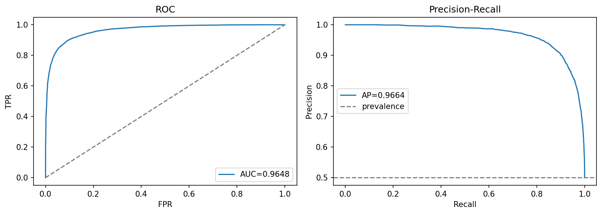
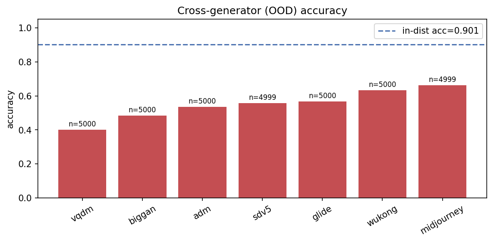

# cnn-scratch — small from-scratch CNN baseline

[← pipelines](README.md) · notebook [`04_cnn-scratch.ipynb`](../../notebooks/04_cnn-scratch.ipynb) ·
builder [`models.build_cnn_scratch`](../../notebooks/utils/models.py)

## Purpose
Every comparison needs a floor, and this is it: the minimal from-scratch CNN whose only job is to
establish the evaluation harness and a reference number that every more sophisticated pipeline must beat
to justify its complexity. There is real value in building it first. It forces the data loaders, the
metric definitions, the threshold-tuning step, and the OOD protocol to all work end-to-end on something
trivial, so that when the heavyweight models arrive the scaffolding is already trustworthy. It is also the
honest control for the project's central claim — that pretrained backbones and frequency-aware designs
*add* something. A baseline that is too weak flatters everything above it; a baseline that is
deliberately simple but competently trained, as this one is, makes the comparison meaningful. It is kept
intentionally plain and is **not tuned** — its number is meant to be the price of entry, not the ceiling.

## Architecture
The design is conventional with one deliberate twist. A **stride-1 stem with no early pooling** runs the
first convolution across the image at full 128² resolution before any spatial downsampling happens. This
is not an accident: the cues that separate generated from real images include very fine, high-frequency
texture statistics — the periodic traces left by upsampling layers, subtle local correlations a camera
sensor does not produce — and an aggressive early max-pool would average exactly those details away in the
very first layer. Keeping the stem at full resolution lets the network *see* the high-frequency content
before it starts compressing space. Only after the stem do the four `Conv-BN-ReLU-MaxPool` blocks begin
the usual halving of spatial size while doubling channels, ending in a global average pool that makes the
classifier insensitive to where in the frame a tell-tale artifact appears.

```
Conv3×3(3→32, s1)              # stem, full resolution
→ [Conv3×3→64,  pool] → [Conv3×3→128, pool]
→ [Conv3×3→256, pool] → [Conv3×3→256, pool]
→ GAP → Dropout(0.3) → Linear(256→1)
```
≈ **0.98 M** parameters. `forward(x) → (B,)` logits. The whole model is under a million parameters — small
enough to train quickly and to make clear that whatever signal it captures is captured *cheaply*.

## Input & preprocessing
RGB **128×128**, **dataset** normalization (mean/std computed on our own train cache, not ImageNet, because
this network has no pretrained weights expecting a particular input distribution). The light resolution
keeps the from-scratch nets fast while still preserving texture; the heavier 224² is reserved for the
pretrained backbones. Light augmentation only — RandomResizedCrop (scale 0.8–1.0) plus a horizontal flip —
at train time, and a deterministic Resize + CenterCrop at eval. The augmentation is kept gentle on purpose:
heavier transforms (blur, JPEG, colour jitter) would erode the subtle generative fingerprint the detector
is trying to read, so they are excluded here and reserved for the robustness *evaluation* instead.

## Training method
BCE loss · AdamW (lr 3e-3, wd 5e-4) · cosine schedule + 3-epoch warmup over **30 epochs** (per-batch
step) · label smoothing 0.05 · batch 256 · early-stop on val AUC (patience 7) · bf16 autocast,
channels_last. No EMA. The recipe is deliberately standard — a single warmup-then-cosine learning-rate
ride, a touch of label smoothing to discourage over-confident logits, and early stopping on validation AUC
so the reported model is the best epoch rather than the last. It is **not Optuna-tuned**: the
hyperparameters are fixed by hand, which is fine for a control but means the number below is a *floor for
this architecture*, not its tuned best. The same applies to `cnn-residual`; see the
[cnn-residual caveat](../05-results.md#cnn-residual-under-performs--a-caveat-to-explain) on why both
from-scratch nets should eventually get a tuning pass before they are compared as equals.

## Results

| | Acc | F1 | AUC | PR-AUC | MCC | Brier |
|---|:---:|:--:|:---:|:------:|:---:|:-----:|
| @0.5 | 0.9011 | 0.9011 | **0.9648** | 0.9664 | 0.8026 | 0.0735 |
| @tuned (0.490) | 0.9014 | 0.9014 | 0.9648 | 0.9664 | 0.8031 | 0.0735 |

Confusion @0.5: `[[5488, 498], [685, 5292]]` (TN,FP / FN,TP). The tuned threshold barely moves from 0.5
(to 0.490), which is itself reassuring — it means the model's probabilities are already roughly centred and
no large recalibration is needed to read its decisions. In-distribution, a sub-million-parameter network
trained for half an hour reaches **0.965 AUC**: the verdict is that detecting *these* generators on *this*
test set is, by itself, an easy problem. The hard problem is generalization. **OOD overall acc 0.5488**,
barely above the 0.5 coin-flip line, and the per-generator breakdown shows why a single number hides the
truth: adm 0.535 · biggan 0.484 · glide 0.567 · midjourney 0.663 · sdv5 0.557 · vqdm 0.401 · wukong 0.634.
On some unseen generators (vqdm, biggan) it scores *below* chance — it has learned a fingerprint specific
to the training generators and is actively misled when that fingerprint is absent.

The headline finding is that this plain baseline's 0.965 AUC actually **beats** the deeper, attention-laden
`cnn-residual` (0.867). That ordering is the opposite of what depth and attention are supposed to buy, and
it is the clearest single signal in the project that `cnn-residual` is being held back by its (untuned)
optimisation rather than by its architecture — the baseline is doing its job by exposing exactly that.





## Explainability
Grad-CAM on the last conv block →
[`gradcam.png`](../../notebooks/artifacts/cnn-scratch/figures/gradcam.png). Because the model ends in a
global average pool over the final convolutional feature map, Grad-CAM on that block shows which spatial
regions drove the "fake" logit — a useful sanity check that the network is keying on image content rather
than a border or a uniform background patch.

## Saved model & reload
Full model `state_dict` → `artifacts/cnn-scratch/models/best.pt` (~12 MB). Everything is trained from
scratch, so the entire model is saved (there is no re-downloadable backbone to omit). Rebuild with
`build_cnn_scratch()` and attach via `training.load_weights` / `load_checkpoint`.
