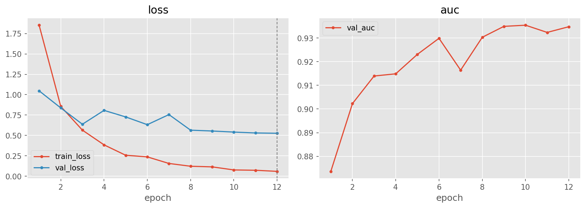
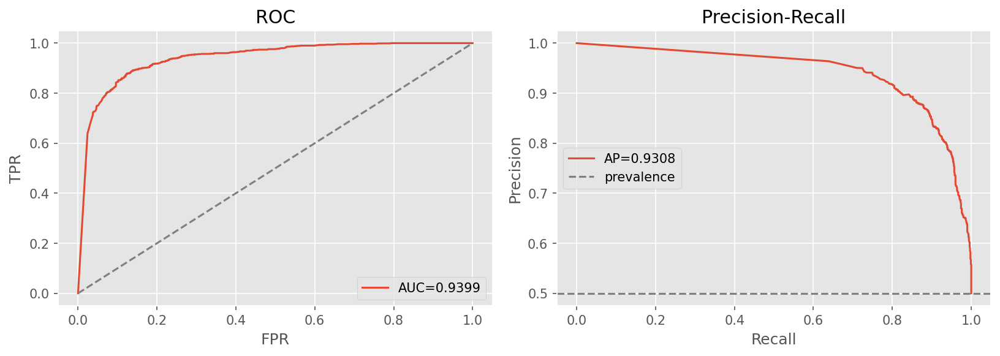

# dire-recon — DIRE (diffusion reconstruction error)

[← pipelines](README.md) · notebook [`13_dire-recon.ipynb`](../../notebooks/13_dire-recon.ipynb) ·
helpers [`utils/dire.py`](../../notebooks/utils/dire.py), builder
[`models.build_cnn_finetune`](../../notebooks/utils/models.py)

This is the project's one **reconstruction-based** detector, and the most experimental pipeline of the
set. Where every other approach reads the image directly, DIRE asks a different question — *how hard is
this image for a diffusion model to recreate?* — and classifies the answer. It is included as a research
arm (extra architecture E) precisely because it embodies a fundamentally different detection principle;
the trade-off is that it is **compute-heavy** and, as flagged below, its in-distribution numbers were
measured on a small subsample and are **not directly comparable** to the other pipelines.

## Purpose
DIRE (Diffusion Reconstruction Error) rests on a clean intuition about where diffusion-generated images
live. A diffusion model's generative process traces a path on its own learned data manifold, so an image
the model itself produced sits *on* that manifold and can be re-traced almost exactly. A real photograph
lies slightly *off* the manifold, so when you push it through the same invert→reconstruct cycle the model
cannot land back on it as precisely. The consequence: **real images reconstruct *worse* than
diffusion-generated images**, and the per-pixel **reconstruction-error map** is therefore discriminative —
larger, more structured error for real photos, smaller error for synthetic ones. Rather than hand-read
that map, we feed it to a CNN and let it learn the boundary.

> **Why it is the optional / experimental pipeline.** The discriminative signal here is not free to
> compute — producing the error map for a *single* image requires a full DDIM inversion and reconstruction
> through Stable Diffusion v1.5 (tens of diffusion U-Net evaluations per image). That is orders of
> magnitude more expensive than a forward pass through a classifier, which is why this pipeline is
> subsampled and treated as a proof-of-concept rather than a headline result.

## Architecture — two stages
The expense is isolated to a one-time preprocessing stage, so that the actual model training is cheap and
behaves like an ordinary image classifier.

1. **DIRE map** ([`utils/dire.py`](../../notebooks/utils/dire.py), computed **once per image** and cached
   to disk): load **Stable Diffusion v1.5**, **DDIM-invert** the image into latent noise, **reconstruct**
   it back through the reverse diffusion process, decode to pixels, and take the per-pixel absolute error
   `|original − reconstruction|`. This is stretched to a `uint8` **256×256×3** map (`compute_dire`,
   `dire_to_uint8`). The inversion uses **20 DDIM steps**. Because the map is cached, the diffusion cost is
   paid exactly once — not every epoch.
2. **Classifier**: a standard timm backbone (`efficientnet_b0` | `resnet50`) trained on the cached error
   maps → a single logit (→ sigmoid `p_fake`). At this stage there is no diffusion in the loop at all; the
   DIRE map is just a 3-channel image, so this reuses the ordinary `build_cnn_finetune` backbone.

This two-stage split — **cache the DIRE maps once, then train a cheap CNN on them** — is what makes the
pipeline tractable. The same cached maps feed both the Optuna search and the final training run, so once
caching is done the search is fast.

Because the diffusion pass is expensive, the DIRE maps are computed on a **subsample**, not the full
dataset: ~**4,000** train / **800** val / **2,000** test / **2,000** OOD images. **Requires `diffusers`
+ `accelerate`** (plus the one-time Stable Diffusion v1.5 download) — these are **not** in the base
[`requirements.txt`](../../requirements.txt), since no other pipeline needs a diffusion model.

## Input & preprocessing
DIRE error maps at **256×256** (the classifier resizes them to **224** and applies **ImageNet**
normalization, matching the pretrained backbone's expected input distribution — see
[02-data §2.6.2](../02-data.md#262-normalization-stats)). Note the model never sees the original RGB
image; its entire input is the reconstruction-error map.

## Training method
On the cached maps: AdamW · cosine schedule with warmup · batch 64 · ~12 final epochs · early-stop on
validation AUC · BCE loss (tuned). Because this stage operates purely on the cached 3-channel maps, it is
no more expensive than any other CNN fine-tune — all the cost was front-loaded into the DIRE caching step.

## Optuna search
Space: `backbone {efficientnet_b0, resnet50}` · `p_drop [0.1, 0.5]` · `lr [1e-4, 1e-3] log` ·
`weight_decay [1e-5, 1e-3] log` · `label_smooth [0, 0.1]` · `loss {bce, focal}`. **20 trials** (9 complete,
**11 pruned** — the MedianPruner culled the weaker configurations early), **best validation AUC 0.9441**.
The search runs against the cached maps, so the full 20 trials were affordable here even though the
caching beforehand was not.

Winner: **efficientnet_b0**, p_drop 0.297, lr 6.19e-4, weight_decay 1.01e-5, label_smooth 0.009,
**loss bce**. The choice of plain BCE (rather than focal) is consistent with the other forensic-signal
nets in the project, where the simpler loss sufficed.

## Results

> ⚠️ **Subsample caveat — read before comparing.** These metrics were measured on a **2,000-image
> subsample** of the test set (`n_fake` 1000 / `n_real` 1000), **not** the full **11,963**-image test set
> the other pipelines use, because materializing DIRE maps for the whole set was too expensive. The
> numbers below are therefore **not directly comparable** to the rest of the project — treat `dire-recon`
> as a proof-of-concept on a different, smaller evaluation set rather than a head-to-head entry.

| | Acc | F1 | AUC | PR-AUC | MCC | Brier |
|---|:---:|:--:|:---:|:------:|:---:|:-----:|
| @0.5 | 0.8730 | 0.8730 | 0.9399 | 0.9308 | 0.7461 | 0.1058 |
| @tuned (0.797) | 0.8645 | 0.8641 | 0.9399 | 0.9308 | 0.7329 | 0.1058 |

Confusion @0.5: `[[881, 119], [135, 865]]`. On its 2,000-image subsample the detector is clearly working —
AUC **0.9399** and ~87% accuracy confirm the reconstruction-error signal is real and learnable — but it
sits **below** the 224-px direct-image backbones, and its **Brier 0.1058** is markedly higher (worse
calibration) than, say, [`patch-ensemble`](patch-ensemble.md)'s 0.0229. Here the **tuned threshold of
0.797** does *not* help accuracy (it falls slightly, 0.8730 → 0.8645): pushing the threshold up trades
recall (0.865 → 0.813) for precision (0.879 → 0.906), tightening false positives at the cost of catching
fewer fakes, which on this balanced subsample nets out slightly negative. AUC/PR-AUC/Brier are unchanged,
as they are threshold-independent.

**OOD overall accuracy 0.5415** — close to chance, and the weakest cross-generator result among the
research pipelines. Per-generator (note the **small per-generator n**, also a subsample):

| adm (290) | biggan (276) | glide (334) | midjourney (262) | sdv5 (272) | vqdm (280) | wukong (286) |
|:---------:|:------------:|:-----------:|:----------------:|:----------:|:----------:|:------------:|
| 0.514     | 0.464        | 0.527       | 0.595            | 0.581      | 0.469      | 0.647        |

The OOD pattern is telling: DIRE was reconstructed with **Stable Diffusion v1.5**, so the error signal is
tuned to *that* model's manifold. It transfers least to the GAN and older-diffusion generators
(biggan 0.464, vqdm 0.469 are below chance) and best to the SD-adjacent / newer generators (wukong 0.647,
midjourney 0.595, sdv5 0.581) — consistent with the reconstruction prior being most informative for images
that resemble what SD v1.5 itself would produce.

## Explainability
The **DIRE error maps are themselves the explanation** — they are the model's entire input, so visualizing
them shows exactly what the classifier sees.
[`dire_maps.png`](../../notebooks/artifacts/dire-recon/figures/dire_maps.png) places real and fake
reconstruction-error maps side by side, making the core hypothesis legible: real images leave larger, more
structured residual error than diffusion-generated ones. No post-hoc saliency method is needed because the
discriminative quantity is the input itself.

## Saved model & reload
The full classifier is committed → `artifacts/dire-recon/models/best.pt` (~16 MB). Rebuild with
`build_cnn_finetune("efficientnet_b0")` and `load_weights`. Reusing it is **not** as simple as loading the
weights, though: its inputs are **DIRE maps**, so any new image must first be passed through
[`utils/dire.py`](../../notebooks/utils/dire.py) to produce its error map — which requires
`diffusers` + `accelerate` and the SD v1.5 download before the cheap classifier can run.
