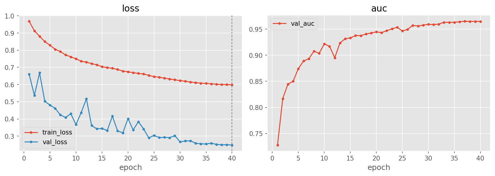
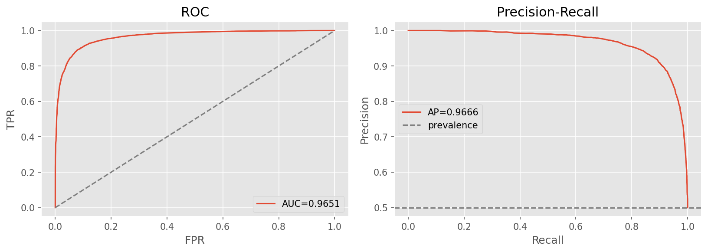
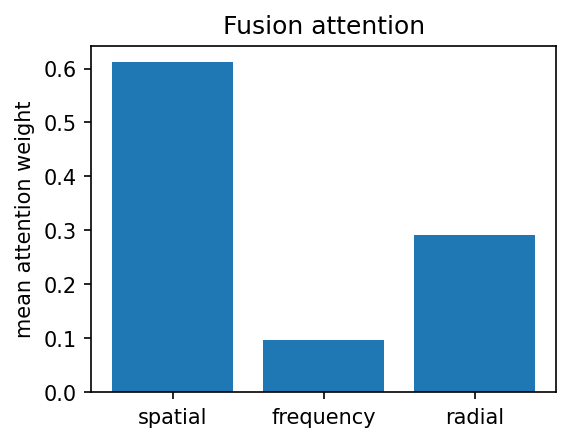

# freqcross — RGB + FFT + radial-spectrum, attention fusion

[← pipelines](README.md) · notebook [`10_freqcross.ipynb`](../../notebooks/10_freqcross.ipynb) ·
builder [`models.build_freqcross`](../../notebooks/utils/models.py)

`freqcross` is the most fully realised version of the frequency idea in the project. Where
[two-stream](two-stream.md) gives the network a pixel view and a spectrum view, `freqcross` adds a *third*
view — the 1-D radial power profile that the EDA singled out — and replaces naive concatenation with a
learned **attention** over the three branches. It is the natural FreqCross-style escalation of the
two-stream design, and at 128px it is the best in-distribution detector the project produces.

## Purpose
Extend two-stream from two branches to three and let the model **weigh** them. The added branch is the
**azimuthally-averaged radial power spectrum** — the same 1-D curve plotted in
[02-data §2.3.4](../02-data.md#234-frequency-analysis--the-empirical-heart-of-the-project), which summarises
how high-frequency energy falls off and is one of the most generator-discriminative single statistics we
found. Fusing by attention (rather than concatenation) lets the network decide, per image, how much to
trust each view.

## Architecture

- **Spatial**: `_FeatCNN(3, feat)` on the RGB image.
- **Frequency**: `_FeatCNN(1, feat)` on the luminance log-FFT magnitude (same transform as two-stream).
- **Radial**: a differentiable `_RadialProfile(size, n_bins)` collapses the 2-D spectrum to a 1-D profile
  by `bincount` over a **precomputed radial-distance map**, followed by an MLP
  `Linear(n_bins→128) → ReLU → Dropout → Linear(128→feat)`.
- **Attention fusion**: stack the three feature vectors into (B, 3, feat) → a softmax **gating** (a Linear
  per branch) produces per-branch weights → weighted sum → head. Per-branch auxiliary heads keep each
  branch independently trained. `forward_all(x) → (fused, spatial, freq, radial)`, and
  `attention_weights(x)` exposes the (B, 3) branch weights for inspection.

≈ **0.82 M** parameters.

> **Why a differentiable radial profile.** The radial profile in EDA was computed offline with numpy, but
> here it must live *inside* the network so gradients can flow back through it. Implementing it as a
> `bincount` over a fixed radial-distance map makes it a differentiable layer with no learnable parameters
> of its own — it deterministically reduces the spectrum, and the MLP that follows learns what to do with
> the resulting curve. This keeps the whole pipeline end-to-end trainable and within the deep-learning
> scope (the transform is an *input* to a neural branch, never a hand-crafted feature for a classical
> classifier).
>
> **Why attention over concatenation.** Plain concatenation forces the head to learn a single fixed mixing
> of the three branches for every image. The three views are not equally reliable — the radial branch is
> weak on its own (below), the spatial branch is strong — and their relative usefulness can vary per image.
> A softmax gate lets the model **down-weight** an unreliable branch and lean on a confident one
> dynamically, and as a bonus the resulting weights are directly interpretable (see Explainability).

## Input & preprocessing
RGB **128×128** with **dataset** normalization and light augmentation — the standard from-scratch-CNN
recipe ([02-data §2.6](../02-data.md#26-preprocessing-notebook-03)). The frequency and radial inputs are
derived from the preprocessed RGB tensor at forward time.

## Training method
The three branches plus the fusion are trained **jointly**, with **per-branch auxiliary losses** weighted
by `aux_weight` so each branch is forced to be individually predictive (the same discipline as two-stream,
extended to three heads). Optimiser **AdamW**, **cosine schedule with warmup**, **batch 128**,
**early-stop on validation AUC**, with the loss type tuned (BCE won here).

## Optuna search

| Hyperparameter | Search space |
|----------------|--------------|
| `feat` | {128, 256, 384} |
| `n_radial` | {48, 64, 96} |
| `aux_weight` | [0.1, 0.7] |
| `p_drop` | [0.1, 0.5] |
| `lr` | [1e-3, 3e-3] log |
| `weight_decay` | [5e-4, 2e-3] log |
| `label_smooth` | [0, 0.1] |
| `loss` | {bce, focal} |

**20 trials** (7 complete, 13 pruned), **best val AUC 0.9338**.

Winner: **feat 256, n_radial 48, aux_weight 0.190**, p_drop 0.230, lr 1.90e-3, weight_decay 1.52e-3,
label_smooth 0.062, **loss bce**. Interestingly the search prefers the *coarsest* radial binning offered
(48 bins) — the discriminative information in the fall-off curve is low-frequency in nature, so a finer
profile adds noise more than signal.

## Results

| | Acc | F1 | AUC | PR-AUC | MCC | Brier |
|---|:---:|:--:|:---:|:------:|:---:|:-----:|
| @0.5 | 0.9003 | 0.9001 | **0.9651** | 0.9667 | 0.8026 | 0.0749 |
| @tuned (0.406) | 0.9048 | 0.9048 | 0.9651 | 0.9667 | 0.8096 | 0.0749 |

Confusion @0.5: `[[5603, 383], [810, 5167]]`. The fairly low default-threshold recall (the model is
conservative about calling "fake") is what the tuned threshold of 0.406 corrects, lifting accuracy to
0.9048 by rebalancing the errors — the AUC is identical because ranking is unchanged.

> **The best 128-px model in-distribution.** At **0.9651 AUC** `freqcross` edges out `cnn-scratch` and the
> other light-resolution models. The third (radial) branch plus attention fusion buys a real, if modest,
> in-distribution improvement over the two-branch [two-stream](two-stream.md) (0.9609) — evidence that the
> extra frequency view carries non-redundant signal.

**Out-of-distribution: 0.5526 overall.** Per generator: adm 0.553 · biggan 0.432 · glide 0.563 ·
midjourney 0.696 · sdv5 0.567 · vqdm 0.437 · wukong 0.621. As everywhere, the unseen generators expose the
generalization gap; the in-distribution lead does **not** translate into a proportional OOD lead, a
recurring theme of the comparison.

**Per-component findings.** With three branches the hierarchy is clear: **spatial is strongest, the radial
branch is weakest alone, and the fusion beats all three single branches.** Each frequency view is
individually weak but contributes complementary signal, which is exactly the case attention fusion is
designed to exploit. See
[05-results §5.4](../05-results.md#54-multi-component-pipelines-fusion-vs-single-stream).

## Explainability
Two complementary views:

- **Grad-CAM on the spatial branch**
  ([`gradcam.png`](../../notebooks/artifacts/freqcross/figures/gradcam.png)) — where the pixel branch
  looks, as for any CNN.
- **The branch-fusion attention weights**
  ([`fusion_attention.png`](../../notebooks/artifacts/freqcross/figures/fusion_attention.png)) — a view
  unique to this architecture, showing how much of each decision is carried by spatial vs. frequency vs.
  radial. This makes the fusion's reasoning legible in a way concatenation never could, and it visually
  confirms the per-component story (spatial dominant, frequency/radial supporting).

## Saved model & reload
The **full model** is committed → `artifacts/freqcross/models/best.pt` (no re-downloadable backbone to
factor out). Rebuild with `build_freqcross(feat=256, n_radial=48)` and `load_weights`; the build cell plus
this committed file fully reconstruct the architecture.
