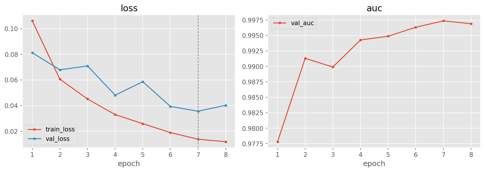
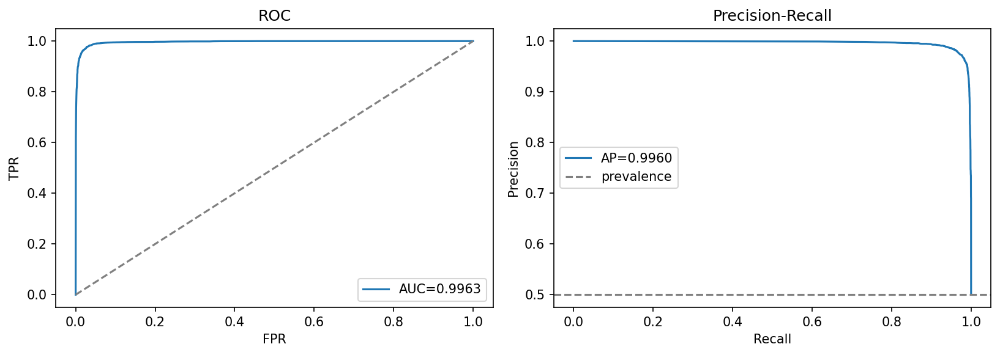
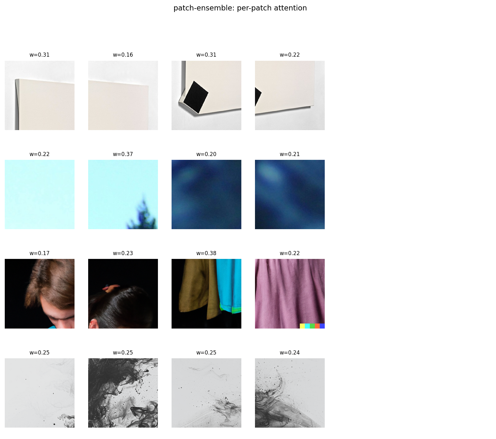

# patch-ensemble — native-resolution patches + gated-attention MIL

[← pipelines](README.md) · notebook [`12_patch-ensemble.ipynb`](../../notebooks/12_patch-ensemble.ipynb) ·
builder [`models.build_patch_ensemble`](../../notebooks/utils/models.py)

This is, scientifically, the most important pipeline in the project — not because its in-distribution
score is the highest (several pipelines tie it on AUC), but because it is **the best cross-generator
generalizer**, and it earns that title by *disagreeing* with the project's original hypothesis. We went in
expecting frozen CLIP embeddings to generalize best; instead a model that simply refuses to throw away
native-resolution detail won, and won clearly. The rest of this page explains the mechanism behind that
result and how to reproduce it.

## Purpose
Every other pipeline pays a hidden tax: it reads from the **256² disk cache**, which resized every image
down to a fixed 256×256 square. That resize was a deliberate and necessary data decision — it kills the
[resolution shortcut](../02-data.md#236-the-resolution-shortcut--the-most-important-data-decision) that
would otherwise let a model cheat by reading image dimensions. But resizing is *also* a low-pass filter:
the very high-frequency fingerprints that generative upsamplers leave behind — the cues that EDA's
[frequency analysis](../02-data.md#234-frequency-analysis--the-empirical-heart-of-the-project) flagged as
the most transferable signal — are precisely what a downscale attenuates. `patch-ensemble` is built to
recover that lost detail.

Instead of one resized view of the whole image, it scores **K native-resolution 224×224 patches** cropped
straight from the original file (no global resize) and aggregates them with **gated-attention
multiple-instance learning (MIL)**. Each patch is seen at the resolution it was generated at, so the
high-frequency artifacts survive; the MIL layer then decides which patches actually carry the evidence.

> **The headline result.** `patch-ensemble` is the **best cross-generator generalizer in the project**:
> OOD overall accuracy **0.6775**, the **smallest generalization gap (0.291)** of any pipeline. This beat
> the pre-registered expectation that [`clip-probe`](clip-probe.md) would win — see the discussion of
> [why the "CLIP generalizes best" hypothesis was not confirmed](../05-results.md#the-clip-generalizes-best-hypothesis-was-not-confirmed).
> The intuition: native patches preserve the texture statistics that separate real from generated
> imagery *more consistently across generators* than CLIP's semantic features do, and gated attention
> lets the model concentrate on the most artifact-bearing crops rather than averaging the signal away.

## Architecture
The model is deliberately a thin wrapper around a strong pretrained encoder; the novelty is in *how the
K patches are combined*, not in the encoder.

- **Input**: K native 224×224 patches per image, delivered as a **bag** of shape `(K, 3, 224, 224)` by
  [`PatchBagDataset`](../../notebooks/utils/datasets.py). At **train** time the K patches are random crops
  (stochastic, so each epoch sees different views of the image); at **eval** time they are a deterministic
  grid (corners + centre) so the score is reproducible. Crucially, the dataset reads from the original
  files and crops *before* any 256 resize — that is the whole point.
- **Encoder**: a shared timm backbone (`efficientnet_b0` | `resnet50`, pretrained, `global_pool="avg"`).
  The bag is flattened to `(B·K, 3, 224, 224)` so all patches pass through the backbone in one batched
  call, then reshaped back to per-image features `(B, K, d)`. Sharing one encoder across patches keeps the
  parameter count low and means every patch is judged by the same forensic criteria.
- **Gated-attention MIL** (Ilse et al., 2018): the K patch features are pooled not by a plain mean but by
  a learned, input-dependent attention weight
  `a = softmax(w·(tanh(V f) ⊙ sigmoid(U f)))` computed over the K patches, followed by an
  attention-weighted sum → a single image vector `(B, d)`. The two gates do complementary jobs: `tanh(V f)`
  scores *how informative* a patch looks, while `sigmoid(U f)` acts as a *gate* that can suppress
  uninformative patches; their element-wise product, projected by `w` and softmaxed, becomes the per-patch
  weight. The effect is a model that can pour almost all of its attention onto the one or two crops that
  contain a visible artifact and ignore bland sky/background patches — exactly the behaviour you want when
  the giveaway is local. `forward_attn(x)` returns the logit **and** the `(B, K)` patch weights, which is
  what the explainability section visualizes.
- **Head**: dropout → Linear → single logit (→ sigmoid `p_fake`).

≈ **4.7 M** trainable params (plus the frozen-init backbone, which is then fine-tuned end-to-end). The MIL
machinery itself is tiny; the capacity lives in the shared backbone.

## Input & preprocessing
Native-resolution **224×224** patch bags, **ImageNet** normalization (the backbone is pretrained on
ImageNet, so its input distribution must match — see [02-data §2.6.2](../02-data.md#262-normalization-stats)).
Note the contrast with every cache-based pipeline: here the 224 comes from *cropping native pixels*, not
from *resizing the whole image down*, which is the source of the extra high-frequency detail.

## Training method
AdamW · cosine schedule with a 1-epoch warmup over 8 final epochs · early-stop on validation AUC
(patience 4) · focal loss (γ tuned, see below). The short 8-epoch budget reflects that each step is
relatively expensive — every image costs K forward passes through the backbone — so the schedule is kept
tight and leans on the pretrained initialization.

> **`EVAL_ONLY` mode.** The notebook defaults to **`EVAL_ONLY=True`**, which skips the Optuna search and
> the training loop entirely and instead loads the committed `best.pt` to evaluate. The intended flow is
> *run-first-cell-then-load-and-evaluate*: run **§2** to load the winning hyperparameters from
> `best_params.json`, then **§3** rebuilds the architecture and loads the weights — or simply **Run All**,
> which does both. Set **`EVAL_ONLY=False`** to re-run the full search and retrain from scratch. This makes
> the notebook cheap to re-execute for grading/inspection without paying the patch-MIL training cost.
>
> **Fixed explainability bug.** The §7 explainability cell originally **assumed every bag contained
> exactly K patches** when indexing the returned attention weights. That assumption can break (e.g. the
> deterministic eval grid or edge cases can yield a different patch count), so the cell was fixed to
> **iterate over the actual number of patches** in each bag rather than a hard-coded K. The fix is purely
> in the visualization path and does not affect the trained model or its metrics.

## Optuna search
The search space deliberately includes **K itself** — how many patches to score is a genuine
accuracy/compute trade-off, not a fixed constant — alongside the backbone and MIL width:

`backbone {efficientnet_b0, resnet50}` · `K {2, 4, 6}` · `mil_hidden {64, 128, 256}` ·
`p_drop [0.1, 0.5]` · `lr [1e-4, 1e-3] log` · `weight_decay [1e-5, 1e-3] log` · `loss {bce, focal}`.

**8 trials** (8 complete, 0 pruned) — the **lightest search in the project**, because each trial trains a
K-patch model and is therefore the most expensive per-trial. Despite the small budget the search reached a
**best validation AUC of 0.9942**.

Winner: **efficientnet_b0, K = 6, mil_hidden = 256**, p_drop 0.156, lr 1.96e-4, weight_decay 5.4e-5,
**loss focal (γ 1.40)**. Two readings worth noting: the search chose the **largest K (6)** and the
**widest MIL hidden size (256)**, i.e. it wanted *more* patches and *more* attention capacity — consistent
with the idea that the discriminative signal is spread across patches and benefits from a richer gating
function. It also preferred **focal loss**, in line with the other strong 224-px backbones in the project,
which down-weights easy examples and concentrates training on the hard, near-boundary cases.

## Results

| | Acc | F1 | AUC | PR-AUC | MCC | Brier |
|---|:---:|:--:|:---:|:------:|:---:|:-----:|
| @0.5 | 0.9681 | 0.9681 | **0.9963** | 0.9960 | 0.9368 | 0.0229 |
| @tuned (0.287) | 0.9739 | 0.9739 | 0.9963 | 0.9960 | 0.9479 | 0.0229 |

Confusion @0.5: `[[5907, 79], [303, 5674]]` (n = 11,963; 5,977 fake / 5,986 real). In-distribution the
model is excellent and well-calibrated — Brier **0.0229** is among the lowest in the project. At the
default 0.5 threshold precision (0.9863) outruns recall (0.9493): it misses a few fakes. Lowering the
threshold to the **tuned 0.287** rebalances this (recall 0.9779, precision 0.9701), lifting accuracy from
0.9681 to **0.9739** and MCC from 0.9368 to 0.9479 while AUC/PR-AUC/Brier are unchanged (they are
threshold-independent). The confusion matrix moves accordingly to `[[5806, 180], [132, 5845]]`.

**OOD overall accuracy 0.6775 — the best of all pipelines.** Per-generator:

| adm   | biggan | glide | midjourney | sdv5  | vqdm  | wukong |
|:-----:|:------:|:-----:|:----------:|:-----:|:-----:|:------:|
| 0.675 | 0.539  | 0.693 | 0.727      | 0.747 | 0.619 | 0.742  |

What makes this stand out is not just the average but the **floor**: this is the **only** pipeline to stay
**above 0.6 on the hardest generators (VQDM 0.619, BigGAN 0.539** is the lone exception, the GAN-era model
that is most distant from the diffusion-heavy training set**)**, and it leads on the newer diffusion
generators (sdv5 0.747, wukong 0.742, midjourney 0.727). The pattern — strong on diffusion families,
weakest on the GAN — fits the texture-statistics story: native patches transfer best to generators whose
artifacts resemble those of the training generators. Even so, the **0.291 in-dist→OOD gap is the smallest
in the project**, and it is still a ~30-point drop, a reminder (see
[05-results §Discussion](../05-results.md#the-generalization-gap-is-real-and-large)) that high
in-distribution AUC says little about cross-generator deployment.

## Explainability
The MIL attention weights are a built-in, faithful explanation: because the final score is literally an
attention-weighted sum over patches, the **per-patch weights tell you which crops drove the decision**.
[`patch_attention.png`](../../notebooks/artifacts/patch-ensemble/figures/patch_attention.png) overlays
these weights on the K patches, showing where the model concentrated when it called an image fake — the
clearest, most direct "where did it look?" view of any pipeline here, since it is the model's own pooling
mechanism rather than a post-hoc saliency estimate.

## Saved model & reload
The full model is committed — trained timm backbone + MIL + head → `artifacts/patch-ensemble/models/best.pt`
(~18 MB). Because the backbone is fine-tuned (not frozen), the whole thing is saved rather than just a head.
Rebuild with `build_patch_ensemble("efficientnet_b0", mil_hidden=256)` and `load_weights`, then feed
**K = 6** native 224×224 patches per image (use `make_patch_loaders` / `make_patch_ood_loader` so the bag
shape and the train-vs-eval cropping match training).
