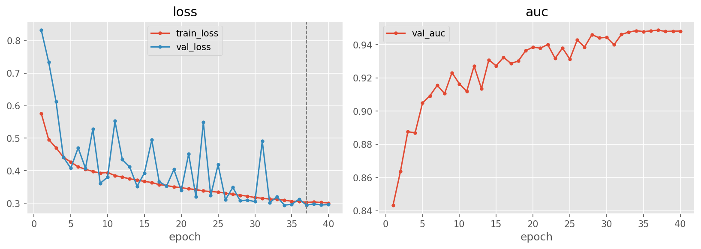
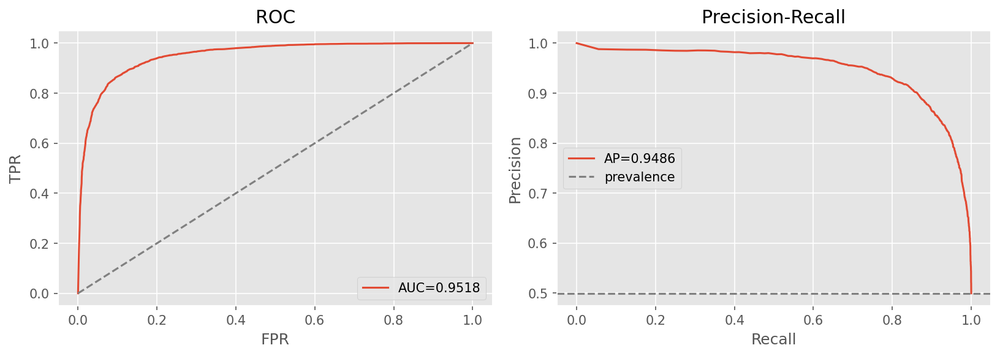

# srm-noise — forensic noise-residual detector (SRM + Bayar)

[← pipelines](README.md) · notebook [`11_srm-noise.ipynb`](../../notebooks/11_srm-noise.ipynb) ·
builder [`models.build_srm_cnn`](../../notebooks/utils/models.py)

This pipeline borrows its core idea from **image forensics** rather than from generic image classification.
The other detectors learn features from the image as-is; `srm-noise` first strips the image down to its
**noise residual** — what is left after the predictable, low-frequency content is subtracted — and
classifies *that*. The bet is that a generator's fingerprint lives in the residual, and that forcing the
network to look there stops it from latching onto semantic content.

## Purpose
Classify the **noise residual, not the content.** Camera sensors and generative models leave different
high-frequency residual statistics; by suppressing the image's smooth content and amplifying its
high-frequency residual, the model is steered toward the manipulation trace itself. This is a
deliberately *content-blind* front-end — it is the classic forensics recipe for camera-model and tampering
detection, repurposed here for real-vs-generated.

## Architecture

- **SRM** (`_SRM`): three **fixed** high-pass kernels (the standard Fridrich/Zhou Spatial Rich Model
  filters, normalised by 4 / 12 / 2), applied with `F.conv2d`. They are registered as a **buffer, not a
  parameter** — they never learn, they simply compute three fixed residual maps → (B, 3, H, W).
- **Bayar constrained conv** (`_BayarConv`): a **learnable** 5×5 convolution under the Bayar constraint —
  on every forward pass its **centre tap is pinned to −1** and the **remaining weights are renormalised to
  sum to +1**. That constraint forces each filter to compute *(neighbourhood prediction) − (centre pixel)*,
  i.e. a learnable high-pass / prediction-error operator → (B, bayar_ch, H, W).
- **Residual + classifier**: `concat(SRM(3), Bayar(bayar_ch))` → `_FeatCNN(3 + bayar_ch, feat)` →
  dropout → logit. `residual(x)` exposes the residual maps for inspection.

≈ **0.39 M** parameters — the **smallest** pipeline in the project.

> **Why a fixed front-end *and* a learnable one.** The two front-ends are complementary by design. The SRM
> kernels are hand-designed, battle-tested high-pass filters that work out of the box and inject a strong
> prior. The Bayar conv keeps the *form* of a high-pass filter (centre −1, surround sums +1) but learns the
> exact coefficients from data, so it can adapt to the specific residual signature of our generators rather
> than relying purely on the fixed prior. Constraining the convolution this way is what guarantees it stays
> a residual extractor — without the centre-tap / sum-to-one constraint, gradient descent would happily
> turn it back into an ordinary content-reading conv and the whole "classify the noise" premise would
> collapse.
>
> **Why this is a classic forensics front-end.** SRM filters and the Bayar constrained convolution are
> standard building blocks in the media-forensics literature for camera-model identification and tampering
> localisation. Bringing them to deepfake detection is the explicit hypothesis that generation, like other
> image manipulations, perturbs the high-frequency residual in a detectable way.

## Input & preprocessing
RGB **128×128** with **dataset** normalization and light augmentation — the standard from-scratch-CNN
recipe ([02-data §2.6](../02-data.md#26-preprocessing-notebook-03)). The SRM/Bayar residuals are computed
inside the model from the preprocessed RGB tensor.

## Training method
**AdamW**, **cosine schedule with warmup**, batch size per the notebook, **early-stop on validation AUC**,
with the loss type tuned (BCE won). The SRM buffer stays fixed throughout; the Bayar conv and the CNN are
the only things that learn (the Bayar re-normalisation is re-applied every forward step, so the constraint
holds across all of training).

## Optuna search

| Hyperparameter | Search space |
|----------------|--------------|
| `feat` | {128, 256, 384} |
| `bayar_ch` | {3, 6} |
| `p_drop` | [0.1, 0.5] |
| `lr` | [1e-3, 3e-3] log |
| `weight_decay` | [5e-4, 2e-3] log |
| `label_smooth` | [0, 0.1] |
| `loss` | {bce, focal} |

**24 trials** (11 complete, 13 pruned), **best val AUC 0.9324**.

Winner: **feat 128, bayar_ch 6**, p_drop 0.345, lr 1.37e-3, weight_decay 1.02e-3, label_smooth 0.025,
**loss bce**. The search prefers the richer **6-channel** Bayar bank over 3 — more learnable residual
operators help, which is consistent with the front-end carrying real discriminative weight.

## Results

| | Acc | F1 | AUC | PR-AUC | MCC | Brier |
|---|:---:|:--:|:---:|:------:|:---:|:-----:|
| @0.5 | 0.8824 | 0.8824 | 0.9518 | 0.9486 | 0.7649 | 0.0855 |
| @tuned (0.424) | 0.8810 | 0.8809 | 0.9518 | 0.9486 | 0.7624 | 0.0855 |

Confusion @0.5: `[[5339, 647], [760, 5217]]`.

> **Reading the result.** At **0.9518 AUC** the noise-residual detector is competitive but sits a notch
> below the RGB-consuming 128px models ([freqcross](freqcross.md) 0.9651, [two-stream](two-stream.md)
> 0.9609). That is an informative outcome rather than a disappointing one: discarding the image content and
> keeping only the residual is a strong constraint, so a model this small reaching ~0.95 AUC confirms that
> a genuine generator fingerprint *does* live in the high-frequency residual — just that, on this data,
> content cues (which this front-end deliberately suppresses) still carry additional signal the
> RGB models can use.

**Out-of-distribution: 0.5231 overall.** Per generator: adm 0.519 · biggan 0.432 · glide 0.527 ·
midjourney 0.678 · sdv5 0.541 · vqdm 0.370 · wukong 0.594. The residual front-end does not, on this data,
close the generalization gap — the unseen generators remain hard, with the same vqdm/biggan difficulty seen
across every pipeline.

## Explainability
Two views, the second specific to this architecture:

- **Grad-CAM** ([`gradcam.png`](../../notebooks/artifacts/srm-noise/figures/gradcam.png)) — where the
  classifier attends in the residual feature map.
- **The noise-residual maps themselves**
  ([`residuals.png`](../../notebooks/artifacts/srm-noise/figures/residuals.png)) — a direct picture of
  *what the SRM/Bayar front-end actually extracts* before the CNN ever sees it. Visualising the residual
  is the most honest explanation for this pipeline, because the residual *is* the input the model
  classifies; it shows the content being suppressed and the high-frequency texture being surfaced.

## Saved model & reload
The **full model** is committed → `artifacts/srm-noise/models/best.pt` (the SRM buffer and Bayar
constraint are rebuilt by the architecture, so a plain weights load suffices). Rebuild with
`build_srm_cnn(feat=128, bayar_ch=6)` and `load_weights`.
