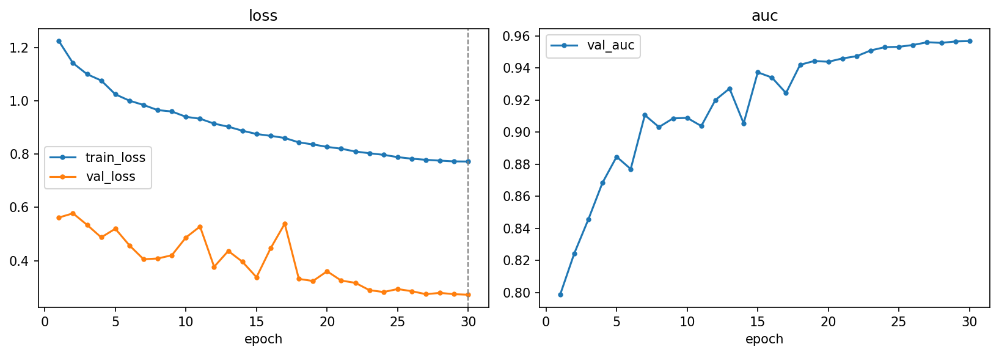
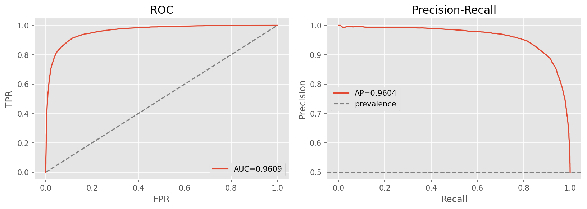

# two-stream — RGB + frequency fusion (multi-component)

[← pipelines](README.md) · notebook [`09_two-stream.ipynb`](../../notebooks/09_two-stream.ipynb) ·
builder [`models.build_two_stream`](../../notebooks/utils/models.py)

This is the first pipeline that acts directly on the project's central empirical finding. The frequency
EDA in [02-data §2.3.4](../02-data.md#234-frequency-analysis--the-empirical-heart-of-the-project) showed
that generated images deviate from real photographs in the high-frequency band — a cue a pure-RGB CNN may
under-exploit because spatial convolutions are not built to read a global spectrum. `two-stream` turns that
observation into an architecture: give the network the frequency view *explicitly*, as a second input
branch, and let it fuse the two.

## Purpose
Operationalise the frequency hypothesis with a **two-branch network** that sees each image twice — once as
RGB pixels and once as a frequency spectrum — and combines the two. It is also the project's first
**multi-component** pipeline: rather than a single black-box score, each stream emits its own intermediate
`p_fake` and the fusion emits the final one, so we can read off how much each modality actually contributes.

## Architecture

- **Spatial stream**: `_FeatCNN(3, feat)` consumes the RGB image and produces a (B, feat) feature vector —
  the conventional pixel-domain view.
- **Frequency stream**: `_FeatCNN(1, feat)` consumes a single-channel **luminance log-magnitude 2D FFT**.
  The transform is `gray = 0.299R + 0.587G + 0.114B` → `fftshift(fft2)` → `log1p(|·|)` → per-sample
  normalize. Luminance (not per-channel) keeps it one cheap channel; `fftshift` centres the low
  frequencies so the periphery is consistently the high-frequency band the EDA flagged; and `log1p`
  compresses the enormous dynamic range of an FFT magnitude into something a CNN can learn from.
- **Fusion**: `concat(spatial, freq)` → dropout → `Linear` → fused logit, with **per-stream auxiliary
  linear heads** alongside. `forward_all(x) → (fused, spatial_logit, freq_logit)` returns all three at once.

≈ **0.78 M** parameters.

> **Why frequency is computed on the fly, not cached.** The FFT branch's input is a deterministic function
> of the RGB image, so it could in principle be pre-computed like the [clip-probe](clip-probe.md)
> embeddings. We don't, for two reasons. First, the spectrum must be recomputed *after* the spatial
> augmentation (crop/flip) so the two streams always see the **same** view of the image — a cached spectrum
> would drift out of sync with an augmented RGB crop. Second, an FFT over a 128² luminance map is cheap
> relative to the convolutions, so caching would save little. The transform is written in **float32 and is
> autocast-safe**, so it slots cleanly into a mixed-precision training loop without numerical surprises.

## Input & preprocessing
RGB **128×128** with **dataset** normalization and light augmentation (the standard from-scratch-CNN recipe
from [02-data §2.6](../02-data.md#26-preprocessing-notebook-03); heavy augmentation is avoided precisely
because it would scrub away the frequency artifacts this model depends on). The frequency stream's input is
derived from the same preprocessed RGB tensor at forward time.

## Training method
The two branches and the fusion are trained **jointly**, with an auxiliary loss that forces each stream to
be independently predictive rather than letting the fusion lean entirely on one of them:

```text
loss = BCE(fused) + aux_weight · [BCE(spatial) + BCE(freq)]
```

The auxiliary term is what makes the per-component scores meaningful — without it, a stream could
contribute features to the fusion while being useless on its own. Optimiser **AdamW**, **cosine schedule
with a 3-epoch warmup over 40 epochs**, **batch 128**, **early-stop on validation AUC** (patience 7), with
the loss type (BCE vs focal) tuned.

## Optuna search

| Hyperparameter | Search space |
|----------------|--------------|
| `feat` | {128, 256, 384} |
| `aux_weight` | [0.1, 0.7] |
| `p_drop` | [0.1, 0.5] |
| `lr` | [1e-3, 3e-3] log |
| `weight_decay` | [5e-4, 2e-3] log |
| `label_smooth` | [0, 0.1] |
| `loss` | {bce, focal} |

**20 trials** (5 complete, 15 pruned), **best val AUC 0.9321** (this is the search-epoch validation score;
the fully-trained final model scores higher on test).

Winner: **feat 128, aux_weight 0.209**, p_drop 0.173, lr 1.40e-3, weight_decay 1.03e-3, label_smooth 0.043,
**loss focal (γ 1.28)**. Note the modest `aux_weight` (0.209) — the search wants the auxiliary heads present
enough to keep both streams honest, but light enough that the fused objective stays in charge.

## Results

| | Acc | F1 | AUC | PR-AUC | MCC | Brier |
|---|:---:|:--:|:---:|:------:|:---:|:-----:|
| @0.5 | 0.8977 | 0.8977 | 0.9609 | 0.9604 | 0.7954 | 0.0862 |
| @tuned (0.484) | 0.8982 | 0.8982 | 0.9609 | 0.9604 | 0.7964 | 0.0862 |

Confusion @0.5: `[[5406, 580], [644, 5333]]`. A solid 128px detector, though not the strongest at this
resolution — [freqcross](freqcross.md) edges it with a third branch and attention fusion.

**Out-of-distribution: 0.5264 overall.** Per generator: adm 0.548 · biggan 0.402 · glide 0.533 ·
midjourney 0.670 · sdv5 0.546 · vqdm 0.378 · wukong 0.607. As with every detector in the project, the
unseen generators expose a large generalization gap, with vqdm and biggan the hardest.

**Per-component findings.** This is where the multi-component design earns its keep:

- The **spatial (RGB) stream is the strong branch** — it carries most of the discriminative power on its
  own.
- The **frequency stream is much weaker alone** — useful, but well below the spatial branch when used in
  isolation.
- Yet **fusion beats either stream individually**: the two views are partly complementary, so combining
  them lifts the result above the better of the two. The frequency cue is also more *generator-stable*,
  which is exactly the property that matters out-of-distribution.

> A weak branch that nonetheless improves the fusion is the textbook justification for a two-stream design:
> the frequency stream contributes information the spatial stream lacks, even if it cannot stand alone. The
> per-stream numbers and the cross-pipeline comparison are tabulated in
> [05-results §5.4](../05-results.md#54-multi-component-pipelines-fusion-vs-single-stream).




## Explainability
**Grad-CAM on the spatial stream's last convolution** →
[`gradcam.png`](../../notebooks/artifacts/two-stream/figures/gradcam.png) shows *where* in the image the
pixel branch is looking. (Grad-CAM is natural for the spatial stream because it is a standard
convolutional feature map; the frequency stream's "where" is the spectrum itself, which the EDA spectra in
[02-data](../02-data.md#234-frequency-analysis--the-empirical-heart-of-the-project) already visualise.)

## Saved model & reload
The **full model** is committed → `artifacts/two-stream/models/best.pt` (**~20 MB**) — there is no
re-downloadable backbone to factor out, so everything trained is saved. Rebuild with
`build_two_stream(feat=128)` and `load_weights`. In the app this pipeline records its multi-component
output natively: `components: [spatial, frequency]` plus the fused `final`, matching the shared prediction
schema.
