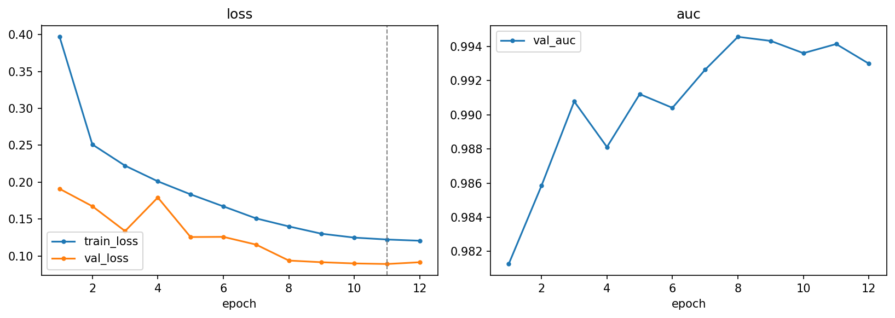
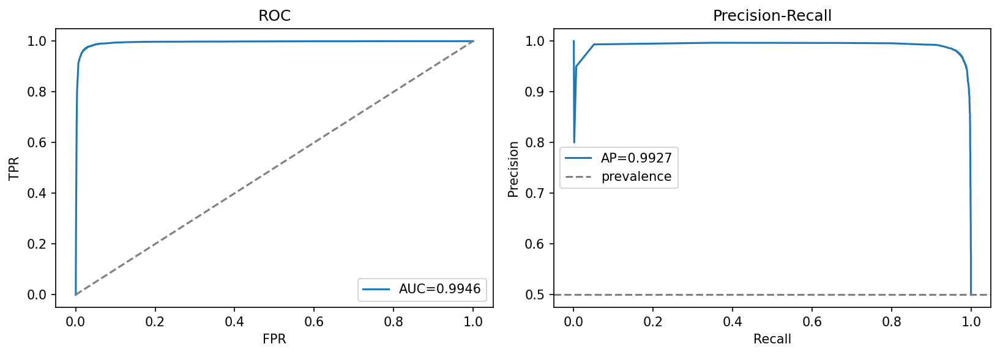
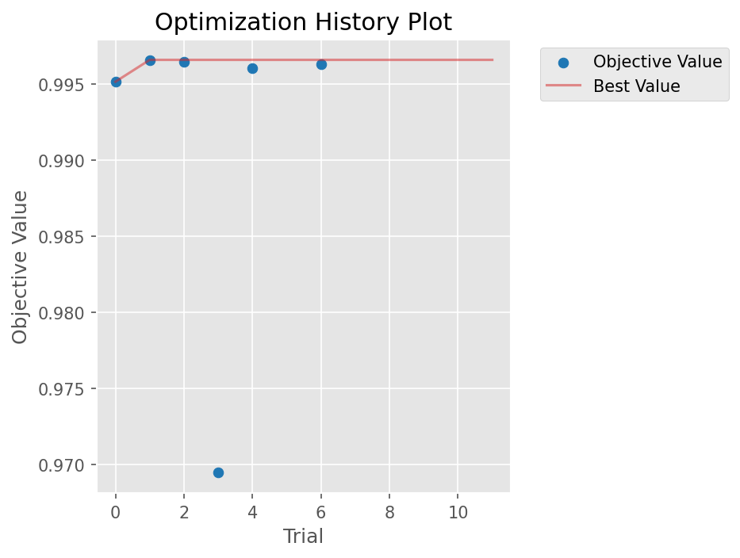

# vit-lora — ViT-Base with LoRA (parameter-efficient fine-tuning)

[← pipelines](README.md) · notebook [`07_vit-lora.ipynb`](../../notebooks/07_vit-lora.ipynb) ·
builder [`models.build_vit_lora`](../../notebooks/utils/models.py)

## Purpose
This pipeline tells the parameter-efficient fine-tuning (PEFT) story: how to adapt an 86-million-parameter
Vision Transformer to real-vs-fake on a single GPU while training only a tiny fraction of those parameters.
The motivation is practical — fully fine-tuning a ViT-Base is memory-hungry and stores a full-size
checkpoint per task — and LoRA sidesteps both costs. It also happens to be the **best in-distribution
model in the project** (AUC 0.9972) and the **best-calibrated** (lowest Brier), so it doubles as evidence
that PEFT is not a compromise: you can get the single strongest fit while training ~1% of the weights.

## Architecture
The backbone is a frozen `vit_base_patch16_224.augreg_in21k` — a ViT-Base pretrained on ImageNet-21k
(~86 M parameters). A Vision Transformer cuts the 224² image into 16×16 patches, embeds each as a token,
prepends a learnable `[CLS]` token, and runs the sequence through transformer blocks whose self-attention
lets every patch exchange information with every other; the final `[CLS]` representation summarises the
whole image for classification. Here that entire backbone is **frozen** — its weights never receive a
gradient.

The adaptation is **LoRA (Low-Rank Adaptation)**, applied via the `peft` library. The key observation
behind LoRA is that the *update* a model needs to learn for a new task is typically low-rank — it lives in
a small subspace — even though the weight matrices themselves are large. So instead of learning a full
update `ΔW` (size `d×d`, with `d=768`), LoRA freezes the original `W` and learns `ΔW = B·A`, where `A` is
`r×d` and `B` is `d×r` with the rank `r ≪ d`. The effective weight at training time is `W + BA`, but only
the two skinny matrices `A` and `B` are trainable. That is the whole trick: the number of trainable
parameters drops from `d²` to `2rd`, a factor of hundreds smaller. Here LoRA is injected into the attention
**`qkv`** projections (the query/key/value matrices, where adaptation has the most leverage), and
`modules_to_save=["head"]` keeps a fresh, trainable classification head on the `[CLS]` token. The result:
only `A, B` + the head are optimised — roughly **~1.2 M of the 86 M** parameters.

> **Zero added inference latency.** Because the update is just `W + BA`, at inference time
> `merge_and_unload()` *folds* the low-rank update back into the original weight matrices, producing a plain
> timm ViT with no LoRA branches and no extra operations. You get the adapted model's accuracy at the
> unmodified model's speed — there is no runtime tax for having used PEFT, unlike adapter methods that leave
> extra layers in the forward path.

## Input & preprocessing
RGB **224×224**, **ImageNet** normalization (matching the backbone's pretraining distribution); the image
is patchified into 16×16 patches by the ViT itself.

## Training method
Only the `requires_grad` parameters — the LoRA matrices and the head — are handed to the optimiser, so the
86 M frozen weights cost no gradient memory. AdamW · cosine + 1-epoch warmup over **12 epochs** · batch 64 ·
early-stop on val AUC (patience 5) · focal loss (selected by the search). Twelve epochs suffice precisely
*because* so few parameters are moving: there is little to fit, the pretrained features do the heavy
lifting, and the small trainable set converges quickly without over-fitting.

## Optuna search
Space: `r {4,8,16,32}`, `lora_alpha {8,16,32}`, `lora_dropout [0,0.2]`, `p_drop [0,0.3]`,
`lr [3e-4,2e-3] log`, `weight_decay [1e-5,1e-3] log`, `label_smooth [0,0.1]`, `loss {bce,focal}`.
**12 trials** (6 complete, 6 pruned), **best val AUC 0.9966**. The search tunes the two LoRA-specific knobs
that matter most — the rank `r` (capacity of the update) and `lora_alpha` (its scaling) — alongside the
usual optimisation hyperparameters.

Winner: **r 32, lora_alpha 32**, lora_dropout 0.028, p_drop 0.088, lr 6.0e-4, weight_decay 8.2e-5,
label_smooth 0.079, **loss focal (γ 2.18)**. The search picking the **largest rank (32)** suggests the task
benefits from a slightly higher-capacity update than the minimum — though even r=32 keeps the trainable set
at ~1.2 M, still a rounding error against the backbone.

## Results

| | Acc | F1 | AUC | PR-AUC | MCC | Brier |
|---|:---:|:--:|:---:|:------:|:---:|:-----:|
| @0.5 | 0.9782 | 0.9782 | **0.9972** | 0.9969 | 0.9564 | **0.0172** |
| @tuned (0.484) | 0.9781 | 0.9781 | 0.9972 | 0.9969 | 0.9562 | 0.0172 |

Confusion @0.5: `[[5857, 129], [132, 5845]]` — the cleanest confusion matrix of all pipelines, with errors
nearly symmetric between the two classes (129 false positives vs 132 false negatives). Two numbers deserve
emphasis. First, the **0.9972 AUC** is the highest in the project, edging out even the strongly-tuned
`cnn-finetune` and `patch-ensemble`. Second, the **Brier score of 0.0172** is the lowest of any pipeline,
which means this model is not just accurate but *well-calibrated* — its predicted probabilities track the
true likelihood of "fake" closely, so a reported `p_fake` of 0.9 really does mean about 90% confidence.
That calibration is corroborated by the tuned threshold sitting almost exactly at 0.5 (0.484): a
well-calibrated model needs essentially no threshold correction, and accuracy is flat across the two
operating points. Why does LoRA on a frozen ViT-21k come out on top? The backbone brings an extremely
strong, broadly-pretrained feature space, and constraining the adaptation to a low-rank update acts as a
built-in regulariser — it cannot over-fit the way a full fine-tune can, because it simply does not have the
free parameters to memorise the training set.

**OOD overall acc 0.6022** (2nd best, behind only `patch-ensemble`); per-generator: adm 0.648 ·
biggan 0.458 · glide 0.566 · midjourney 0.791 · sdv5 0.641 · vqdm 0.426 · wukong 0.686. The same low-rank
regularisation that gives the best in-distribution fit also leaves it with a *smaller* generalization gap
than the heavily-adapted `cnn-finetune` — it is both the strongest in-distribution model and one of the
more robust ones out-of-distribution, the most favourable combination in the comparison.

## Explainability
**Attention rollout** over the transformer blocks →
[`attention_rollout.png`](../../notebooks/artifacts/vit-lora/figures/attention_rollout.png) (also in the
[evaluation gallery](../../notebooks/artifacts/evaluation/figures/vit_attention_rollout.png)). Attention
rollout is the ViT-native counterpart to Grad-CAM: it multiplies the per-layer attention matrices together
to trace how much each input patch ultimately influences the `[CLS]` token, yielding a heatmap of where the
transformer "looked" when deciding real vs. fake.

## Saved model & reload
**LoRA + head only** → `artifacts/vit-lora/models/best.pt` (~2.4 MB). This is the most extreme example of
the project's model-sharing scheme: because the 86 M-parameter ViT is re-downloadable, only the ~1.2 M
trained parameters are committed, and the whole checkpoint is a mere 2.4 MB. Rebuild with
`build_vit_lora(r=32, lora_alpha=32, …)` (which re-downloads the frozen ViT), load with
`load_weights(strict=False)` (the backbone weights are absent by design, hence non-strict), then call
`merge_and_unload()` to fold the LoRA update in for inference and attention rollout.
