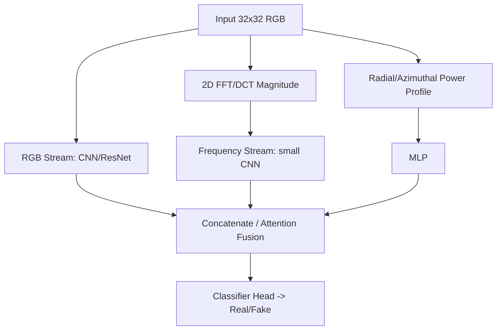
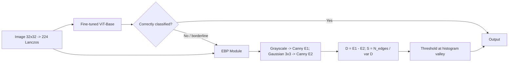
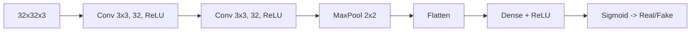
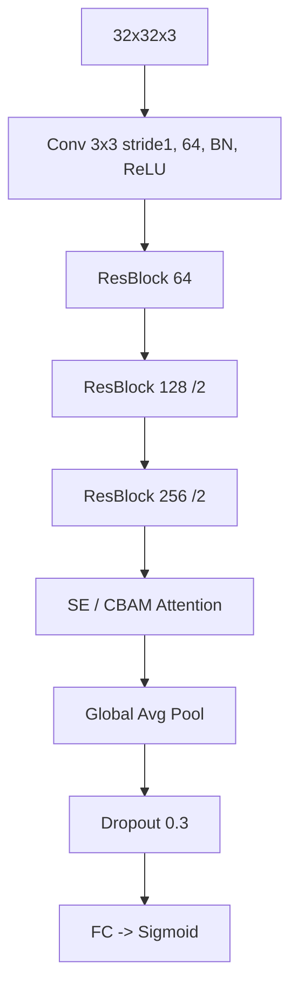
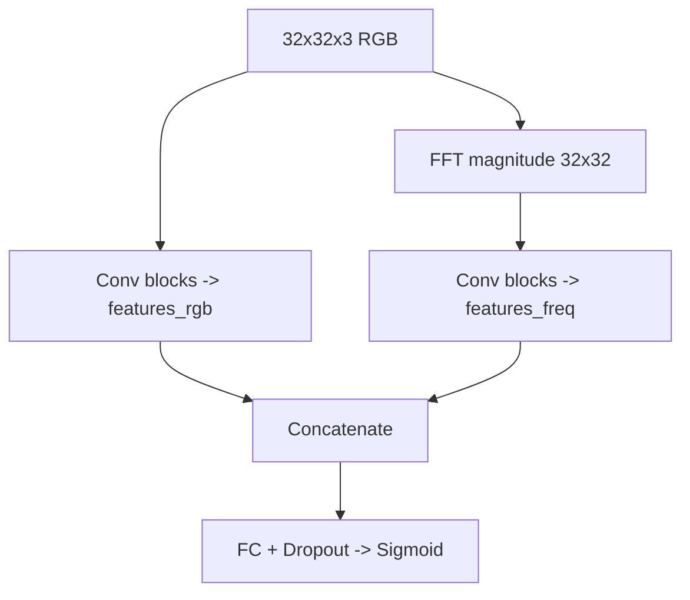

# Detecting Deepfakes & AI-Generated Images: A Complete Method Guide

> **Project update (2026-06) — read first.** This project **no longer uses CIFAKE (32×32)** — it was dropped as too low-resolution for photographic detection, transfer learning, and a meaningful upload-a-photo app. The datasets are now **`ai-real-images`** (`tristanzhang32/ai-generated-images-vs-real-images`, ~60k photo-resolution real-vs-AI images from Stable Diffusion + Midjourney + DALL·E) as the **primary** training/eval set, and **`tiny-genimage`** (a GenImage subset, 7 generators) as the **cross-generator OOD** test set.
>
> Therefore the **CIFAKE-specific guidance below no longer applies** (32×32 handling, 32→224 upsampling, CIFAR-style stems, and any CIFAKE accuracy figures) and is retained only as historical context. The **higher-level methodology is dataset-agnostic and still valid**: transfer learning, LoRA/PEFT, CLIP/DINOv2 probes, two-stream frequency fusion, the generalization gap, robustness curves, and explainability. See [CLAUDE.md](../CLAUDE.md) for the current plan.

## TL;DR

- **For a 3-person MSc project, the highest-value, realistic pipeline is: (1) a small CNN trained from scratch on 32×32 (reproducing the CIFAKE baseline ~92.98%), (2) a fine-tuned backbone — ResNet50V2 reached ~96.35% and an edge-enhanced ViT reached 97.75% accuracy / F1 0.9777 on CIFAKE — and (3) a CLIP linear-probe for cross-generator generalization.** Classical/handcrafted baselines (LightGBM on fused HOG/LBP/GLCM/DCT/wavelet features) reach F1 ≈ 0.9447 and are cheap, CPU-trainable and interpretable.
- **The single most important scientific lesson to demonstrate is the generalization gap:** GenImage shows a ResNet-50 trained and tested within the Stable Diffusion V1.4/V1.5 subsets reaches 99.9% accuracy, yet the same ResNet-50 trained on SD V1.4 and tested on Midjourney drops to 54.9% (cross-generator average 66.9%); Ojha et al. report trained deep networks generalize at only ~53–58% on unseen generators. Building a cross-generator test (CIFAKE → GenImage/Synthbuster) and a robustness curve (JPEG/blur/noise) is worth more marks than chasing the last 1% of in-distribution accuracy.
- **Frequency analysis is a project in itself:** diffusion images (CIFAKE) differ from real CIFAR-10 in the spectral domain, and this difference — plus reconstruction-based features (DIRE/DNF) and CLIP embeddings — is what powers two-stream and hybrid architectures.

## Key Findings

1. **CIFAKE is a binary, 32×32 RGB problem with 120k images** (60k real CIFAR-10, 60k Stable Diffusion 1.4 fakes; 100k train / 20k test). The originating paper (Bird & Lotfi, arXiv:2303.14126) used a tiny 2-conv-layer CNN reaching 92.98%, and crucially its Grad-CAM showed the model keys on background imperfections, not the object.
2. **Transfer learning dominates the in-distribution leaderboard** — fine-tuned ResNet50V2 ~96.35%, edge-enhanced ViT 97.75% / F1 0.9777 (arXiv:2508.17877), CNN-ViT hybrids ~98.3%.
3. **Handcrafted features remain competitive and interpretable**: fused features + LightGBM reach F1 0.9447 / ROC-AUC 0.9878 / balanced accuracy 0.9446 (arXiv:2601.19262).
4. **CLIP-feature linear/nearest-neighbour probes generalize best across unseen generators** (Ojha et al. CVPR 2023: +15.07 mAP, +25.90% accuracy over prior SoTA on unseen diffusion/autoregressive models; Cozzolino et al. CVPR-W 2024).
5. **Reconstruction-based features (DIRE, DNF)** exploit that diffusion models reconstruct their own outputs with lower error than real images — strong but compute-heavy.
6. **The 32×32 resolution is a real constraint**: upsampling to 224 (Lanczos) for ImageNet backbones vs. adapting a CIFAR-style stem are the two routes, and should be reported as an ablation.

## Details

### 1. The CIFAKE Dataset and Why 32×32 Matters

CIFAKE (Bird & Lotfi, IEEE Access 2024; arXiv:2303.14126) pairs the 60,000 real CIFAR-10 images with 60,000 synthetic images generated by **Stable Diffusion 1.4** (rendered at 512px, resized to 32×32). The split is 100,000 training (50k/50k) and 20,000 test (10k/10k), across the 10 CIFAR classes. It is a clean, balanced binary classification benchmark.

The original CNN: a sweep of **36 topologies** (filters {16,32,64,128} × {1,2,3} conv layers). Best accuracy 92.98% (2 conv × 128 filters); the selected lowest-loss model used **2 conv layers × 32 filters + dense layers + sigmoid output** (92.93%, BCE loss 0.18). The replication paper (arXiv:2412.00073) describes it as "two convolutional layers, each with 32 filters, followed by two linear (fully connected) layers." **Grad-CAM finding (verbatim): "the actual entity itself does not hold useful information for classification; instead, the model focuses on small visual imperfections in the background of the images."** Documented synthetic defects included text-like glitches, missing detail (a jet with no cockpit window), and anatomical errors.

**The 32×32 challenge.** Most pretrained backbones expect 224×224. Two strategies:

- **Upsample 32→224** (bilinear/bicubic/Lanczos). The edge-ViT paper used **Lanczos** resampling. Pro: reuse ImageNet weights directly. Con: upsampling can blur/introduce its own artifacts and destroy native high-frequency cues.
- **Adapt the stem CIFAR-style**: replace the 7×7 stride-2 conv + maxpool of ResNet with a 3×3 stride-1 conv, no early downsampling, so the network keeps spatial resolution. Standard for CIFAR ResNets.

### 2. Classical / OpenCV & Traditional ML Baselines

This is where a strong, interpretable, low-compute baseline lives.

**Handcrafted feature families (all implementable in OpenCV / scikit-image):**

- **Color histograms / color statistics** — per-channel histograms, mean/var, CbCr chrominance (the CIFAKE paper itself flagged chrominance as promising).
- **Texture: LBP (Local Binary Patterns)**, **GLCM (Gray-Level Co-occurrence Matrix)** → contrast/homogeneity/energy/correlation, **HOG (Histogram of Oriented Gradients)**.
- **Frequency: 2D DCT / FFT spectra**, **azimuthal averaging of the power spectrum** (reduces the 2D spectrum to a 1D radial profile — the classic Frank et al. "Leveraging Frequency Analysis for Deep Fake Image Recognition" approach), **wavelet (Daubechies) subband energies**.
- **Forensic residuals**: **PRNU** (sensor noise — weak at 32×32), **Error Level Analysis (ELA)**, **JPEG artifact / quantization analysis**, **noise residuals**.

**Classifiers on top**: Logistic Regression, SVM, Random Forest, ExtraTrees, and gradient-boosted trees (XGBoost, LightGBM, CatBoost).

**Concrete CIFAKE result (arXiv:2601.19262, "Handcrafted Feature Fusion"):** Using 50k train / 10k test, fusing raw pixels + color histograms + DCT + HOG + LBP + GLCM + wavelets and classifying with **LightGBM** gave **PR-AUC 0.9879, ROC-AUC 0.9878, F1 0.9447, balanced accuracy 0.9446, MCC 0.8891, Brier 0.0414**. Performance improved monotonically: baseline (raw+hist+DCT) LightGBM F1 0.9018 → advanced (HOG+LBP+GLCM+wavelets) 0.9171 → mixed 0.9447. Boosted trees beat bagging (RF/ExtraTrees) and linear models; worst was Logistic Regression on baseline features (F1 0.75). Feature recipe: color hist 16 bins/channel; DCT top-left 8×8 low-freq block; HOG 8×8 cells/9 orientations; LBP uniform P=8,R=1; GLCM 32 levels, d=1, 4 angles; wavelets db2 level-1 subband energies.

**Reliability assessment**: Handcrafted + boosting is **surprisingly strong in-distribution** (F1 ~0.94), very cheap (CPU-trainable in minutes), interpretable and data-efficient. But it is brittle across generators and to compression. **Suitability for CIFAKE: excellent as a baseline and interpretability anchor; implementation difficulty: low; libraries: OpenCV, scikit-image, scikit-learn, lightgbm/xgboost.**

### 3. Dataset Analysis & Frequency-Domain EDA

What the team can extract directly from CIFAKE:

- **EDA**: class balance, per-class mean images, pixel-intensity histograms, color-channel statistics real vs fake, saturation/brightness distributions.
- **Frequency analysis**: average 2D FFT/DCT magnitude spectra for real vs fake; **azimuthally averaged (radial) power spectrum**. Key documented physics: **GAN images leave periodic "checkerboard" high-frequency spikes** (from transposed-conv upsampling), whereas **diffusion images lack those periodic spikes but show a broad, non-periodic deviation in the high-frequency band** — and diffusion models exhibit a *frequency bias*: they under-reproduce the finest high frequencies/details (Corvi et al. CVPR-W 2023, "Intriguing Properties of Synthetic Images"). FreqCross (arXiv:2507.02995) reports synthetic images show systematically elevated energy in the 0.1–0.4 normalized-frequency range.
- **Spectral fingerprints**: each generator family inserts a characteristic spectral signature; diffusion images inherit spectral characteristics of their training data (arXiv:2503.11071).
- **Per-class analysis & visualization**: t-SNE/UMAP of features (the multi-feature fusion work arXiv:2603.29788 shows fused CLIP+texture features form more separable clusters; silhouette ALL 0.052 > CLIP alone 0.043).

This is a high-value, low-risk section and directly motivates the two-stream architectures below.

### 4. Fine-Tuning Pretrained Backbones (Transfer Learning)

**Backbones**: ResNet50/ResNet50V2, EfficientNet-B0, ConvNeXt, DenseNet121, ViT-Base/DeiT/Swin. All available in **timm** and torchvision.

**CIFAKE numbers** (note: some are same-protocol re-implementations from arXiv:2508.17877 Table 3, others standalone):

- Fine-tuned **ResNet50V2 ~96.35%** (transfer-learning study).
- **Edge-enhanced ViT + EBP 97.75% / F1 0.9777** (arXiv:2508.17877) — backbone `vit-base-patch16-224-in21k`, ~86M params.
- MobileNet 90.10%, VGG16/InceptionV4 lower (SpringerLink pre-trained CNN study).
- SE-ResNet50 (ResNet + Squeeze-Excitation) 96.12% (MDPI Appl. Sci. 2025).
- CNN-ViT hybrid 98.32%, AUROC 0.9977 (arXiv:2512.21512).
- From edge-ViT Table 3 (their re-implementation): ResNet50 0.8988, MobileNetV2 0.9337, DenseNet121 0.9387, EfficientNet-B0 0.9275, VGG19 0.9375.

**Two-stage fine-tuning recipe** (recommended): (1) freeze backbone, train only the new head; (2) unfreeze and fine-tune with **discriminative learning rates** (small LR for early layers, larger for head) + cosine schedule. Use light augmentation (flips, small crops); **avoid aggressive augmentation that destroys the subtle generative artifacts** (heavy JPEG/blur during training is a deliberate robustness choice, not free).

**Suitability for CIFAKE**: excellent; single mid-range GPU suffices at 32×32. Difficulty: low-medium. Libraries: PyTorch + timm.

### 5. Image Encoding + Classification (Foundation-Model Embeddings)

Extract embeddings from a **frozen** vision encoder, then train a lightweight classifier (linear probe / MLP / SVM).

- **CLIP** (Ojha, Li & Lee, "Towards Universal Fake Image Detectors That Generalize Across Generative Models," CVPR 2023 / arXiv:2302.10174): nearest-neighbor or linear probe on frozen CLIP features generalizes across unseen generators. Verbatim: "it improves upon the SoTA by +15.07 mAP and +25.90% acc when tested on unseen diffusion and autoregressive models." They reach ~82% on unseen generators where trained deep networks manage only 53–58%.
- **Cozzolino et al., "Raising the Bar…with CLIP"** (CVPR-W 2024 / arXiv:2312.00195): a few example images from one generator give a CLIP detector that generalizes to DALL·E 3, Midjourney v5, Firefly; +6% AUC OOD, +13% robustness. Code at grip-unina/ClipBased-SyntheticImageDetection.
- **C2P-CLIP, RINE, FatFormer** inject category prompts / intermediate features / adapters.
- **DINOv2, BLIP** are alternative encoders.

**Why CLIP generalizes**: its features encode high-level semantic/distributional cues, and detectors learn to flag *deviation from the real manifold* rather than generator-specific low-level artifacts. As Ojha et al. put it (verbatim): "the resulting classifier is asymmetrically tuned to detect patterns that make an image fake. The real class becomes a 'sink' class holding anything that is not fake, including generated images from models not accessible during training." **Suitability for CIFAKE: very strong, and the best vehicle for the generalization story**; difficulty: low (embeddings + sklearn). Libraries: open_clip / HF transformers + scikit-learn.

### 6. LoRA and Parameter-Efficient Fine-Tuning (PEFT)

**LoRA (Low-Rank Adaptation, Hu et al. ICLR 2022)**: freeze pretrained weight W; learn a low-rank update ΔW = B·A where A∈ℝ^{r×k}, B∈ℝ^{d×r}, rank r ≪ min(d,k). Forward pass h = Wx + BAx. Only A,B are trained (orders of magnitude fewer parameters); at inference W* = W + BA can be merged (zero added latency). In ViTs, LoRA is **injected into the query and value projection matrices** (sometimes K and the output projection) of the multi-head self-attention. Typical rank r ∈ {4, 8, 16, 64}; a common ViT-Base setting is r=16 with d=768.

**Other PEFT**: **Adapters** (small bottleneck MLPs inserted in blocks), **BitFit** (train only biases), **prompt/prefix tuning**, **Convpass** (convolutional adapters). "Mixture of Low-rank Experts" (arXiv:2404.04883) applies LoRA experts to CLIP-ViT for transferable AIGI detection.

**Benefits for a student project**: fine-tune a ViT-Base on a single GPU with a fraction of the memory/compute, less overfitting on a small task, and tiny (~MB) checkpoints. Libraries: Hugging Face **peft** + transformers.

**LoRA as an ATTACK** (arXiv:2412.00073): the authors LoRA-fine-tuned Stable Diffusion 2.1 with a photorealism trigger word (`R3E4AL`) to build CIFAKE-SD2.1-LoRA; a CNN detector trained on CIFAKE-SD2.1 dropped from **95.23% → 85.27% overall and to 78.18% on the fake class** — i.e., cheap LoRA personalization produces evasive fakes. They also showed cross-version brittleness (a CIFAKE-SD3.0-trained model scored only 44.63% on original CIFAKE fakes) and that Gaussian blur crushed fake-detection accuracy (98.10% → 49.90%).

### 7. Hybrid & Two-Stream / Multi-Modal Architectures

**(a) Spatial + Frequency two-stream.** RGB stream (CNN) ∥ frequency stream (FFT/DCT) → fuse → classify.

**FreqCross (arXiv:2507.02995)** is exactly this three-branch design: ResNet-18 spatial + lightweight CNN on FFT magnitude + MLP on radial energy profile → concatenation → head; **97.8% accuracy** on SD3.5-vs-COCO, ~94.6% average cross-generator. **CAMME** (arXiv:2505.18035) and the **multi-modal texture fusion** network (RGB + LBP + GLCM branches, Front. AI 2025) are similar.

**(b) Handcrafted + deep fusion.** Concatenate handcrafted descriptors (LBP/GLCM/DCT) with deep features before the classifier (multi-feature fusion arXiv:2603.29788).

**(c) Edge-enhanced (arXiv:2508.17877).** Fine-tuned ViT (`vit-base-patch16-224-in21k`, ImageNet-21k pretrained; 32→224 via **Lanczos**) + an **Edge-Based Processing (EBP)** module: grayscale → Canny on the original (E₁) and a 3×3-Gaussian-blurred copy (E₂) → difference map D=E₁−E₂ → score **S = N_edges / (var(D)+ε)**; threshold set at the histogram valley between the real/fake median scores. AI images have smoother textures/weaker edges, so their edge structure barely changes after smoothing. Applied as post-processing to ViT-misclassified samples → **97.75% / F1 0.9777** (Precision 0.9689, Recall 0.9867); a 3×3 kernel beat larger kernels.

**(d) Reconstruction-based.**

- **DIRE (arXiv:2303.09295, ICCV 2023)**: invert the image with DDIM, reconstruct with a pretrained diffusion model; **diffusion-generated images reconstruct with lower error** than real ones → DIRE map → binary classifier. Robust to blur/JPEG; generalizes across diffusion models. Heavy (≈40 diffusion calls). Introduced the **DiffusionForensics** dataset.
- **DNF (Diffusion Noise Feature, arXiv:2312.02625)**: collect estimated noise across inverse diffusion steps; amplifies high-frequency fingerprints; a ResNet on DNF reaches SoTA. Independent testing confirms strong in-distribution but weaker OOD generalization.
- **DistilDIRE (arXiv:2406.00856)** distills DIRE for speed.

These are described for completeness; at 32×32 they require a diffusion model operating at that resolution and are **compute-heavy for a course project**.

### 8. Custom Architectures From Scratch (32×32)

**(A) Original CIFAKE CNN (reproduce as baseline):**

~92.98% accuracy; trains in minutes.

**(B) Improved residual CNN (recommended custom model):**

CIFAR-style stem (3×3 stride-1, no early maxpool) preserves the high-frequency artifacts; residual blocks + an attention module (SE/CBAM) + GAP. Expect mid-90s% with light augmentation.

**(C) Dual-branch spatial/frequency CNN from scratch** (mirrors FreqCross but small): one branch on RGB, one on the per-image FFT magnitude, concatenate → FC. The dual-input model in arXiv:2406.13688 (RGB + DFT) reaches ~94%.

### 9. Broader Deepfake Detection Landscape (Background)

- **Face/video deepfakes**: FaceForensics++ (1,000 real + 4,000 fake via DeepFakes/Face2Face/FaceSwap/NeuralTextures), Celeb-DF v2 (590 real + 5,639 fake videos, 59 celebrities), DFDC (1,131 real + 4,119 fake in preview; ~100k clips full), DeeperForensics-1.0, WildDeepfake, and the newer Celeb-DF++ (22 forgery methods). Cross-dataset generalization is poor (e.g., FF++→Celeb-DF++ average frame-AUC ~69.4%).
- **GAN vs diffusion artifacts**: GANs → periodic spectral spikes; diffusion → broad high-frequency deviation + frequency bias; diffusion images are "harder," with fewer spectral artifacts than GANs.
- **Biological/physiological signals (video)**: eye-blink rate (In Ictu Oculi; healthy-adult blink interval ~2.8 s, harder for old deepfakes to mimic), head-pose inconsistency, rPPG/heart-rate (DeepFakesON-Phys ~98% on Celeb-DF/DFDC; DeepRhythm). **However, Seibold et al., "High-quality deepfakes have a heart!" (Frontiers in Imaging vol. 4, 30 Apr 2025, doi:10.3389/fimag.2025.1504551, Fraunhofer HHI / Humboldt University Berlin) show that recent high-quality deepfakes inherit a realistic heartbeat from the source video, undermining rPPG detectors** — lead author Eisert: "recent high-quality deepfake videos can feature a realistic heartbeat … which makes them much harder to detect." (Not applicable to CIFAKE objects; included as context.)
- **The generalization problem (central challenge)**: GenImage (arXiv:2306.08571) — "training and testing within each subset consistently yield accuracy rates surpassing 98.5% … Stable Diffusion V1.4 and V1.5 subsets achieve an exceptional accuracy of 99.9%. However … when the ResNet-50 is trained on Stable Diffusion V1.4 and tested on Midjourney, the binary classification accuracy drops to 54.9%" (cross-generator average 66.9%). Ojha et al. report trained deep networks generalize at only ~53–58% on unseen generators.
- **Robustness**: JPEG, blur, resize, and noise degrade detectors sharply; resizing to 25% can make some CLIP detectors useless. Heavy augmentation during training (Corvi) buys JPEG robustness.
- **Adversarial attacks**: RAID (arXiv:2506.03988) and "Fake It Until You Break It" (arXiv:2410.01574) show transferable adversarial perturbations flip SoTA detectors.
- **Surveys**: "Recent Advances on Generalizable Diffusion-generated Image Detection" (arXiv:2502.19716) classifies methods into data-driven vs feature-driven (6 sub-categories); "Methods and Trends in Detecting AI-Generated Images" (arXiv:2502.15176). **VERITAS (arXiv:2507.05146)** is directly relevant: a framework that classifies *small (32×32)* images as real/synthetic AND explains why via artifact localization + VLM semantic reasoning — a strong template for the explainability component.

### 10. More Recent / Additional Datasets

| Dataset | Size | Generators | Resolution | Use |
|---|---|---|---|---|
| **CIFAKE** | 120k (60k/60k) | SD 1.4 | 32×32 | Primary; binary |
| **GenImage** (arXiv:2306.08571) | 2,681,167 (1,331,167 real / 1,350,000 fake) | 8: BigGAN, GLIDE, VQDM, SD1.4, SD1.5, ADM, Midjourney, Wukong | ImageNet-scale | Cross-generator + degraded protocols |
| **DiffusionForensics** (DIRE) | 439,020 fake / 92,000 real | 8–11 diffusion models | LSUN/ImageNet/CelebA-HQ | Diffusion detection |
| **ArtiFact** | 1,521,900 fake / 962,200 real | GANs + DMs | mixed | Broad |
| **WildFake** (arXiv:2402.11843) | 3,694,313 (1,013,446 real / 2,680,867 fake) | GANs, DMs, others; hierarchical | mixed | In-the-wild, robustness |
| **Synthbuster** | 9×1,000 fake + 1,000 real (RAISE) | SD2, SDXL, DALL·E 2/3, Midjourney, Firefly, GLIDE | high-res | OOD benchmark |
| **Chameleon** | ~26k (≈11k fake / 14k real) | in-the-wild | 720p–4K | Hard "sanity check" |
| **DiffusionDB** | 14,000,000 | SD prompts | mixed | Prompts/scale |

For cross-generator generalization, **GenImage** (its SD V1.4 subset pairs naturally with CIFAKE) and **Synthbuster** are the best optional add-ons. SD1.4, SD1.5, SDXL, SD3, DALL·E, Midjourney and FLUX outputs all appear across these benchmarks.

### 11. Evaluation Methodology

- **Metrics**: accuracy, **macro-F1**, **AUC-ROC**, **average precision/PR-AUC**, precision/recall, confusion matrix, **MCC** and **Brier score** (calibration — used in the handcrafted paper). For balanced CIFAKE, accuracy is acceptable, but always report F1/AUC too.
- **Splits**: use the official 100k/20k; carve a validation set from train (e.g., 90/10 stratified). Never tune on test.
- **Cross-generator protocol**: train on CIFAKE (SD1.4), test on GenImage subsets / Synthbuster / SD2.1/SD3 variants; report per-generator accuracy (this exposes the generalization gap).
- **Robustness protocol**: plot metric vs perturbation strength for JPEG quality (100→60), Gaussian blur σ, downsample scale, and additive noise.
- **Explainability**: **Grad-CAM** (CNNs), **attention rollout** (ViTs), frequency-spectrum visualizations, and t-SNE of embeddings. Reproduce the CIFAKE Grad-CAM "background, not object" finding; consider the VERITAS-style artifact-localization explanation.

### 12. Practical Implementation Stack & Roadmap

**Stack**: PyTorch; **timm** (backbones); **Hugging Face transformers + peft** (ViT + LoRA); **open_clip** (CLIP); **OpenCV + scikit-image** (handcrafted/frequency); **scikit-learn + lightgbm/xgboost** (classical); **matplotlib/seaborn** (viz); **pytorch-grad-cam** (explainability). A single mid-range GPU (8–12 GB) is sufficient at 32×32; classical baselines run on CPU.

**Suggested scope & division of labour (3 people, ~4–6 weeks):**

- **Person A — Classical & EDA**: dataset EDA, frequency analysis (FFT/DCT, azimuthal power spectrum), handcrafted features (HOG/LBP/GLCM/DCT/wavelets) + LightGBM/SVM; reproduce ~F1 0.94 and the spectral real-vs-fake story.
- **Person B — Deep models**: reproduce CIFAKE CNN from scratch, train the improved residual/dual-branch CNN, fine-tune ResNet50V2/EfficientNet and a ViT (with **LoRA** for the efficiency story). Target 96–98%.
- **Person C — Foundation models, generalization & robustness**: CLIP/DINOv2 linear probe; cross-generator eval (GenImage/Synthbuster); robustness curves (JPEG/blur/noise); adversarial/LoRA-attack mini-study; explainability (Grad-CAM, attention rollout).
- **Shared**: a two-stream (RGB+FFT) fusion model as the integrative "novel" contribution, and a unified evaluation harness.

## Recommendations

1. **Start by reproducing the CIFAKE CNN (92.98%) and a LightGBM handcrafted baseline (F1 ~0.94).** Quick wins that establish your evaluation harness and interpretability anchor.
2. **Then fine-tune one CNN (ResNet50V2/EfficientNet) and one ViT.** Use the CIFAR-style stem OR Lanczos upsampling — *report both* as an ablation. Add **LoRA** to the ViT for the PEFT story (memory/compute savings on one GPU). Target ≥96%.
3. **Build the generalization + robustness evaluation early** — this is the differentiator. Threshold to change strategy: **if in-distribution accuracy is ≥95% but cross-generator accuracy drops below ~70%** (the GenImage/Ojha regime), pivot effort to a **CLIP linear probe** (best OOD generalizer) and to augmentation-based robustness rather than more in-distribution tuning.
4. **Implement one two-stream (RGB+FFT) model** as your integrative contribution; it directly operationalizes the frequency findings and is small enough to train from scratch at 32×32.
5. **Treat DIRE/DNF as "described, optionally attempted"** — SoTA-relevant but compute-heavy at 32×32; only attempt if a diffusion model at that resolution and GPU budget allow.
6. **Report calibration (Brier) and confusion matrices, not just accuracy**, and reproduce the Grad-CAM "background" finding for the explainability section.

## Caveats

- Several CIFAKE accuracy figures (ResNet50 89.88%, VGG19 93.75%, DenseNet121 93.87%, etc.) are **same-protocol re-implementations from arXiv:2508.17877**, not the originating papers' standalone numbers; DenseNet121 is reported at 97.74% elsewhere (arXiv:2512.21512). Treat cross-paper comparisons cautiously.
- The **96.35% ResNet50V2** figure comes from a transfer-learning study that reuses the "CIFAKE: Image Classification and Explainable Identification…" title (distinct from Bird & Lotfi's 92.98% original) — attribute carefully.
- arXiv:2601.19262 reports **balanced accuracy 0.9446 / F1 0.9447**, not a plain "accuracy" number.
- arXiv preprints dated 2026 (2601.19262, 2512.x, 2603.x) are recent and may not be peer-reviewed; cite as preprint claims.
- **No dedicated Swin-Transformer CIFAKE accuracy** was found in a primary CIFAKE-specific paper — a genuine gap if Swin numbers are required.
- Reconstruction methods (DIRE/DNF) and physiological signals were validated on other datasets/resolutions; their CIFAKE-at-32×32 performance is not directly established here.
- The deepfake-heartbeat finding (Seibold et al. 2025) means rPPG-based detection is increasingly unreliable; report it as context, not a recommended method.
